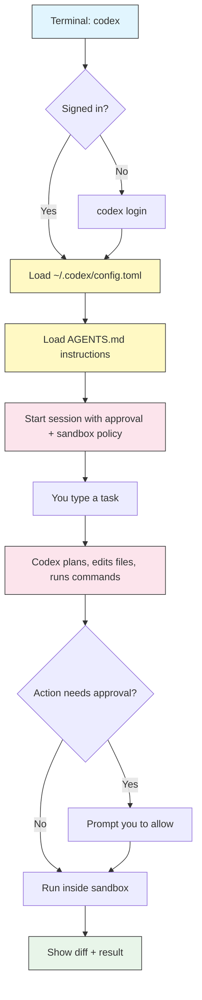

# Getting Started

## Overview

OpenAI Codex CLI is an open-source coding agent that runs in your terminal. You describe a task in natural language, and Codex reads your files, writes code, runs commands, and iterates — all inside a sandbox that you control through an approval policy.

This module takes you from zero to your first completed task: install the CLI, sign in, run an interactive session, and run a one-shot non-interactive command. By the end you will know where Codex stores its configuration and how to control what it is allowed to do.

> **Note**: Codex is available as a terminal CLI, an IDE extension, and a cloud agent. This guide focuses on the **CLI** (`@openai/codex`). The concepts (approvals, `AGENTS.md`, MCP) carry over to the other surfaces.

## Architecture



Codex loads your configuration and `AGENTS.md` instructions, then runs your task under a sandbox and an approval policy. Every risky action is either auto-run inside the sandbox or paused for your approval.

## Installation

Install globally with npm or Homebrew:

```bash
# npm (Node.js 18+)
npm install -g @openai/codex

# or Homebrew (macOS / Linux)
brew install codex
```

Verify the install:

```bash
codex --version
```

Upgrade later with:

```bash
# npm
npm install -g @openai/codex@latest

# Homebrew
brew upgrade codex
```

> **Note (Windows)**: Codex runs on Windows, but the OS-level sandbox is best supported under **WSL2**. If you are on Windows, install and run Codex inside a WSL2 distribution for full sandboxing. See [Troubleshooting](#troubleshooting).

## Signing in

Codex needs credentials before it can do anything. There are two ways to authenticate.

### Option 1 — Sign in with ChatGPT (recommended)

```bash
codex login
```

This opens a browser to sign in with your ChatGPT account. Codex usage is included with **Plus, Pro, Team, Edu, and Enterprise** plans — no separate API billing required.

### Option 2 — Use an API key

```bash
# Pass the key directly
codex login --api-key "$OPENAI_API_KEY"

# or export it in your shell profile
export OPENAI_API_KEY="sk-..."
```

Check and manage your session:

```bash
codex login status   # show who you are signed in as
codex logout         # clear stored credentials
```

## Your first interactive session

Start the terminal UI (TUI) from inside a project directory:

```bash
cd my-project
codex
```

You will land in an interactive prompt. Type a task in plain language:

```text
Add a --verbose flag to the CLI and update the README to document it.
```

Codex will propose a plan, edit files, and — depending on your approval policy — ask before running commands or touching files outside the workspace. Review each diff and approve or reject.

You can also pass the first task on the command line:

```bash
codex "explain what this project does and list its entry points"
```

## Your first non-interactive run

For scripts, CI, and one-shot tasks, use `exec` (also called "headless" mode). It runs to completion and prints the result without an interactive prompt:

```bash
codex exec "run the test suite and summarize any failures"
```

This is the building block for automation — see [Automation](../07-automation/).

## The TUI layout

The interactive session has three regions:

- **Transcript** — the running history of your messages, Codex's reasoning summary, file diffs, and command output.
- **Status line** — shows the current model, approval mode, sandbox mode, and token usage.
- **Composer** — where you type. Type `/` to open the slash-command menu, or `@` to attach a file.

Run `/status` any time to see the full session and configuration state.

## Keyboard shortcuts

| Key | Action |
|-----|--------|
| `Ctrl+C` | Interrupt the agent; press again to quit the session |
| `Ctrl+D` | Exit when the prompt is empty |
| `Esc` | Interrupt the current turn / edit your last message |
| `Ctrl+J` or `Shift+Enter` | Insert a newline without submitting |
| `@` | Trigger the file-mention picker |
| `Ctrl+T` | Toggle the full transcript view |
| `Up` / `Down` | Cycle through prompt history |
| `/` | Open the slash-command menu |

## Approvals and sandboxing (preview)

Every session runs under two dials:

- **Sandbox mode** — what Codex is technically allowed to do: `read-only`, `workspace-write`, or `danger-full-access`.
- **Approval policy** — when Codex must stop and ask you: `untrusted`, `on-failure`, `on-request`, or `never`.

Switch them live with `/approvals`, or set defaults in `config.toml`. The full model is covered in [Approvals & Sandbox](../05-approvals-sandbox/) — start there once you are comfortable running basic tasks.

A common low-friction combination for local work:

```bash
codex --sandbox workspace-write --ask-for-approval on-request
```

## Where Codex keeps its files

Codex stores everything under the home config directory `~/.codex/` (on Windows, `%USERPROFILE%\.codex\`):

| Path | Purpose |
|------|---------|
| `~/.codex/config.toml` | Global configuration (model, approvals, sandbox, MCP, profiles) |
| `~/.codex/AGENTS.md` | Personal, cross-project instructions |
| `~/.codex/prompts/` | Custom prompt files that become slash commands |
| `~/.codex/sessions/` | Saved conversation transcripts (used by `codex resume`) |
| `~/.codex/log/` | Diagnostic logs |

Project-level instructions live in an `AGENTS.md` file at your repository root — see [AGENTS.md](../03-agents-md/).

## Examples

### 1. Verify a clean install

```bash
codex --version
codex login status
```

If both succeed, you are ready to run tasks.

### 2. Ask a question without changing files

Run in read-only mode so Codex cannot edit anything:

```bash
codex --sandbox read-only "summarize the architecture of this repository"
```

### 3. Make a small change interactively

```bash
cd my-project
codex
# then type:
# Fix the typo in src/config.ts where "recieve" should be "receive"
```

Review the diff and approve.

### 4. One-shot task in a script

```bash
codex exec "add a LICENSE file with the MIT license and my name"
```

### 5. Resume where you left off

```bash
codex resume --last     # continue the most recent session
codex resume            # pick a session from a list
```

### 6. Bootstrap project instructions

Inside a session, run:

```text
/init
```

Codex scaffolds an `AGENTS.md` describing your project so future sessions start with context.

## Best practices

| Do | Don't |
|----|-------|
| Start in `read-only` or `on-request` until you trust a workflow | Start in `--dangerously-bypass-approvals-and-sandbox` on your main machine |
| Run Codex from the project root so it sees your files | Run from your home directory with a broad task |
| Sign in with ChatGPT if your plan includes Codex | Hardcode API keys in scripts committed to git |
| Review every diff before approving | Blindly approve commands you do not understand |
| Use `codex exec` for repeatable, scriptable tasks | Use the TUI inside CI pipelines |
| Keep Codex updated (`@latest`) | Assume behavior is frozen across versions |

## Troubleshooting

### `codex: command not found`

- Confirm the install: `npm ls -g @openai/codex` or `brew list codex`.
- Ensure your npm global bin directory is on `PATH` (`npm bin -g` shows it).
- Restart your terminal after installing.

### Authentication failed

- Run `codex login status` to see current state.
- Re-run `codex login`, or set `OPENAI_API_KEY` and retry.
- If you use an API key, confirm the key is valid and has credit.

### Sandbox errors on Windows

- Run Codex inside **WSL2** for full OS-level sandbox support.
- Alternatively, choose an approval policy that prompts you for each action instead of relying on the sandbox.

### Codex will not edit files

- You are likely in `read-only` sandbox mode. Switch with `/approvals`, or start with `--sandbox workspace-write`.

## Related guides

- [Slash Commands & Custom Prompts](../02-slash-commands/) — built-in commands and your own
- [AGENTS.md](../03-agents-md/) — persistent project and personal instructions
- [Configuration](../04-config/) — `config.toml` in depth
- [Approvals & Sandbox](../05-approvals-sandbox/) — control what Codex can do
- [CLI Reference](../10-cli/) — every command and flag

---

**Last Updated**: September 28, 2026
**Tool**: OpenAI Codex CLI (`@openai/codex`)
**Compatible Models**: GPT-5-Codex (default), GPT-5, plus OpenAI-compatible and local (OSS) models
*Part of the [codexhowto](../) guide series*
