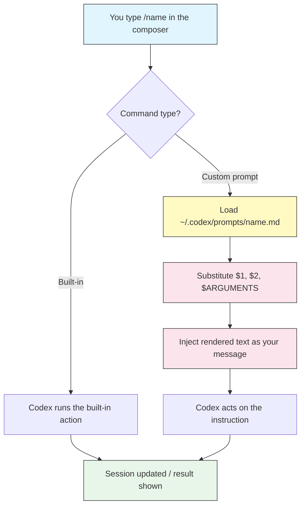

# Slash Commands & Custom Prompts

## Overview

Slash commands control a Codex session from the composer. Type `/` and a menu appears with every available command. There are two kinds:

- **Built-in commands** — shipped with Codex (`/init`, `/diff`, `/model`, `/approvals`, …).
- **Custom prompts** — Markdown files you drop in `~/.codex/prompts/` that turn a reusable instruction into a `/command`.

Built-ins change the session (model, approvals, context). Custom prompts inject a saved instruction — perfect for reviews, commits, and any task you repeat.

## Architecture



A built-in command runs an internal action; a custom prompt is loaded from disk, its arguments are substituted, and the result is sent as your next message.

## Built-in commands

Type `/` to open the menu. The core built-ins:

| Command | Purpose |
|---------|---------|
| `/init` | Scaffold an `AGENTS.md` describing the current project |
| `/diff` | Show the working-tree git diff |
| `/compact` | Summarize and shrink the conversation to free up context |
| `/new` | Start a fresh conversation in the same session |
| `/clear` | Clear the visible transcript |
| `/model` | Pick the model and reasoning effort (`minimal`/`low`/`medium`/`high`) |
| `/approvals` | Change the approval policy and sandbox mode for this session |
| `/status` | Show session info: model, approval mode, sandbox, token usage |
| `/mcp` | List configured MCP servers and their tools |
| `/review` | Run a code review of the current changes |
| `/prompts` | List your available custom prompts |
| `@` / `/mention` | Attach a file to your message |
| `/quit` | Exit the session (alias `/exit`) |

> **Tip**: `/status` is the fastest way to confirm which model and sandbox you are running before a risky task. `/compact` rescues a session that is running low on context without losing the thread.

## Custom prompts

A custom prompt is a Markdown file in `~/.codex/prompts/`. The filename (without `.md`) becomes the command name.

```text
~/.codex/prompts/
├── review.md     ->  /review
├── commit.md     ->  /commit
└── explain.md    ->  /explain
```

> **Note**: Depending on your Codex version, custom prompts may appear namespaced as `/prompts:review` in the menu. Either way they are listed by `/prompts` and triggered from the `/` menu.

### File format

A prompt file is plain Markdown. The body is the instruction sent to Codex. An optional YAML frontmatter block adds metadata shown in the menu:

```markdown
---
description: Review changed files for bugs and security issues
argument-hint: [focus-area]
---

Review the files changed in this branch. Focus on: $ARGUMENTS

Report findings grouped by severity with file:line references.
```

| Frontmatter field | Purpose |
|-------------------|---------|
| `description` | One-line summary shown in the slash menu |
| `argument-hint` | Placeholder hint for expected arguments |

### Arguments

Prompts accept arguments typed after the command:

| Token | Expands to |
|-------|-----------|
| `$1`, `$2`, … | Individual positional arguments |
| `$ARGUMENTS` | All arguments as a single string |

Example — a file named `explain.md` containing:

```markdown
Explain what the file $1 does, step by step, for a new teammate.
```

Invoked as `/explain src/auth.ts` sends: *"Explain what the file src/auth.ts does…"*.

### Creating your own

```bash
mkdir -p ~/.codex/prompts
cat > ~/.codex/prompts/tests.md <<'EOF'
---
description: Write tests for a file
argument-hint: [file]
---

Write thorough unit tests for $1. Cover edge cases and error paths.
Match the existing test framework and style in this project.
EOF
```

Reopen the `/` menu (or run `/prompts`) and `/tests` is ready to use.

## Example prompts in this module

Copy the ready-made templates from [`prompts/`](prompts/) into `~/.codex/prompts/`:

| File | Command | What it does |
|------|---------|--------------|
| [`prompts/review.md`](prompts/review.md) | `/review` | Reviews changed files; optional focus area via `$ARGUMENTS` |
| [`prompts/commit.md`](prompts/commit.md) | `/commit` | Generates a Conventional Commit message from the git diff |
| [`prompts/explain.md`](prompts/explain.md) | `/explain` | Explains a file passed as `$1` |

Install them all:

```bash
mkdir -p ~/.codex/prompts
cp 02-slash-commands/prompts/*.md ~/.codex/prompts/
```

## Examples

### 1. Switch models mid-task

```text
/model
```

Pick `gpt-5-codex` at `high` reasoning effort for a hard refactor, then drop back to `medium` for routine edits.

### 2. Review before committing

```text
/diff
/review
```

Inspect the raw diff, then let Codex review it for bugs and security issues.

### 3. Free up context in a long session

```text
/compact
```

Codex summarizes the conversation so far and continues with a smaller context footprint.

### 4. Run a custom review with a focus area

```text
/review authentication and input validation
```

`$ARGUMENTS` becomes "authentication and input validation".

### 5. Generate a commit message

```text
/commit
```

Codex reads the staged diff and proposes a Conventional Commit message.

### 6. Explain unfamiliar code

```text
/explain src/payments/webhook.ts
```

`$1` becomes the file path.

## Best practices

| Do | Don't |
|----|-------|
| Give each prompt a clear `description` | Leave the menu full of unnamed prompts |
| Keep one prompt focused on one task | Cram a whole workflow into a single prompt |
| Use `$1`/`$ARGUMENTS` for the variable parts | Hardcode file paths that change per project |
| Store team prompts in a shared repo and symlink them | Duplicate prompt files by hand across machines |
| Use `/status` before risky commands | Assume the model/sandbox from last session carries over |

## Troubleshooting

### A custom prompt does not appear

- Confirm the file is in `~/.codex/prompts/` and ends in `.md`.
- Run `/prompts` to list what Codex found.
- Reopen the `/` menu (restart the session if needed).
- Check the frontmatter is valid YAML delimited by `---` lines.

### Arguments are not substituted

- Use `$1` (not `${1}`) for positional args and `$ARGUMENTS` for the full string.
- Pass arguments after the command: `/explain path/to/file`.

### Built-in and custom command clash

- Built-ins take precedence. Rename your prompt file to avoid shadowing a built-in like `/model` or `/diff`.

## Related guides

- [Getting Started](../01-getting-started/) — install and first session
- [AGENTS.md](../03-agents-md/) — persistent instructions vs. one-shot prompts
- [Configuration](../04-config/) — set default model and reasoning effort
- [Automation](../07-automation/) — run prompts non-interactively with `codex exec`

---

**Last Updated**: September 28, 2026
**Tool**: OpenAI Codex CLI (`@openai/codex`)
**Compatible Models**: GPT-5-Codex (default), GPT-5, plus OpenAI-compatible and local (OSS) models
*Part of the [codexhowto](../) guide series*
