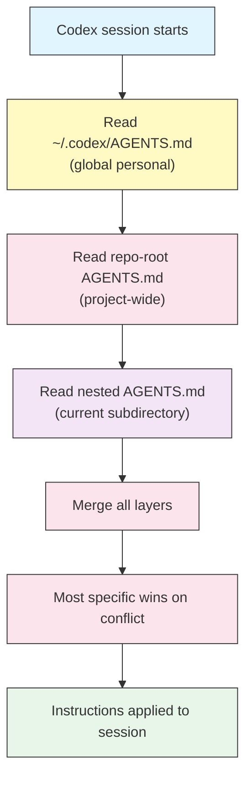

# AGENTS.md — Project Memory and Instructions

## Overview

`AGENTS.md` is the file where you tell Codex how your project works. It is plain
Markdown — prose, headings, and lists — that Codex reads at the start of a
session and treats as standing instructions. Think of it as the onboarding doc
you would hand a new teammate: how to build, how to test, what the conventions
are, and what to avoid.

Unlike a one-off prompt, an `AGENTS.md` file persists. Every session in that
repository starts with the same context, so you stop re-explaining the same
things and Codex stops guessing.

`AGENTS.md` is an open, cross-tool standard (see [agents.md](https://agents.md)).
The same file works across multiple coding agents, so the effort you put into it
is not locked to a single tool.

## Architecture

Codex looks for `AGENTS.md` in several places and merges them, from most global
to most specific. When two files disagree, the file closest to the code being
edited wins.



Codex reads every applicable layer and combines them. The nested file does not
replace the repo-root file; it adds to it and overrides only where they
conflict.

## The Three Layers

| Layer | Location | Scope | Use for |
|-------|----------|-------|---------|
| **Global personal** | `~/.codex/AGENTS.md` | Every project on your machine | Personal style, defaults you always want |
| **Project** | `<repo-root>/AGENTS.md` | The whole repository | Build/test commands, layout, team conventions |
| **Nested** | `<repo>/<subdir>/AGENTS.md` | One directory subtree | Rules specific to a package, service, or module |

On Windows the global file lives at `%USERPROFILE%\.codex\AGENTS.md`.

### Precedence in practice

If your global file says "prefer `npm`" and the repo-root file says "this project
uses `pnpm`", Codex follows the repo-root file inside that repository. If a
nested `src/api/AGENTS.md` adds "all handlers must validate input with `zod`",
that rule applies only while Codex works under `src/api/`.

## What to Put in AGENTS.md

Keep it practical and specific. The best entries are the things a new contributor
would get wrong on day one.

- **Commands** — how to install, build, test, lint, and run. Give the exact
  command lines.
- **Project layout** — where the important code lives, and what each top-level
  directory is for.
- **Code style** — formatter, linter, naming conventions, import rules.
- **Conventions** — patterns the team follows (error handling, logging, state).
- **Do and don't** — guardrails: never touch generated files, never commit to
  `main`, always run tests before finishing.
- **Commit and PR rules** — message format, branch naming, what a green PR needs.

Avoid dumping the entire README. Codex can read the codebase; `AGENTS.md` is for
the things that are not obvious from the files themselves.

## Scaffolding with `/init`

You do not have to write `AGENTS.md` from scratch. Inside an interactive Codex
session, run:

```text
/init
```

Codex scans the repository — package manifests, config files, directory
structure — and drafts an `AGENTS.md` for you. Review and edit it: the draft is
a strong starting point, but you know conventions that the file tree does not
reveal.

## Controlling How Much Is Read

Large `AGENTS.md` files consume context. The `project_doc_max_bytes` key in
`config.toml` caps how many bytes Codex reads from project documents:

```toml
# ~/.codex/config.toml
project_doc_max_bytes = 32768
```

If your file is longer than the cap, the tail is truncated. Keep the file focused
so the important rules are never the ones cut off. See the
[Configuration guide](../04-config/) for the full key reference.

## Examples

### 1. Minimal project file

The smallest useful `AGENTS.md` names the commands and the one rule that matters
most.

```markdown
# Project: acme-api

## Commands
- Install: `pnpm install`
- Test: `pnpm test`
- Lint: `pnpm lint`

## Rules
- Never edit files under `generated/` — they are built from the OpenAPI spec.
```

### 2. Global personal preferences

Put machine-wide preferences in `~/.codex/AGENTS.md` so they apply everywhere.

```markdown
# Personal preferences

- Explain the plan before making large multi-file changes.
- Prefer standard library solutions over new dependencies.
- Use `rg` (ripgrep) for searching, not `grep -r`.
- Keep commit messages in Conventional Commits format.
```

See [personal-AGENTS.md](personal-AGENTS.md) for a fuller template.

### 3. Directory-specific rules

A nested file narrows the rules for one part of the tree. Place this at
`src/api/AGENTS.md`:

```markdown
# src/api conventions

- Every route handler validates its input with `zod` before use.
- Return errors with the `problem+json` shape from `src/api/errors.ts`.
- Do not import from `src/web/` — the API layer must stay UI-agnostic.
```

See [nested-AGENTS.md](nested-AGENTS.md) for a fuller template.

### 4. Encoding a hard guardrail

Use direct, unambiguous language for anything destructive.

```markdown
## Safety
- Do NOT run database migrations. Prepare the migration file and stop.
- Do NOT push to `main`. Open a branch named `codex/<short-description>`.
- Ask before deleting more than 5 files in one change.
```

### 5. Monorepo with per-package files

In a monorepo, a light repo-root file plus focused per-package files keeps each
context small.

```text
AGENTS.md                 # shared: tooling, commit rules, monorepo layout
packages/web/AGENTS.md    # React conventions, component structure
packages/api/AGENTS.md    # service conventions, DB access rules
packages/cli/AGENTS.md    # argument parsing, output format
```

## Best Practices

| Do | Don't |
|----|-------|
| State exact commands (`pnpm test`, not "run the tests") | Assume Codex can guess your task runner |
| Keep the file short and scannable | Paste the whole README or design doc |
| Put machine-wide habits in the global file | Repeat personal preferences in every repo |
| Use nested files for package-specific rules | Cram every package's rules into the root file |
| Write destructive guardrails in plain, direct language | Bury critical "do not" rules in a wall of text |
| Run `/init` to bootstrap, then refine | Hand-write everything before trying `/init` |
| Update the file when conventions change | Let it drift out of sync with the codebase |

## Troubleshooting

### Codex ignores a rule

- Check the precedence: a nested or repo-root file may override the rule you
  expected to win. The most specific file takes priority.
- Make the rule unambiguous. "Prefer X" is a suggestion; "Always use X, never Y"
  is a rule.
- Confirm the file is named exactly `AGENTS.md` (uppercase) and sits at a path
  Codex actually reads for the files being edited.

### The file seems truncated

- Your file may exceed `project_doc_max_bytes`. Raise the cap in `config.toml`
  or trim the file so the essential rules come first.

### Rules leak between projects

- Project-specific rules belong in the repo-root or nested file, not in
  `~/.codex/AGENTS.md`. Move anything project-specific out of the global file.

### `/init` produced a generic file

- That is expected — `/init` infers from the file tree. Add the conventions that
  are not visible in the code (why decisions were made, what to avoid).

## Related guides

- [Getting Started](../01-getting-started/) — install Codex and run your first session
- [Slash Commands and Custom Prompts](../02-slash-commands/) — `/init` and reusable prompts
- [Configuration](../04-config/) — `project_doc_max_bytes` and other keys
- [Approvals and Sandbox](../05-approvals-sandbox/) — encode safety in config, not just prose

---

**Last Updated**: September 28, 2026
**Tool**: OpenAI Codex CLI (`@openai/codex`)
**Compatible Models**: GPT-5-Codex (default), GPT-5, plus OpenAI-compatible and local (OSS) models
*Part of the [codexhowto](../) guide series*
