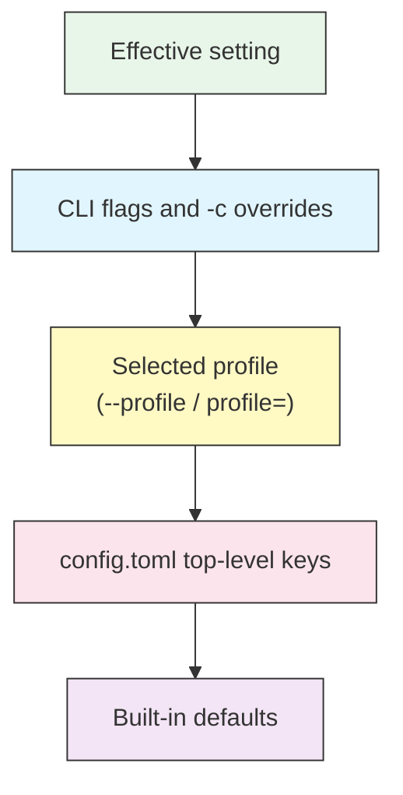

# Configuration — config.toml

## Overview

Codex reads its settings from a single TOML file at `~/.codex/config.toml`
(`%USERPROFILE%\.codex\config.toml` on Windows). This is where you set the model,
how much Codex is allowed to do on its own (approvals and sandbox), reasoning
effort, custom model providers, and reusable profiles.

Anything in `config.toml` can be overridden per-run from the command line with
`-c key=value`, so you can keep safe defaults in the file and loosen or tighten
them for a single session.

## Architecture

Settings resolve from most specific to least specific. The first source that sets
a key wins.



A `-c` flag on the command line beats a profile; a profile beats a top-level key;
a top-level key beats the built-in default.

## Core Keys

| Key | Values | Purpose |
|-----|--------|---------|
| `model` | e.g. `"gpt-5-codex"`, `"gpt-5"` | Which model to run |
| `model_provider` | provider id (default `"openai"`) | Where the model comes from |
| `model_reasoning_effort` | `"minimal"` / `"low"` / `"medium"` / `"high"` | How hard the model thinks |
| `model_reasoning_summary` | `"auto"` / `"concise"` / `"detailed"` / `"none"` | How reasoning is summarized |
| `model_verbosity` | `"low"` / `"medium"` / `"high"` | Length of responses |
| `approval_policy` | `"untrusted"` / `"on-failure"` / `"on-request"` / `"never"` | When Codex asks before acting |
| `sandbox_mode` | `"read-only"` / `"workspace-write"` / `"danger-full-access"` | What Codex can touch |
| `profile` | a profile name | Which profile to use by default |
| `project_doc_max_bytes` | integer (bytes) | Cap on `AGENTS.md` read size |
| `disable_response_storage` | `true` / `false` | Opt out of server-side response storage |
| `hide_agent_reasoning` | `true` / `false` | Hide reasoning summaries in output |

Approvals and sandbox are the two settings that decide how autonomous Codex is.
They are covered in depth in the [Approvals and Sandbox guide](../05-approvals-sandbox/);
this page shows how to set them, not when to use each value.

## Sandbox and Approval Tables

### `[sandbox_workspace_write]`

Applies when `sandbox_mode = "workspace-write"`.

| Key | Values | Purpose |
|-----|--------|---------|
| `network_access` | `true` / `false` (default `false`) | Allow network from inside the sandbox |
| `writable_roots` | array of paths | Extra directories Codex may write to |
| `exclude_tmpdir_env_var` | `true` / `false` | Don't auto-add `$TMPDIR` to writable roots |
| `exclude_slash_tmp` | `true` / `false` | Don't auto-add `/tmp` to writable roots |

```toml
sandbox_mode = "workspace-write"

[sandbox_workspace_write]
network_access = false
writable_roots = ["/tmp/codex-scratch"]
```

### `[tools]`

| Key | Values | Purpose |
|-----|--------|---------|
| `web_search` | `true` / `false` | Let Codex search the web |

```toml
[tools]
web_search = true
```

## Custom Model Providers

Use `[model_providers.NAME]` to point Codex at an OpenAI-compatible endpoint or a
gateway. Select it with `model_provider = "NAME"`.

| Key | Purpose |
|-----|---------|
| `name` | Human-readable label |
| `base_url` | API base URL |
| `env_key` | Env var holding the API key |
| `wire_api` | Wire protocol (`"chat"` or `"responses"`) |

```toml
[model_providers.my-gateway]
name = "My Gateway"
base_url = "https://gateway.example.com/v1"
env_key = "MY_GATEWAY_API_KEY"
wire_api = "chat"
```

Providers and local (OSS) models are covered in the
[Profiles and Providers guide](../08-profiles/).

## Profiles

A `[profiles.NAME]` block bundles several keys under one name. Switch with
`--profile NAME`, or set `profile = "NAME"` at the top level to make it the
default.

```toml
profile = "safe"

[profiles.safe]
approval_policy = "on-request"
sandbox_mode = "read-only"

[profiles.yolo]
approval_policy = "never"
sandbox_mode = "workspace-write"
model_reasoning_effort = "high"
```

```bash
# Use the "yolo" profile for one run
codex --profile yolo "refactor the auth module"
```

See the [Profiles and Providers guide](../08-profiles/) for the full pattern.

## CLI Overrides with `-c`

Any key can be set for a single run with `-c key=value`. String values need
quotes; the whole `key=value` is often quoted for the shell.

```bash
# Override the model for one run
codex -c model="gpt-5" "explain this stack trace"

# Force read-only for a risky exploration
codex -c 'sandbox_mode="read-only"' "audit this dependency"

# Combine several overrides
codex -c model="gpt-5-codex" -c 'approval_policy="on-request"' "add tests"
```

`-c` beats the profile and the file, so it is the safest way to tighten
permissions ad hoc without editing the file.

## Examples

### 1. Everyday balanced config

```toml
# ~/.codex/config.toml
model = "gpt-5-codex"
approval_policy = "on-request"
sandbox_mode = "workspace-write"
model_reasoning_effort = "medium"

[tools]
web_search = true
```

### 2. Cautious default with an opt-in fast profile

```toml
model = "gpt-5-codex"
approval_policy = "on-request"
sandbox_mode = "read-only"

[profiles.build]
approval_policy = "on-failure"
sandbox_mode = "workspace-write"
```

```bash
codex --profile build "implement the feature and run tests"
```

### 3. Turning reasoning up for a hard problem

```bash
codex -c 'model_reasoning_effort="high"' "find the race condition in the scheduler"
```

### 4. Limiting how much AGENTS.md is read

```toml
project_doc_max_bytes = 16384
```

### 5. Allowing network inside the sandbox for a dependency install

```toml
sandbox_mode = "workspace-write"

[sandbox_workspace_write]
network_access = true
```

## Best Practices

| Do | Don't |
|----|-------|
| Keep the file's default safe (read-only or on-request) | Default to `never` + `danger-full-access` |
| Use profiles for named modes you switch between | Hand-edit the file every time you change modes |
| Loosen permissions per-run with `-c` | Leave the loosest setting as the permanent default |
| Quote string values in `-c` overrides | Pass unquoted values that the shell mangles |
| Keep custom-provider keys in env vars | Hardcode API keys in `config.toml` |
| Comment non-obvious settings | Leave a cryptic config with no notes |

## Troubleshooting

### A setting has no effect

- Check precedence: a `-c` flag or the active profile may be overriding the
  top-level key. CLI overrides win.
- Confirm the value is a valid option (see the tables above); an unknown value
  may be ignored or rejected.

### TOML parse error on startup

- TOML strings need quotes: `model = "gpt-5"`, not `model = gpt-5`.
- Table headers use square brackets: `[profiles.safe]`.
- Arrays use square brackets with commas: `writable_roots = ["/tmp/a", "/tmp/b"]`.

### The custom provider is not used

- Set `model_provider = "NAME"` (or pick a profile that does), and make sure the
  `env_key` variable is exported in your shell.

### Codex still can't write files

- `sandbox_mode` may be `read-only`. Switch to `workspace-write`, or add the path
  to `writable_roots` if it is outside the workspace.

## Related guides

- [Getting Started](../01-getting-started/) — first run and login
- [AGENTS.md](../03-agents-md/) — project memory that `project_doc_max_bytes` caps
- [Approvals and Sandbox](../05-approvals-sandbox/) — choosing `approval_policy` and `sandbox_mode`
- [MCP](../06-mcp/) — `[mcp_servers]` configuration
- [Profiles and Providers](../08-profiles/) — profiles and custom/local models

---

**Last Updated**: September 28, 2026
**Tool**: OpenAI Codex CLI (`@openai/codex`)
**Compatible Models**: GPT-5-Codex (default), GPT-5, plus OpenAI-compatible and local (OSS) models
*Part of the [codexhowto](../) guide series*
