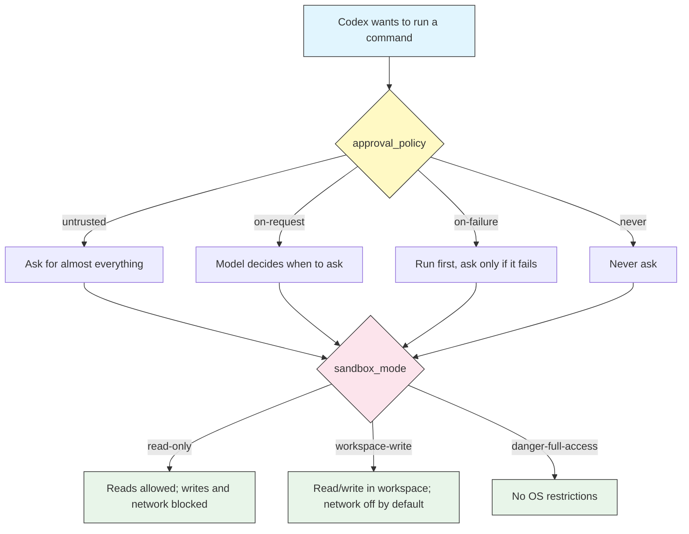

# Approvals and Sandboxing

## Overview

Approvals and sandboxing are the two controls that decide how much freedom Codex has on your machine. They are the signature safety feature of Codex CLI, and they work as **two independent axes** that combine:

- **`approval_policy`** — *when* Codex pauses to ask you before doing something.
- **`sandbox_mode`** — *what* Codex is technically allowed to do, enforced by the operating system.

The distinction matters. Approvals are a prompt you answer; the sandbox is a wall the OS enforces even if the model tries to step past it. A permissive approval policy behind a tight sandbox is still safe, because the sandbox blocks the action regardless of what the model decides. Picking the right combination is the difference between babysitting every command and letting Codex run unattended.

## Architecture



Every command Codex proposes passes through both gates: first the approval policy decides whether to ask you, then the sandbox decides what is physically permitted once it runs.

## The two axes

### Approval policy — when Codex asks

Set with `--ask-for-approval <policy>` (short flag `-a`) or `approval_policy` in `config.toml`.

| Policy | Behavior | Best for |
|--------|----------|----------|
| `untrusted` | Approve almost every command; only a small safe allowlist (like reading files) runs without asking | Maximum oversight, unfamiliar repos |
| `on-request` | The model decides when it needs to ask for more access — the balanced default | Everyday interactive work |
| `on-failure` | Commands run inside the sandbox; Codex only asks when one fails or needs to escalate out of the sandbox | Low-friction sessions where you trust the sandbox |
| `never` | Codex never pauses to ask; it works fully autonomously within whatever the sandbox allows | Automation, CI, scripted runs |

> **Note**: `never` does not mean "unrestricted." It means Codex will not stop to ask — it still cannot cross the sandbox boundary. Pair `never` with a tight `sandbox_mode` for safe automation.

### Sandbox mode — what Codex can do

Set with `--sandbox <mode>` (short flag `-s`) or `sandbox_mode` in `config.toml`.

| Mode | Filesystem | Network | Use when |
|------|-----------|---------|----------|
| `read-only` | Read only; no writes | Blocked | Reviewing code, answering questions, planning |
| `workspace-write` | Read/write inside the working directory and a temp dir | **Disabled by default** | Normal coding and edits |
| `danger-full-access` | No filesystem restrictions | Allowed | Trusted, disposable environments only |

The sandbox is enforced by the operating system, not by the model. In `workspace-write`, writes outside the working directory are blocked, and network access is off unless you explicitly turn it on (see [`[sandbox_workspace_write]`](#tuning-workspace-write)).

## The policy x mode matrix

The two axes multiply into the behavior you actually experience:

| | `read-only` | `workspace-write` | `danger-full-access` |
|--|------------|-------------------|----------------------|
| **`untrusted`** | Safest review mode | Edits, but confirm most commands | Rarely useful |
| **`on-request`** | Guided reading | **Recommended everyday combo** | Powerful but exposed |
| **`on-failure`** | Reading with rare prompts | Smooth coding, prompts on escalation | Fast but exposed |
| **`never`** | Autonomous read/analysis | Autonomous coding in a box | Full YOLO (containers only) |

**Recommended everyday setting: `on-request` + `workspace-write`.** Codex edits freely inside your project, keeps network off unless a task needs it, and asks before doing anything that escapes the box.

## Presets

Codex ships shortcuts so you do not have to set both axes by hand.

| Preset | Expands to | Meaning |
|--------|-----------|---------|
| `--full-auto` | `workspace-write` sandbox + `on-failure` approvals | Low-friction: Codex edits and runs commands in the workspace, only prompting when something fails or needs escalation |
| `--dangerously-bypass-approvals-and-sandbox` (YOLO) | `never` + `danger-full-access` | No approvals, no sandbox. Use only in throwaway containers, VMs, or CI runners |

In the interactive TUI, the `/approvals` picker exposes the same idea as three friendly presets:

- **Read Only** — Codex can look but not touch.
- **Auto** — Codex works in the workspace and asks when it needs more.
- **Full Access** — Codex can read/write anywhere and use the network.

## Tuning workspace-write

`workspace-write` is the sweet spot for most work, and you can widen it precisely with a `[sandbox_workspace_write]` table in `config.toml`:

```toml
sandbox_mode = "workspace-write"

[sandbox_workspace_write]
# Re-enable network access for tasks that need it (npm install, curl, etc.)
network_access = true

# Add extra directories Codex may write to, beyond the working dir
writable_roots = ["/tmp/codex-scratch", "~/.cache/my-tool"]
```

> **Important**: Even inside a writable root, some paths stay protected and will still prompt — notably `.git/`, so Codex cannot silently rewrite your git history. This protection holds even in `workspace-write`.

## Platform notes

The sandbox is implemented with native OS features, so behavior differs by platform:

- **macOS** — Apple Seatbelt (`sandbox-exec`) confines filesystem and network access.
- **Linux** — Landlock (filesystem) plus seccomp (syscalls) provide the boundary.
- **Windows** — OS-level sandboxing is limited. Run Codex inside **WSL2** for real enforcement, or rely on the approval policy (`untrusted` / `on-request`) as your primary control.

> **Tip**: If you are on Windows without WSL2, treat approvals as your safety net and avoid `danger-full-access`.

## Practical examples

### 1. Read-only code review

Explore an unfamiliar repository without any risk of changes:

```bash
codex --sandbox read-only "Explain the architecture of this service and list the main modules"
```

Codex can read every file and answer questions, but cannot write, delete, or reach the network.

### 2. Everyday coding (recommended)

The balanced default for interactive work:

```bash
codex --ask-for-approval on-request --sandbox workspace-write "Add input validation to the signup handler"
```

Codex edits files in your project and runs local commands, pausing only when it needs access beyond the workspace.

### 3. A task that needs the network

Installing dependencies requires network, which `workspace-write` disables by default. Turn it on for the task:

```bash
codex --sandbox workspace-write \
  -c 'sandbox_workspace_write.network_access=true' \
  "Install the missing dependencies and run the test suite"
```

Or set it persistently in `config.toml` under `[sandbox_workspace_write]`.

### 4. Low-friction session with full-auto

Let Codex work through a multi-step change with minimal interruptions:

```bash
codex --full-auto "Refactor the payments module into smaller files and update the imports"
```

This is `workspace-write` + `on-failure`: Codex only stops to ask when a command fails or needs to escalate.

### 5. Unattended automation in a container

Inside a disposable CI runner or container, remove all friction:

```bash
codex exec --dangerously-bypass-approvals-and-sandbox \
  "Generate the changelog from git history and write it to CHANGELOG.md"
```

> **Warning**: Never use YOLO mode on your primary machine or on a repo with credentials. It disables every guardrail.

### 6. Switching modes mid-session

You do not have to restart. Inside the TUI, run:

```text
/approvals
```

Then pick Read Only, Auto, or Full Access. This is handy when you start by reviewing and then decide to let Codex make the change.

## Best practices

| Do | Don't |
|----|-------|
| Default to `on-request` + `workspace-write` | Reach for `danger-full-access` out of habit |
| Start read-only in unfamiliar repositories | Run YOLO mode outside a container or VM |
| Turn on `network_access` only for tasks that need it | Leave network on globally when you rarely need it |
| Use `--full-auto` for trusted, well-scoped tasks | Approve commands you have not read |
| Add specific `writable_roots` instead of full access | Widen the sandbox to fix a single blocked path |
| Use `never` + tight sandbox for CI, not `never` + full access | Assume `never` means "no restrictions" |

## Troubleshooting

### A command was blocked

**Problem**: Codex reports it cannot run a command or write a file.

**Solutions**:
- Check your `sandbox_mode` — `read-only` blocks all writes.
- The target path may be outside the workspace; add it to `writable_roots`.
- Escalate the single command by approving it when prompted, rather than widening the sandbox globally.

### Network calls fail

**Problem**: `npm install`, `pip install`, or `curl` fails with a network error.

**Solutions**:
- `workspace-write` disables network by default. Set `sandbox_workspace_write.network_access=true` for the task, via `-c` flag or `config.toml`.
- Confirm you are not in `read-only`, which also blocks the network.

### Codex keeps prompting for git operations

**Problem**: Even in `workspace-write`, writes into `.git/` ask for approval.

**Solutions**:
- This is intentional — `.git/` is a protected path so history cannot be rewritten silently. Approve the specific operation when you trust it.

### Windows: the sandbox does not seem to restrict anything

**Problem**: Filesystem restrictions are not enforced.

**Solutions**:
- Native Windows sandboxing is limited. Run Codex inside WSL2 for real enforcement, or use `untrusted` / `on-request` approvals as your primary guardrail.

## Related guides

- [Config](../04-config/) — Set `approval_policy` and `sandbox_mode` persistently in `config.toml`
- [CLI Reference](../10-cli/) — Full list of `--ask-for-approval` and `--sandbox` flags
- [Automation](../07-automation/) — Safe unattended runs with `codex exec`
- [Getting Started](../01-getting-started/) — Your first session and the `/approvals` picker
- [Profiles](../08-profiles/) — Bundle a policy and sandbox mode into a named profile

---

**Last Updated**: September 28, 2026
**Tool**: OpenAI Codex CLI (`@openai/codex`)
**Compatible Models**: GPT-5-Codex (default), GPT-5, plus OpenAI-compatible and local (OSS) models
*Part of the [codexhowto](../) guide series*
