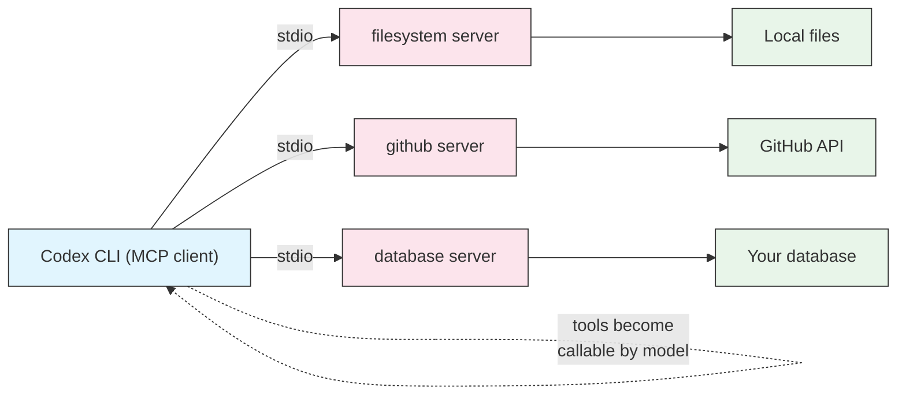

# MCP (Model Context Protocol)

## Overview

The Model Context Protocol (MCP) is an open standard for connecting AI agents to external tools and data sources. Codex CLI is an **MCP client**: you register MCP servers in your configuration, and the tools those servers expose become callable by the model during a session. Need Codex to query a database, browse your filesystem with structured tools, or open GitHub issues? Point it at the right MCP server instead of writing glue code.

Codex can also work the other way around — it can run **as** an MCP server, so other agents and tools can call Codex like any other MCP tool.

This lesson covers both directions: configuring servers Codex talks to, and exposing Codex itself.

## Architecture



Each MCP server is a separate process Codex launches and talks to over a transport (most commonly stdio). The server advertises a set of tools; Codex adds them to the model's toolbox for the session.

## What MCP gives you

- **Structured tools instead of shell hacks** — an MCP filesystem server offers typed operations rather than raw `cat`/`sed`.
- **External systems** — GitHub, databases, issue trackers, and internal APIs become first-class capabilities.
- **Reuse** — the same MCP servers work across MCP-compatible agents, not just Codex.
- **Isolation** — each server runs as its own process with its own permissions and environment.

## Configuring MCP servers

MCP servers live under `[mcp_servers.NAME]` tables in `~/.codex/config.toml`. The most portable transport is **stdio**, where Codex launches a command and speaks MCP over its standard input/output.

```toml
[mcp_servers.filesystem]
command = "npx"
args = ["-y", "@modelcontextprotocol/server-filesystem", "/path/to/project"]

[mcp_servers.github]
command = "npx"
args = ["-y", "@modelcontextprotocol/server-github"]
env = { GITHUB_PERSONAL_ACCESS_TOKEN = "ghp_your_token_here" }
```

| Field | Purpose |
|-------|---------|
| `command` | The executable to launch (e.g. `npx`, `python`, `node`, a binary) |
| `args` | Array of arguments passed to the command |
| `env` | Table of environment variables for the server process |

The table key (`filesystem`, `github`) is the server name you will see in the TUI.

> **Note**: Some versions also support remote MCP servers over HTTP with a `url` and auth fields. The stdio form above is the most widely supported path and the best place to start.

See the ready-to-copy snippets in this folder: [`filesystem-mcp.toml`](filesystem-mcp.toml), [`github-mcp.toml`](github-mcp.toml), and [`multi-mcp.toml`](multi-mcp.toml).

## Managing servers from the command line

The `codex mcp` subcommands manage servers without hand-editing TOML:

```bash
# List configured MCP servers
codex mcp list

# Add a server (writes to config.toml)
codex mcp add filesystem -- npx -y @modelcontextprotocol/server-filesystem /path/to/project

# Inspect the mcp subcommand group
codex mcp --help
```

Everything under `codex mcp` maps to the same `[mcp_servers.*]` tables you could edit by hand — use whichever you prefer.

## Inspecting servers in the TUI

Inside an interactive session, run:

```text
/mcp
```

This lists every connected MCP server and the tools it exposes, so you can confirm a server started correctly and see exactly what Codex can now call.

## Codex as an MCP server

Codex can expose itself over MCP so other agents can delegate coding tasks to it:

```bash
# Run Codex as an MCP server over stdio
codex mcp-server
```

Point another MCP-compatible client at that command and Codex becomes a callable tool in that agent's toolbox — useful for building multi-agent setups where Codex handles the code-writing step.

## Practical examples

### 1. Give Codex structured filesystem access

Add the filesystem server scoped to a project directory:

```toml
[mcp_servers.filesystem]
command = "npx"
args = ["-y", "@modelcontextprotocol/server-filesystem", "/Users/me/work/app"]
```

Now Codex can list, read, and search files through typed MCP tools in addition to its built-in file access.

### 2. Connect GitHub for issues and PRs

Store your token in the environment, then reference it:

```toml
[mcp_servers.github]
command = "npx"
args = ["-y", "@modelcontextprotocol/server-github"]
env = { GITHUB_PERSONAL_ACCESS_TOKEN = "ghp_xxx" }
```

Ask Codex to "open an issue summarizing the failing tests" and it can call the GitHub tools directly.

### 3. Add a server without editing TOML

```bash
codex mcp add github -- npx -y @modelcontextprotocol/server-github
```

Then set the token in `config.toml` or your shell environment, and run `/mcp` to confirm it connected.

### 4. Run several servers together

Combine filesystem, GitHub, and a custom Python server in one config (see [`multi-mcp.toml`](multi-mcp.toml)):

```toml
[mcp_servers.filesystem]
command = "npx"
args = ["-y", "@modelcontextprotocol/server-filesystem", "."]

[mcp_servers.github]
command = "npx"
args = ["-y", "@modelcontextprotocol/server-github"]
env = { GITHUB_PERSONAL_ACCESS_TOKEN = "ghp_xxx" }

[mcp_servers.metrics]
command = "python"
args = ["-m", "my_company.metrics_mcp"]
env = { METRICS_API_URL = "https://metrics.internal" }
```

### 5. Expose Codex to another agent

```bash
codex mcp-server
```

Register that command as an MCP server in a second agent, and it can hand coding tasks to Codex programmatically.

## Best practices

| Do | Don't |
|----|-------|
| Keep secrets in `env` or environment variables | Hardcode tokens where they get committed |
| Scope filesystem servers to specific directories | Point a filesystem server at your entire home dir |
| Use `/mcp` to verify a server connected | Assume a server works without checking |
| Give servers clear, memorable names | Reuse one server name for different tools |
| Pin server versions where possible | Blindly run untrusted MCP servers |
| Combine MCP with a tight sandbox | Grant broad access just to make a tool work |

## Troubleshooting

### A server will not start

**Problem**: `/mcp` shows the server as failed or missing.

**Solutions**:
- Run the `command` and `args` manually in a shell to see the real error.
- Confirm the runtime is installed (`node`/`npx`, `python`, or the binary).
- Check that `args` is an array of separate strings, not one combined string.

### Missing environment variables

**Problem**: The server starts but its tools fail with auth errors.

**Solutions**:
- Verify the required env var name (e.g. `GITHUB_PERSONAL_ACCESS_TOKEN`).
- Set it in the server's `env` table, or export it in your shell before launching Codex.
- Regenerate the token if it expired or lacks the needed scopes.

### Tools do not appear to the model

**Problem**: Codex does not use an MCP tool you expected.

**Solutions**:
- Run `/mcp` to confirm the tool is listed.
- Restart the session after editing `config.toml`.
- Make your request specific enough that the tool is clearly relevant.

### The server hangs on startup

**Problem**: Codex waits a long time for a server to connect.

**Solutions**:
- A first `npx` run may download the package; let it finish once, then it is cached.
- Check network access — some servers need it to initialize.

## Related guides

- [Config](../04-config/) — Where `[mcp_servers.*]` lives and how config precedence works
- [Approvals and Sandboxing](../05-approvals-sandbox/) — Keep MCP-powered access inside a safe boundary
- [CLI Reference](../10-cli/) — The `codex mcp` and `codex mcp-server` subcommands
- [Automation](../07-automation/) — Use MCP tools in non-interactive `codex exec` runs

---

**Last Updated**: September 28, 2026
**Tool**: OpenAI Codex CLI (`@openai/codex`)
**Compatible Models**: GPT-5-Codex (default), GPT-5, plus OpenAI-compatible and local (OSS) models
*Part of the [codexhowto](../) guide series*
