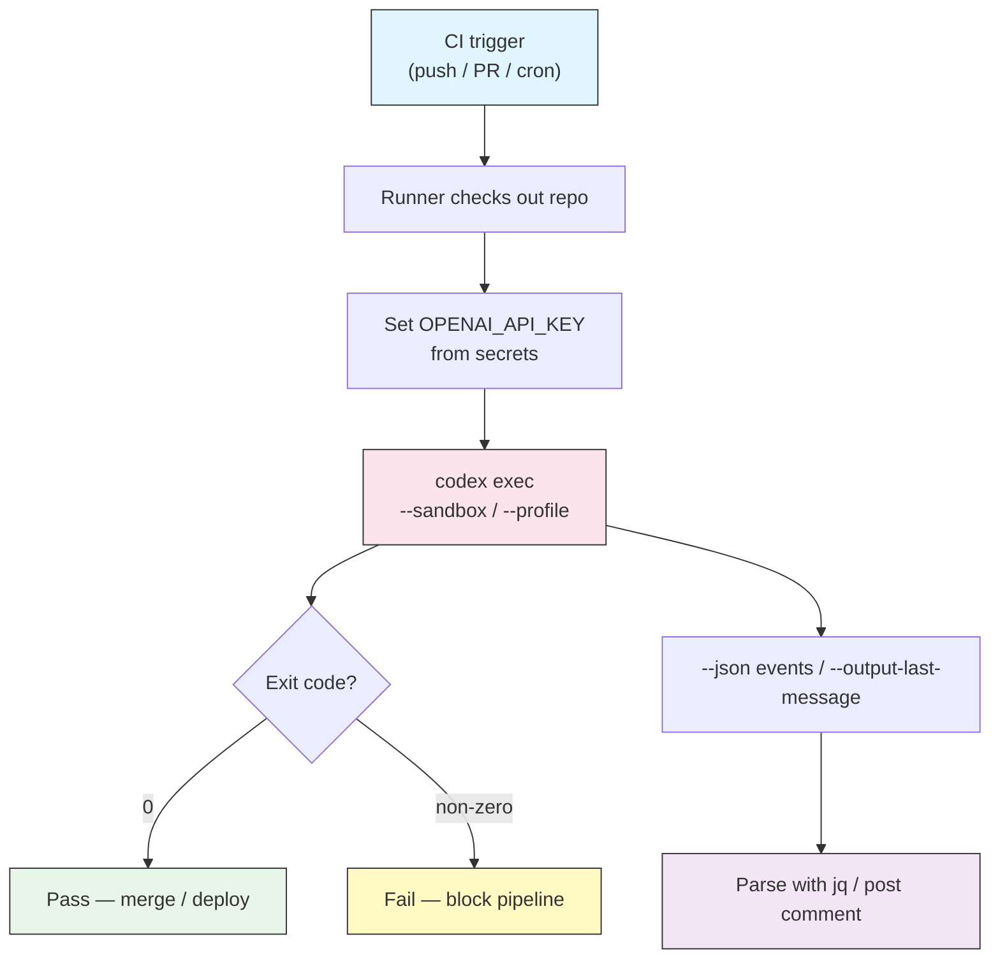

# Automation & CI

## Overview

`codex exec` is the non-interactive face of Codex CLI. Where `codex` opens an
interactive TUI and pauses to ask for approval, `codex exec` runs a prompt to
completion, prints the result, and exits with a status code. That single
difference is what makes Codex scriptable: you can drop it into a shell
pipeline, a `Makefile`, a cron job, or a CI runner and treat it like any other
command-line tool.

This lesson covers headless execution, structured JSON output, using the exit
code as a quality gate, piping data in and out, supplying configuration on the
command line, and authenticating in an environment where nobody is sitting at a
keyboard.

## Architecture



The runner supplies credentials and a sandbox choice, `codex exec` does the
work, and the exit code plus any captured output feed the rest of the pipeline.

## Headless Mode: `codex exec`

`codex exec` takes a prompt as an argument, or reads one from standard input,
runs it, and exits. There is no interactive prompt and no approval loop, so it
is safe to run unattended.

```bash
# Prompt as an argument
codex exec "add a CHANGELOG entry for the latest commit"

# Prompt from stdin
echo "summarize the open TODOs in this repo" | codex exec

# Prompt from a file
codex exec < prompts/nightly-audit.txt
```

Because there is no human to answer approval prompts, you must pair `codex exec`
with a sandbox and approval choice that can complete without asking. See
[Approvals & Sandboxing](../05-approvals-sandbox/) for the full model.

## Structured Output

For anything beyond printing text, ask for machine-readable output.

| Flag | Effect |
|------|--------|
| `--json` | Emits structured JSONL events (one JSON object per line) as the run progresses |
| `--output-last-message <file>` | Writes only the final assistant message to a file |

```bash
# Stream JSONL events for a parser
codex exec --json "list every failing test and why" > events.jsonl

# Capture just the final answer
codex exec --output-last-message result.txt "write release notes for v2.0"
cat result.txt
```

Combine `--json` with `jq` to pull out exactly the fields you need instead of
scraping prose.

```bash
codex exec --json "audit dependencies for known CVEs" \
  | jq -r 'select(.type=="item.completed") | .text'
```

## The Exit Code Is a Gate

`codex exec` exits non-zero when the run fails. That makes it a drop-in gate for
any pipeline: if the command fails, the stage fails.

```bash
# Fail the build if Codex reports blocking issues
codex exec "Review the staged diff. If you find a blocking bug, exit non-zero
by printing 'BLOCKING' and failing. Otherwise print 'OK'." || {
  echo "Codex flagged blocking issues"
  exit 1
}
```

For deterministic gating, ask Codex to run a real check (tests, a linter, a
build) rather than judging prose. A failing test command inside the sandbox
propagates a non-zero exit that you can trust.

## Piping Data In and Out

`codex exec` reads stdin, so it composes with the tools you already use.

```bash
# Review a diff
git diff | codex exec "review this diff for bugs and security issues"

# Triage a log
cat /var/log/app/error.log | codex exec "group these errors and rank by severity"

# Chain into other tools
codex exec "list all API endpoints, one per line" | sort | uniq
```

## Configuration on the Command Line

Everything in `config.toml` can be overridden per-invocation, which is essential
when the same script runs in different environments.

```bash
# Override individual keys with -c
codex exec -c model="gpt-5" -c 'sandbox_mode="read-only"' "audit this module"

# Select a named profile
codex exec --profile ci-review "review the changed files"

# Pick a sandbox/approval preset directly
codex exec --full-auto "regenerate the OpenAPI client"
```

Precedence, highest first: `-c` / explicit flags → `--profile` → `config.toml`
top level → built-in defaults. See [Configuration](../04-config/) and
[Profiles & Model Providers](../08-profiles/).

## Authentication in CI

Interactive `codex login` signs in through ChatGPT, which needs a browser. CI
runners have no browser, so use **API-key authentication** instead.

```yaml
env:
  OPENAI_API_KEY: ${{ secrets.OPENAI_API_KEY }}
```

Set the key as a masked secret in your CI provider and export it into the job.
Codex picks it up automatically. Never echo the key or commit it to the repo.

## Practical Examples

### 1. Local review script

Pipe the working-tree diff into Codex for a fast pre-commit review.

```bash
git diff | codex exec --sandbox read-only \
  "Review this diff. List concrete bugs and risky changes only."
```

See [`scripts/review-diff.sh`](scripts/review-diff.sh) for a portable version
that handles the empty-diff case.

### 2. PR review in GitHub Actions

Run Codex on every pull request and fail the check when it finds a blocking
issue. See [`scripts/codex-review.yml`](scripts/codex-review.yml) for the full
workflow. The core step is:

```yaml
- name: Codex review
  env:
    OPENAI_API_KEY: ${{ secrets.OPENAI_API_KEY }}
  run: |
    git fetch origin "${{ github.base_ref }}"
    git diff "origin/${{ github.base_ref }}"... \
      | codex exec --sandbox read-only \
        "Review this diff. Print findings grouped by severity." \
      | tee review.md
```

### 3. Batch processing across many files

Loop over a set of files and run the same instruction on each.

```bash
for f in src/**/*.py; do
  echo "== $f =="
  codex exec --full-auto "Add or fix docstrings in $f. Do not change behavior."
done
```

The full script with safety guards is
[`scripts/batch-docstrings.sh`](scripts/batch-docstrings.sh).

### 4. Log triage on a schedule

Run a nightly summary of production errors from a cron job.

```bash
# crontab: 0 6 * * *  /usr/local/bin/nightly-triage.sh
tail -n 5000 /var/log/app/error.log \
  | codex exec --sandbox read-only --output-last-message /tmp/triage.md \
    "Summarize these errors, group duplicates, and list the top 5 to fix."
mail -s "Nightly error triage" oncall@example.com < /tmp/triage.md
```

### 5. Structured output for a dashboard

Emit JSON and parse it into a metric.

```bash
COUNT=$(codex exec --json --sandbox read-only \
  "Count functions missing type hints. Reply with only a number." \
  | jq -r 'select(.type=="item.completed") | .text' | tail -1)
echo "untyped_functions=$COUNT" >> metrics.txt
```

## Best Practices

| Do | Don't |
|----|-------|
| Use `--sandbox read-only` for review/analysis jobs | Use `--dangerously-bypass-approvals-and-sandbox` outside a disposable container |
| Store `OPENAI_API_KEY` as a masked CI secret | Print or log the API key |
| Let the exit code drive pass/fail | Parse prose to guess success |
| Pin behavior with `--profile` or `-c` for reproducibility | Rely on whatever `config.toml` happens to be on the runner |
| Add a timeout around long runs | Let an unattended job hang forever |
| Use `--json` + `jq` for anything programmatic | Regex-scrape formatted text |

> **Note**: `--full-auto` uses a `workspace-write` sandbox with low-friction
> approvals — good for jobs that must edit files. `read-only` is safest for jobs
> that only need to look. Reserve full bypass for throwaway CI containers.

## Troubleshooting

### Authentication failed in CI

- Confirm `OPENAI_API_KEY` is set in the job environment (not just defined as a secret).
- Check the secret is available to the branch/PR context running the job.
- Verify the key is active and has quota.

### Codex hangs or waits

- An unattended run met an approval it cannot answer. Add `--full-auto`, a
  suitable `--sandbox`, or a profile that does not require prompts.
- Wrap the call in a timeout: `timeout 600 codex exec ...`.

### Command blocked by the sandbox

- The task needs to write or reach the network but the sandbox forbids it. Move
  to `--sandbox workspace-write` (and enable network in
  `[sandbox_workspace_write]`) only if the task truly needs it.

### JSON parsing breaks

- Use `--json` (JSONL events), not "reply in JSON" in the prompt.
- Select the completion event with `jq 'select(.type=="item.completed")'`
  rather than assuming line order.

## Related guides

- [Approvals & Sandboxing](../05-approvals-sandbox/) — the sandbox/approval model you pair with `exec`
- [Configuration](../04-config/) — keys you override with `-c`
- [Profiles & Model Providers](../08-profiles/) — reusable bundles for CI
- [CLI Reference](../10-cli/) — every flag and subcommand
- [MCP](../06-mcp/) — extend `exec` runs with external tools

---

**Last Updated**: September 28, 2026
**Tool**: OpenAI Codex CLI (`@openai/codex`)
**Compatible Models**: GPT-5-Codex (default), GPT-5, plus OpenAI-compatible and local (OSS) models
*Part of the [codexhowto](../) guide series*
