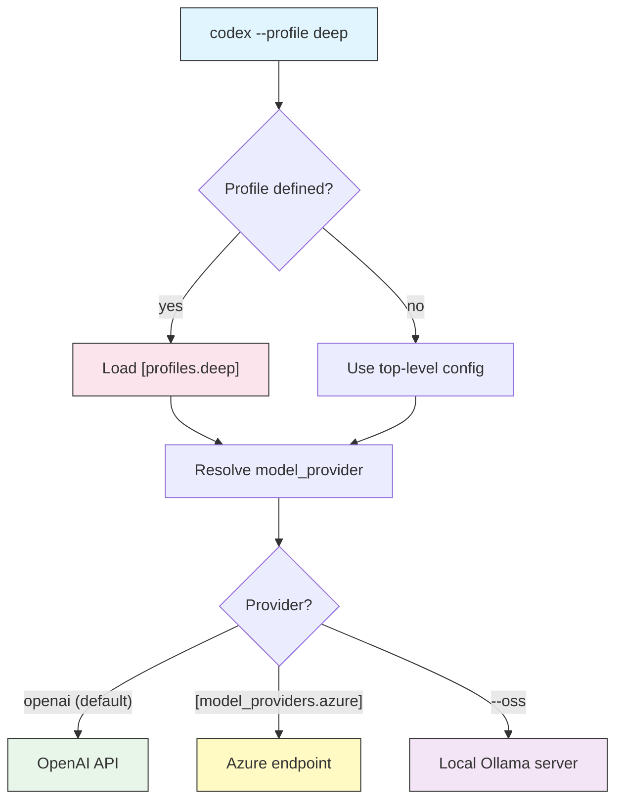

# Profiles & Model Providers

## Overview

A **profile** is a named bundle of configuration in `config.toml`. Instead of
repeating `-c model=...`, `-c approval_policy=...`, and `-c sandbox_mode=...` on
every run, you define the combination once and switch to it with
`--profile NAME`. A **model provider** tells Codex *where* to send requests —
the default is OpenAI, but the same mechanism lets you point at Azure OpenAI, an
OpenAI-compatible gateway, or a local model server.

Together they turn Codex into a tool you can retune per task: a fast profile for
quick edits, a deep profile for hard problems, a locked-down profile for review,
and a local profile for offline or private work.

## Architecture



Selecting a profile loads its keys; a profile (or the top level) names a
provider; the provider decides which endpoint actually serves the model.

## Profiles

Define a profile as a `[profiles.NAME]` table. Any top-level key can go inside
it — `model`, `model_provider`, `approval_policy`, `sandbox_mode`,
`model_reasoning_effort`, and so on.

```toml
[profiles.deep]
model = "gpt-5-codex"
model_reasoning_effort = "high"
approval_policy = "on-request"
sandbox_mode = "workspace-write"

[profiles.fast]
model = "gpt-5"
model_reasoning_effort = "low"
```

### Activating a profile

```bash
# One run, deep profile
codex --profile deep "refactor the auth module for testability"

# Short form
codex -p fast "rename this variable everywhere"

# In headless mode
codex exec --profile readonly-review "review the staged diff"
```

### Making a profile the default

Set `profile` at the top level of `config.toml` and every run uses it unless you
override with `--profile`.

```toml
profile = "deep"   # default profile for all sessions
```

### Precedence

When the same key is set in more than one place, the most specific wins:

| Priority | Source |
|----------|--------|
| 1 (highest) | `-c key=value` and explicit flags (`--model`, `--sandbox`, …) |
| 2 | The active `--profile` (or top-level `profile`) |
| 3 | Top-level keys in `config.toml` |
| 4 (lowest) | Built-in defaults |

## Model Providers

By default Codex talks to OpenAI. A `[model_providers.NAME]` table defines an
alternative endpoint, and `model_provider = "NAME"` selects it.

| Key | Purpose |
|-----|---------|
| `name` | Human-readable label |
| `base_url` | The API base URL to send requests to |
| `env_key` | Name of the environment variable holding the API key |
| `wire_api` | Protocol: `"responses"` or `"chat"` |
| `query_params` | Optional query parameters (e.g. Azure `api-version`) |

```toml
# OpenAI-compatible gateway
[model_providers.gateway]
name = "Internal Gateway"
base_url = "https://llm.example.com/v1"
env_key = "GATEWAY_API_KEY"
wire_api = "chat"

# Azure OpenAI
[model_providers.azure]
name = "Azure OpenAI"
base_url = "https://my-resource.openai.azure.com/openai"
env_key = "AZURE_OPENAI_API_KEY"
wire_api = "responses"
query_params = { api-version = "2025-04-01-preview" }
```

Point a profile (or the top level) at a provider:

```toml
[profiles.corp]
model = "gpt-5"
model_provider = "gateway"
```

The key named by `env_key` must exist in your environment:

```bash
export GATEWAY_API_KEY="..."
codex --profile corp "explain this service"
```

## Local & Open-Source Models

`codex --oss` runs against a local [Ollama](https://ollama.com) server instead
of a hosted API — useful for offline work or code that cannot leave your
machine.

```bash
# Use the default local OSS model
codex --oss "summarize this file"

# Pick a specific local model
codex --oss -m gpt-oss:20b "draft a unit test for parse()"
```

Because inference is local, no API key is needed and requests never leave the
host. Capability depends on the local model, so pair `--oss` with a modest task
or a `local` profile.

## Practical Examples

### 1. A fast profile for small edits

```toml
[profiles.fast]
model = "gpt-5"
model_reasoning_effort = "low"
approval_policy = "on-request"
sandbox_mode = "workspace-write"
```

```bash
codex -p fast "fix the typo in the README title"
```

### 2. A deep profile for hard problems

```toml
[profiles.deep]
model = "gpt-5-codex"
model_reasoning_effort = "high"
sandbox_mode = "workspace-write"
```

```bash
codex -p deep "find and fix the race condition in the job queue"
```

### 3. A read-only review profile

```toml
[profiles.readonly-review]
model = "gpt-5-codex"
approval_policy = "on-request"
sandbox_mode = "read-only"
```

```bash
git diff | codex exec -p readonly-review "review this diff"
```

### 4. A local, private profile

```toml
[profiles.local]
model_provider = "oss"
model = "gpt-oss:20b"
sandbox_mode = "workspace-write"
```

```bash
codex --oss -p local "add logging to the parser"
```

### 5. Overriding one key of a profile

Flags still win over the profile, so you can borrow a profile and change one
thing.

```bash
codex -p deep --sandbox read-only "just analyze, do not edit"
```

The complete, commented file backing these examples is
[`profiles-config.toml`](profiles-config.toml).

## Best Practices

| Do | Don't |
|----|-------|
| Name profiles by intent (`fast`, `deep`, `review`) | Name them after models (`gpt5a`, `gpt5b`) |
| Store provider keys in env vars via `env_key` | Hardcode API keys in `config.toml` |
| Set a sensible top-level `profile` default | Retype the same `-c` flags every run |
| Give review profiles a `read-only` sandbox | Reuse a full-access profile for analysis |
| Use `--oss` for code that must stay local | Send private code to a hosted model without approval |

> **Tip**: Profiles compose with everything else — a CI job can pin behavior
> with `codex exec --profile ci-review`, guaranteeing the same model, sandbox,
> and approval policy on every runner.

## Troubleshooting

### Profile has no effect

- Check the header spelling: `[profiles.deep]`, and activate with the exact name (`--profile deep`).
- Remember flags override profiles — an explicit `--model`/`--sandbox` wins.

### Provider authentication fails

- The variable named by `env_key` must be exported in the current shell.
- Verify `base_url` and `wire_api` match what the provider expects (`chat` vs `responses`).
- For Azure, confirm the `query_params` `api-version` is valid for your resource.

### `--oss` cannot connect

- Ensure Ollama is installed and running, and the model has been pulled (`ollama pull gpt-oss:20b`).
- Confirm the local server is reachable on its default port.

### Wrong model is used

- Print effective settings with `codex --profile NAME` then `/status` in the TUI.
- Check precedence: a top-level key or a `-c` flag may be overriding the profile.

## Related guides

- [Configuration](../04-config/) — every key a profile can hold
- [Automation & CI](../07-automation/) — pinning profiles for reproducible runs
- [Approvals & Sandboxing](../05-approvals-sandbox/) — the safety keys profiles bundle
- [CLI Reference](../10-cli/) — `--profile`, `--oss`, `-c`, and `--model`
- [Getting Started](../01-getting-started/) — first-run basics

---

**Last Updated**: September 28, 2026
**Tool**: OpenAI Codex CLI (`@openai/codex`)
**Compatible Models**: GPT-5-Codex (default), GPT-5, plus OpenAI-compatible and local (OSS) models
*Part of the [codexhowto](../) guide series*
