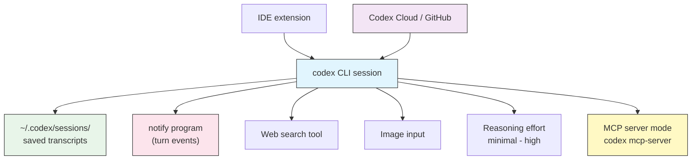

# Advanced Features

## Overview

Once you are comfortable with the basics — running `codex`, writing an `AGENTS.md`, and choosing an approval mode — Codex CLI has a second layer of features that turn it from a chat tool into a durable part of your workflow. This module covers the ones you reach for once the novelty wears off:

- **Sessions and resume** — pick up a conversation days later instead of starting over.
- **The `notify` hook** — run your own program when Codex finishes a turn or needs you.
- **Web search** — let Codex pull current information into a task.
- **Image input** — hand Codex a screenshot or mockup.
- **Reasoning effort** — trade speed for depth on hard problems.
- **The IDE extension** — the same agent, inside your editor.
- **Codex Cloud** — delegate long tasks to a hosted sandbox that opens pull requests.
- **GitHub review** — `@codex` on your pull requests.
- **MCP server mode** — let other agents drive Codex.

Each is independent; adopt them one at a time.

## Architecture



Codex reads and writes everything through the `~/.codex/` home directory, so these features share one source of truth: your config, your `AGENTS.md`, and your session history.

## Sessions and resume

Every conversation is written to disk under `~/.codex/sessions/` as it happens. That means you can close your terminal, reboot, and come back to exactly where you left off.

| Action | Command |
|--------|---------|
| Resume the most recent session | `codex resume --last` |
| Pick a session from a list | `codex resume` |
| Resume a specific session | `codex resume <SESSION_ID>` |
| Start a fresh conversation (in the TUI) | `/new` |
| Shrink a long conversation to reclaim context | `/compact` |

`codex resume` (no argument) opens an interactive picker showing recent sessions with their working directory and first prompt, so you can find the right one by sight.

> **Tip**: When a session gets long and Codex starts to feel forgetful, run `/compact`. It summarizes the conversation so far into a compact form, freeing context window space while keeping the important decisions. Use `/new` instead when you are switching to an unrelated task.

## The `notify` hook

`notify` is the closest thing Codex CLI has to an event hook. You register an external program in `config.toml`, and Codex runs it when notable events occur — most usefully when a turn completes or when Codex is blocked waiting for your approval.

```toml
# ~/.codex/config.toml
notify = ["bash", "/home/you/.codex/notify.sh"]
```

Codex invokes the program and passes a JSON payload describing the event (as an argument and/or on stdin). Your script decides what to do with it — post to Slack, ring a bell, send a desktop notification, or append to a log.

This is how you stop babysitting a long-running task: kick it off, switch windows, and let `notify` tell you when Codex needs you back. See [`notify.sh`](notify.sh) in this folder for a ready-to-use example.

> **Note**: `notify` runs on your machine with your permissions, outside the sandbox. Keep the script small and audited — treat it like any other shell hook.

## Web search

By default Codex reasons from your code and its training. Turn on web search when a task needs current information — a new library version, an error message you are pasting in, an API that changed.

```toml
# ~/.codex/config.toml
[tools]
web_search = true
```

Or enable it per run with the flag:

```bash
codex --search "check whether our pinned axios version has known CVEs"
```

With search on, Codex can fetch pages and cite what it found. Leave it off for offline or air-gapped work.

## Image input

Codex is multimodal. Attach a screenshot, a design mockup, or a photo of a whiteboard and ask Codex to work from it.

```bash
# Attach a screenshot of a failing UI
codex --image ./bug-screenshot.png "the button overlaps the footer on mobile — fix the CSS"

# Short flag, multiple images
codex -i mockup-1.png -i mockup-2.png "build a React component matching these two states"
```

This is especially good for front-end work ("match this design"), reproducing a visual bug, or reading an error shown in a screenshot instead of retyping it.

## Reasoning effort

Codex's models support adaptive reasoning. Higher effort means the model thinks longer before acting — better on gnarly problems, slower and more expensive on simple ones.

| Level | Use for |
|-------|---------|
| `minimal` | Trivial edits, formatting, quick lookups |
| `low` | Routine changes with a clear path |
| `medium` | Everyday feature work (a good default) |
| `high` | Architecture, tricky debugging, subtle refactors |

Set it interactively with `/model`, or persist it in config:

```toml
# ~/.codex/config.toml
model = "gpt-5-codex"
model_reasoning_effort = "high"
```

> **Tip**: Don't leave `high` on for everything. It burns tokens and time on tasks that don't need it. Bump it up for the hard part of a session, then drop back down.

## The IDE extension

There is an official Codex extension for VS Code (and VS Code forks such as Cursor). It runs the same agent you use in the terminal, inside your editor, with inline diffs and one-click approvals.

The extension shares your `~/.codex/` configuration — the same `config.toml`, the same profiles, and the same `AGENTS.md` files. Anything you learn here about approvals, sandboxing, and project memory carries over unchanged. Install it from your editor's extension marketplace and sign in the same way (`codex login`).

## Codex Cloud

Codex Cloud lets you delegate a task to a hosted environment instead of running it locally. You describe the work, Codex runs it in a cloud sandbox, and it can open a pull request with the result — useful for long or parallel tasks you don't want tying up your machine.

You start cloud tasks from the Codex web experience (chatgpt.com/codex) or hand off from the CLI, and pick the results back up as branches or PRs. Exact commands and availability move quickly, so treat this section as conceptual: the mental model is "same agent, someone else's machine, ends in a PR."

## GitHub code review

Codex integrates with GitHub as a reviewer. Once the Codex GitHub app is installed on a repository, mentioning `@codex` on a pull request asks it to review the diff and leave comments. This complements the local `/review` command and the CI recipe in [Automation](../07-automation/) — use local review while you work, and the bot as a second pass on the PR.

## MCP server mode

Codex is usually an MCP *client* (it calls out to MCP servers — see [MCP](../06-mcp/)). It can also run as an MCP *server*, so another agent or tool can drive Codex as a callable tool:

```bash
codex mcp-server
```

This exposes Codex over stdio using the Model Context Protocol. Use it when you are building a larger multi-agent system and want Codex to be one of the workers.

## Practical examples

### 1. Resume yesterday's work

```bash
# Come back to the most recent session
codex resume --last

# Or browse and pick
codex resume
```

Codex reloads the full conversation, including the files it touched and the decisions you made, so you can continue mid-refactor.

### 2. Get pinged when a long task finishes

```toml
# ~/.codex/config.toml
notify = ["bash", "/home/you/.codex/notify.sh"]
```

Start a big task, then walk away. When Codex finishes the turn or hits an approval prompt, `notify.sh` fires a desktop notification and you come back only when needed.

### 3. Research a current issue mid-task

```bash
codex --search "does Next.js 15 still support the pages router, and what's the migration note?"
```

Web search lets Codex ground its answer in current docs instead of guessing from training data.

### 4. Fix a visual bug from a screenshot

```bash
codex --image ./mobile-overlap.png \
  "on screens under 400px the CTA overlaps the footer — find and fix the responsive CSS"
```

### 5. Turn up reasoning for the hard part

```bash
# Deep session for a tricky concurrency bug
codex -c model_reasoning_effort="high" "trace this deadlock between the worker pool and the DB connection cache"
```

### 6. Reclaim context on a marathon session

```text
/compact
```

Codex summarizes everything so far, freeing space to keep going without losing the thread.

### 7. Expose Codex to another agent

```bash
# Let an orchestrator call Codex as an MCP tool
codex mcp-server
```

## Best practices

| Do | Don't |
|----|-------|
| Use `codex resume` to keep long work in one thread | Start a new session for every small follow-up |
| Run `/compact` when context fills up | Let a session bloat until Codex forgets early decisions |
| Keep `notify` scripts small and audited | Put secrets or heavy logic in the notify hook |
| Enable web search when a task needs current facts | Leave search on for offline or sensitive work |
| Raise reasoning effort for the hard part, then lower it | Run everything at `high` and pay for it |
| Share one `~/.codex/` config across CLI and IDE | Maintain divergent settings per tool |

## Troubleshooting

### `codex resume` shows no sessions

**Solutions:**
- Confirm sessions exist under `~/.codex/sessions/` (or `$CODEX_HOME/sessions/` if you set `CODEX_HOME`).
- You may be in a different user account or a container without the mounted home directory.

### The notify program never runs

**Solutions:**
- Check the `notify` array in `config.toml` points at an existing, executable script (`chmod +x`).
- Make sure the interpreter is correct: `notify = ["bash", "/abs/path/notify.sh"]`.
- Test the script by hand with a sample JSON argument to confirm it doesn't error.

### Web search returns nothing

**Solutions:**
- Verify `web_search = true` under `[tools]`, or pass `--search`.
- Network must be reachable — a `read-only` sandbox or an offline machine will block it.

### Image not recognized

**Solutions:**
- Pass a real path to a supported image format (PNG/JPEG).
- Use `--image`/`-i` once per file; confirm the file exists relative to your working directory.

## Related guides

- [Configuration](../04-config/) - the `config.toml` keys behind these features
- [Approvals & Sandboxing](../05-approvals-sandbox/) - what web search and commands are allowed to do
- [MCP](../06-mcp/) - Codex as an MCP client and server
- [Automation & CI](../07-automation/) - headless runs and GitHub review in CI
- [Profiles & Model Providers](../08-profiles/) - reasoning effort per profile
- [CLI Reference](../10-cli/) - every flag and subcommand

---

**Last Updated**: September 28, 2026
**Tool**: OpenAI Codex CLI (`@openai/codex`)
**Compatible Models**: GPT-5-Codex (default), GPT-5, plus OpenAI-compatible and local (OSS) models
*Part of the [codexhowto](../) guide series*
