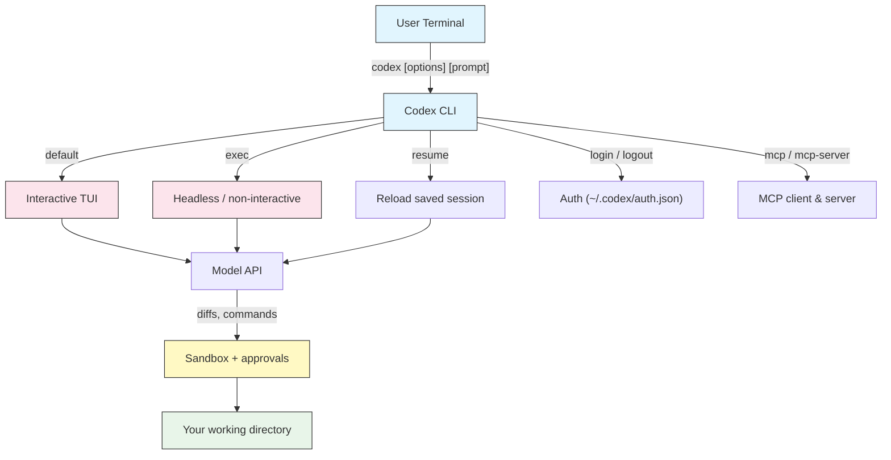
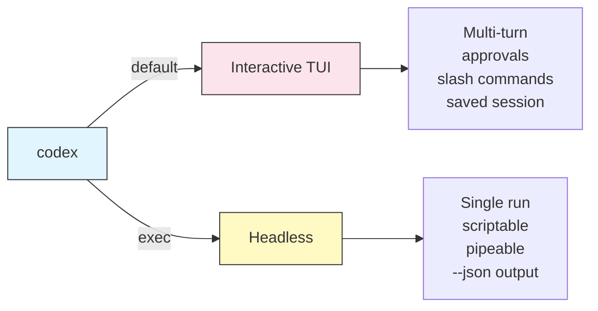

# CLI Reference

## Overview

The `codex` command is the entry point to Codex CLI — OpenAI's open-source terminal coding agent. It runs an interactive TUI by default, but the same binary drives non-interactive automation, session management, authentication, and MCP integration. This module is the complete command-line reference: every subcommand, flag, config key, and environment variable in one place.

## Architecture



## Installation and upgrade

Codex CLI is distributed on npm and Homebrew.

```bash
# Install with npm (Node.js 18+)
npm install -g @openai/codex

# Or with Homebrew (macOS / Linux)
brew install codex

# Upgrade to the latest release
npm install -g @openai/codex@latest
brew upgrade codex

# Verify the install
codex --version
```

> **Note**: On Windows, the OS-level sandbox is limited. Running Codex inside WSL2 gives you the full Linux sandbox (Landlock + seccomp); native Windows works but leans more on approval prompts. See [Approvals & Sandboxing](../05-approvals-sandbox/).

## Subcommands

| Command | Description | Example |
|---------|-------------|---------|
| `codex` | Start the interactive TUI | `codex` |
| `codex "prompt"` | Start the TUI with an initial prompt | `codex "explain this repo"` |
| `codex exec "prompt"` | Non-interactive (headless) run; prints result and exits | `codex exec "add tests for utils.ts"` |
| `codex resume` | Open a picker of saved sessions | `codex resume` |
| `codex resume --last` | Resume the most recent session | `codex resume --last` |
| `codex resume <id>` | Resume a specific session by ID | `codex resume 01J9...` |
| `codex login` | Sign in with ChatGPT (opens browser) | `codex login` |
| `codex login --api-key <key>` | Sign in with an API key | `codex login --api-key "$OPENAI_API_KEY"` |
| `codex login status` | Show current auth status | `codex login status` |
| `codex logout` | Sign out and clear credentials | `codex logout` |
| `codex mcp` | Manage MCP servers (add / list) | `codex mcp list` |
| `codex mcp-server` | Run Codex itself as an MCP server (stdio) | `codex mcp-server` |
| `codex apply` | Apply the latest generated diff/patch to your working tree | `codex apply` |
| `codex completion <shell>` | Print shell completion script | `codex completion zsh` |

### Interactive vs headless



**Interactive** (default) — a full-screen terminal UI with slash commands, approval prompts, and inline diffs:

```bash
codex
codex "walk me through the authentication flow"
```

**Headless** (`codex exec`) — one prompt, runs to completion, no interactive approvals. Built for scripts and CI:

```bash
codex exec "run the linter and fix every warning"
git diff | codex exec "review this diff for security issues"
```

## Core flags

| Flag | Alias | Description | Example |
|------|-------|-------------|---------|
| `--model <name>` | `-m` | Choose the model | `codex -m gpt-5` |
| `--profile <name>` | `-p` | Use a config profile | `codex -p deep` |
| `--ask-for-approval <policy>` | `-a` | Approval policy | `codex -a on-request` |
| `--sandbox <mode>` | `-s` | Sandbox mode | `codex -s read-only` |
| `--full-auto` | | `workspace-write` sandbox + low-friction approvals | `codex --full-auto` |
| `--dangerously-bypass-approvals-and-sandbox` | | No approvals, no sandbox (containers/CI only) | `codex --dangerously-bypass-approvals-and-sandbox` |
| `--cd <dir>` | `-C` | Set the working directory | `codex -C ./service` |
| `--config key=value` | `-c` | Override any config key | `codex -c model_reasoning_effort="high"` |
| `--image <path>` | `-i` | Attach an image to the prompt | `codex -i ui.png "match this"` |
| `--oss` | | Use a local (Ollama) model | `codex --oss -m gpt-oss` |
| `--search` | | Enable web search for this run | `codex --search "latest API change"` |
| `--version` | | Print version and exit | `codex --version` |
| `--help` | `-h` | Show help | `codex --help` |

### Approval policy values (`-a`)

| Value | Behavior |
|-------|----------|
| `untrusted` | Approve most commands; only a safe allowlist runs automatically |
| `on-failure` | Run in the sandbox; ask only when a command fails and needs escalation |
| `on-request` | The model asks for more access when it decides it needs it (balanced default) |
| `never` | Never ask; fully autonomous within whatever sandbox is set |

### Sandbox mode values (`-s`)

| Value | Behavior |
|-------|----------|
| `read-only` | Read files only — no writes, no network |
| `workspace-write` | Read/write in the working dir and temp; network off by default |
| `danger-full-access` | No sandboxing at all |

See [Approvals & Sandboxing](../05-approvals-sandbox/) for how the two axes combine and which pairs to use.

### `-c` / `--config` overrides

The `-c` flag sets any `config.toml` key for a single run, using dotted paths for nested tables. Values are TOML, so quote strings.

```bash
# Override the model and reasoning effort
codex -c model="gpt-5" -c model_reasoning_effort="high" "design the cache layer"

# Force a read-only sandbox for a review
codex -c 'sandbox_mode="read-only"' "audit this module"

# Set a nested table key
codex -c 'sandbox_workspace_write.network_access=true' "install and run the e2e suite"
```

**Precedence** (highest wins): `-c` and command-line flags → active `--profile` → top-level `config.toml` → built-in defaults.

## Configuration keys

These live in `~/.codex/config.toml` (or `$CODEX_HOME/config.toml`). Full detail is in [Configuration](../04-config/); this is the quick index.

| Key | Purpose |
|-----|---------|
| `model` | Model to use (e.g. `"gpt-5-codex"`, `"gpt-5"`) |
| `model_provider` | Which provider to route to (default `"openai"`) |
| `model_reasoning_effort` | `"minimal"` \| `"low"` \| `"medium"` \| `"high"` |
| `approval_policy` | `"untrusted"` \| `"on-failure"` \| `"on-request"` \| `"never"` |
| `sandbox_mode` | `"read-only"` \| `"workspace-write"` \| `"danger-full-access"` |
| `[sandbox_workspace_write]` | `network_access`, `writable_roots`, `exclude_tmpdir_env_var`, `exclude_slash_tmp` |
| `[profiles.<name>]` | A named bundle of the settings above |
| `[model_providers.<name>]` | Custom/OpenAI-compatible provider (`base_url`, `env_key`, `wire_api`) |
| `[mcp_servers.<name>]` | MCP server definition (`command`, `args`, `env`) |
| `notify` | External program run on turn events |
| `[tools] web_search` | Enable web search (`true`/`false`) |
| `disable_response_storage` | Opt out of server-side response storage |
| `project_doc_max_bytes` | Cap on how much `AGENTS.md` is read |

## Environment variables

| Variable | Description |
|----------|-------------|
| `OPENAI_API_KEY` | API key used for API-key authentication and in CI |
| `CODEX_HOME` | Override the `~/.codex` home directory (config, sessions, auth) |
| `RUST_LOG` | Log verbosity for debugging (e.g. `RUST_LOG=debug`) |

Provider API keys are referenced by name through `env_key` in `[model_providers.<name>]`, so a custom provider might read, for example, `AZURE_OPENAI_API_KEY` from your environment.

```bash
# Point Codex at a different home (useful for isolated setups or CI)
export CODEX_HOME="$PWD/.codex-ci"

# API-key auth for headless use
export OPENAI_API_KEY="sk-..."
codex exec "run the test suite and summarize failures"
```

## Authentication

Codex supports two auth methods, stored in `~/.codex/auth.json`:

| Method | How | Best for |
|--------|-----|----------|
| ChatGPT sign-in | `codex login` (opens a browser) | Interactive local use on a paid ChatGPT plan |
| API key | `codex login --api-key "$OPENAI_API_KEY"` or `OPENAI_API_KEY` env | CI, servers, scripting |

```bash
# Interactive sign-in
codex login

# Check who you are signed in as
codex login status

# Sign out
codex logout
```

> **Note**: Use ChatGPT sign-in for daily interactive work if your plan includes Codex usage. Use API-key auth (via `OPENAI_API_KEY`) for anything non-interactive, since a headless run can't complete a browser flow.

## Common flag combinations

| Use case | Command |
|----------|---------|
| Read-only code review | `codex -s read-only -a on-request "review this module"` |
| Everyday coding (balanced) | `codex -a on-request -s workspace-write "implement the feature"` |
| Hands-off local run | `codex --full-auto "fix all lint errors"` |
| Deep reasoning on a hard bug | `codex -c model_reasoning_effort="high" "trace this deadlock"` |
| Headless CI review | `codex exec -s read-only "review the staged diff"` |
| Disposable container / CI, no prompts | `codex exec --dangerously-bypass-approvals-and-sandbox "..."` |
| Local/offline model | `codex --oss -m gpt-oss "refactor this file"` |
| Work in another directory | `codex -C ./services/api "add request logging"` |
| Structured output for scripts | `codex exec --json "list the public functions"` |

## Headless output for scripts

`codex exec` is designed to be wired into other tools.

```bash
# Structured JSONL events for parsing
codex exec --json "summarize the changes in this PR"

# Write only the final assistant message to a file
codex exec --output-last-message result.txt "generate release notes from git log"

# Pipe input in
cat error.log | codex exec "group these errors and suggest the top fix"
```

`codex exec` exits non-zero when the run fails, so it works as a gate in CI. See [Automation & CI](../07-automation/) for full pipelines.

## Quick reference

### Most common commands

```bash
# Interactive session
codex

# One-off headless task
codex exec "your task"

# Resume where you left off
codex resume --last

# Sign in
codex login

# Read-only review
codex -s read-only "review this code"
```

## Troubleshooting

### `codex: command not found`

**Solutions:**
- Reinstall: `npm install -g @openai/codex` (or `brew install codex`).
- Ensure your npm global bin directory is on `PATH`.
- Restart the shell after installing.

### Authentication failed

**Solutions:**
- Run `codex login status` to see current state.
- For CI, confirm `OPENAI_API_KEY` is set and valid (`codex login --api-key "$OPENAI_API_KEY"`).
- Delete `~/.codex/auth.json` and sign in again if credentials are stale.

### Commands are blocked or keep asking for approval

**Solutions:**
- You are likely in `read-only` or `untrusted`. Choose a looser pair, e.g. `-a on-request -s workspace-write`.
- Network-dependent commands need `sandbox_workspace_write.network_access=true`.
- See [Approvals & Sandboxing](../05-approvals-sandbox/).

### Config change has no effect

**Solutions:**
- Remember precedence: a `-c` flag or an active `--profile` overrides top-level `config.toml`.
- Check TOML syntax — strings must be quoted, tables use `[section]` headers.
- Confirm you edited the file at `~/.codex/config.toml` (or `$CODEX_HOME/config.toml`).

## Related guides

- [Getting Started](../01-getting-started/) - install, login, first run
- [Slash Commands & Custom Prompts](../02-slash-commands/) - in-session commands
- [AGENTS.md](../03-agents-md/) - project memory
- [Configuration](../04-config/) - full `config.toml` reference
- [Approvals & Sandboxing](../05-approvals-sandbox/) - the safety model
- [Automation & CI](../07-automation/) - `codex exec` in pipelines

---

**Last Updated**: September 28, 2026
**Tool**: OpenAI Codex CLI (`@openai/codex`)
**Compatible Models**: GPT-5-Codex (default), GPT-5, plus OpenAI-compatible and local (OSS) models
*Part of the [codexhowto](../) guide series*
