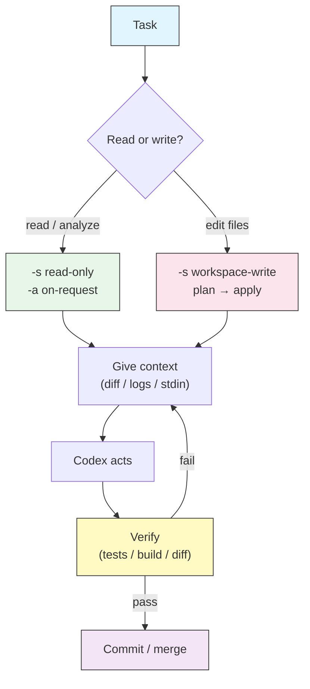

# Recipes & Workflows

## Overview

The earlier modules teach features one at a time. Real work is never one
feature — it is a *sequence*: pick a model and reasoning effort, choose an
approval policy and sandbox that fit the risk, feed Codex the right context, let
it act, then verify. This lesson is a cookbook of end-to-end **recipes** that
wire those pieces together for tasks you actually do: onboarding to a new repo,
running a TDD loop, gating a pull request in CI, driving a multi-file codemod,
debugging a stack trace, generating docstrings in bulk, and triaging a pile of
logs.

Each recipe states the **goal**, the exact **command** (with the approval and
sandbox flags that make it safe), the **prompt** to hand Codex, and what to
**verify** when it finishes. Treat them as starting points — copy one, adjust
the paths and phrasing, and make it yours.

## Architecture



Every recipe below is a walk through this same loop. The two decisions that
change per task are **how much Codex may touch** (sandbox) and **when it must
ask** (approval policy) — see [Approvals & Sandboxing](../05-approvals-sandbox/)
for the full model.

## How to read a recipe

Each recipe has four parts:

| Part | What it answers |
|------|-----------------|
| **Goal** | What you want at the end |
| **Command** | How to launch Codex with the right safety flags |
| **Prompt** | The instruction that goes to the model |
| **Verify** | How you confirm it actually worked |

Never skip **Verify**. Codex reports what it *intended* to do; you confirm what
it *did* with tests, a build, or a diff you read yourself.

## Recipe 1 — Onboard to an unfamiliar repo

**Goal**: understand a codebase you have never seen without changing a single
file.

**Command** — keep it strictly read-only so a tour can never edit anything:

```bash
codex -s read-only -a on-request \
  "Give me a tour of this repository."
```

**Prompt** — ask for a map, not a novel:

```text
You are onboarding me to this repo. Produce:
1. A one-paragraph summary of what it does.
2. The top-level directory layout with a one-line purpose for each.
3. The main entry points and how a request/command flows through them.
4. Build, test, and run commands (read them from config files, do not guess).
5. The five files worth reading first, and why.
Do not modify anything.
```

**Verify**: spot-check two or three claims against the real files. Confirm the
build/test commands exist in `package.json`, `Makefile`, `pyproject.toml`, etc.
For a repeatable version, see [`scripts/onboarding-tour.sh`](scripts/onboarding-tour.sh).

> **Tip**: capture the tour into an `AGENTS.md` so future sessions start with
> the context instead of rediscovering it. See [AGENTS.md](../03-agents-md/).

## Recipe 2 — TDD loop: red → green → verify

**Goal**: implement a feature test-first, letting Codex write the failing test,
make it pass, and prove it.

**Command** — Codex needs to edit and run tests, so use `workspace-write`; keep
approvals on request so it pauses before anything surprising:

```bash
codex -s workspace-write -a on-request \
  "Add input validation to parseConfig() using TDD."
```

**Prompt** — force the order explicitly so it does not skip to the answer:

```text
Work test-first, one step at a time:
1. Write a failing test for parseConfig() rejecting an empty path with a
   clear error. Run the suite and show me it fails for the right reason.
2. Implement the minimal change to make that test pass. Run the suite again.
3. Do not touch unrelated code. Stop after the suite is green.
```

**Verify**: run the test suite yourself (`npm test`, `pytest`, `go test ./...`).
Read the diff — the change should be small and confined to `parseConfig` and its
test. If the test passed on the first run, it was not actually failing first;
ask Codex to redo step 1.

## Recipe 3 — Automated code review in CI

**Goal**: review the diff on every pull request and fail the check on a blocking
bug, with no human at the keyboard.

**Command** — headless `codex exec`, read-only (a review never needs to write),
API-key auth because CI has no browser:

```bash
git fetch origin "$BASE_REF"
git diff "origin/$BASE_REF"... \
  | codex exec --sandbox read-only \
    "Review this diff. Report findings grouped by severity (blocking / warning
     / nit). If any finding is blocking, end your reply with the line BLOCKING."
```

**Prompt gate** — turn the review into a real pass/fail with the exit code:

```bash
OUT=$(git diff "origin/$BASE_REF"... | codex exec --sandbox read-only \
  "Review this diff. End with BLOCKING if you find a release-blocking bug.")
echo "$OUT"
echo "$OUT" | grep -q '^BLOCKING' && { echo "Review failed"; exit 1; } || true
```

**Verify**: run it once on a PR you know is clean (expect exit 0) and once on a
PR with a planted bug (expect exit 1). This recipe is the interactive cousin of
the pipeline in [Automation & CI](../07-automation/) — reuse
[`../07-automation/scripts/codex-review.yml`](../07-automation/scripts/codex-review.yml)
for the full GitHub Actions job.

## Recipe 4 — Large multi-file refactor / codemod

**Goal**: apply the same mechanical change across many files (rename an API,
swap a logging call, migrate an import) without a runaway edit.

**Two phases — plan read-only first, then apply.** This is the safety pattern
for anything with a wide blast radius.

Phase 1, plan (no writes):

```bash
codex exec --sandbox read-only \
  "Find every call site of the old logger \`log.warn(msg)\` and list the files
   and line numbers. Propose the exact replacement \`logger.warning(msg)\`.
   Output a plan only — do not edit anything."
```

Phase 2, apply (after you have read the plan):

```bash
codex -s workspace-write -a on-request \
  "Apply the logger migration from the plan. Change only the call sites listed.
   After editing, run the test suite and report the result."
```

**Verify**: `git diff --stat` to confirm the change count matches the plan;
`grep -rn 'log.warn(' .` should return nothing; the test suite must still pass.
The runnable two-phase wrapper is
[`scripts/codemod-plan-then-apply.sh`](scripts/codemod-plan-then-apply.sh).

> **Warning**: never start a wide codemod with `--dangerously-bypass-approvals-and-sandbox`.
> A bad pattern applied everywhere at once is far harder to undo than to prevent.

## Recipe 5 — Debug a failing test from a stack trace

**Goal**: go from a red test and a stack trace to a fix and a green suite.

**Command** — pipe the failure in as context, let Codex edit and re-run:

```bash
npm test 2>&1 | tail -n 40 \
  | codex exec -s workspace-write -a on-request \
    "This is the failing test output. Find the root cause, fix it, and re-run
     the failing test to confirm it passes. Do not change unrelated tests."
```

**Prompt add-on** — when the cause is not obvious, ask for diagnosis before the
fix so you can sanity-check the theory:

```text
Before editing, state in two sentences what you believe the root cause is and
which file it lives in. Then make the smallest fix and re-run the test.
```

**Verify**: run the full suite, not just the one test — a fix that breaks
neighbors is not a fix. Read the diff to confirm it addresses the cause, not the
symptom (e.g. it fixed the off-by-one, not just loosened the assertion).

## Recipe 6 — Bulk docstring / comment generation

**Goal**: add or repair docstrings across a package without changing behavior.

**Command** — loop over the files and run one focused edit per file so each
change stays small and reviewable:

```bash
for f in src/**/*.py; do
  echo "== $f =="
  codex exec -s workspace-write -a on-request \
    "Add or fix docstrings in $f. Document parameters, returns, and raised
     errors. Do NOT change any executable code — comments and docstrings only."
done
```

**Verify**: `git diff` should touch only docstrings/comments — no logic lines.
Run the test suite to prove behavior is unchanged, and a linter (`ruff`,
`flake8`) to catch malformed docstrings. This mirrors the batch pattern in
[Automation & CI](../07-automation/); see
[`../07-automation/scripts/batch-docstrings.sh`](../07-automation/scripts/batch-docstrings.sh).

## Recipe 7 — Log / incident triage

**Goal**: turn a wall of error output into a ranked, deduplicated action list.

**Command** — read-only (you are analyzing, not fixing), pipe the log in,
capture the summary to a file:

```bash
tail -n 5000 /var/log/app/error.log \
  | codex exec --sandbox read-only --output-last-message triage.md \
    "Group these errors by root cause, collapse duplicates, and rank the top 5
     by impact. For each, give the likely cause and the first thing to check."
cat triage.md
```

**Verify**: open `triage.md` and confirm the top item matches the most frequent
or most severe error you can see in the raw log. Because the run is read-only,
it cannot touch production state — safe to run against live log files.

> **Tip**: for a recurring version, put this behind a cron job and mail the
> `--output-last-message` file to your on-call address, as in
> [Automation & CI](../07-automation/).

## Best practices

| Do | Don't |
|----|-------|
| Match the sandbox to the task: `read-only` to analyze, `workspace-write` to edit | Reach for `--dangerously-bypass-approvals-and-sandbox` because it is one flag shorter |
| Plan a wide change read-only before applying it | Let a codemod edit everywhere in one unreviewed pass |
| Feed context in via stdin (diffs, logs, traces) | Make Codex re-derive what you can just paste |
| Always verify with tests / build / a diff you read | Trust the model's summary of its own work |
| Keep each batch edit to one file and one concern | Ask for a sweeping change in a single vague prompt |
| Save hard-won context into `AGENTS.md` | Re-explain the repo every session |

## Troubleshooting

### Codex edited more than I asked

- The prompt was too broad or the sandbox too permissive. Re-run the plan phase
  read-only first (Recipe 4), and scope the prompt to named files.
- Use `git restore` / `git checkout --` to discard the extra edits, then retry
  with a tighter instruction.

### The run hangs in a script

- A headless `codex exec` hit an approval it cannot answer. Give it a sandbox +
  approval combination that completes unattended, or wrap it in `timeout`. See
  [Automation & CI](../07-automation/).

### The "failing" test passed on the first run (Recipe 2)

- It was never red, so the test proves nothing. Ask Codex to show the failing
  run explicitly before implementing, or write the test yourself first.

### Review recipe never fails the build (Recipe 3)

- The gate depends on an exact sentinel. Make the prompt end with a fixed token
  (`BLOCKING`) and match it with `grep -q '^BLOCKING'`, not fuzzy prose.

## Related guides

- [Approvals & Sandboxing](../05-approvals-sandbox/) — the sandbox/approval pairs every recipe leans on
- [Automation & CI](../07-automation/) — headless `codex exec`, exit-code gates, batch loops
- [Configuration](../04-config/) — set defaults so recipes need fewer flags
- [AGENTS.md](../03-agents-md/) — persist repo context between sessions
- [Profiles & Model Providers](../08-profiles/) — bundle a recipe's flags into a named profile
- [CLI Reference](../10-cli/) — every flag used above

---

**Last Updated**: September 28, 2026
**Tool**: OpenAI Codex CLI (`@openai/codex`)
**Compatible Models**: GPT-5-Codex (default), GPT-5, plus OpenAI-compatible and local (OSS) models
*Part of the [codexhowto](../) guide series*
