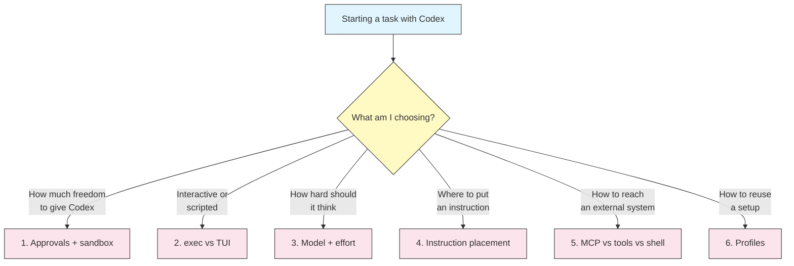
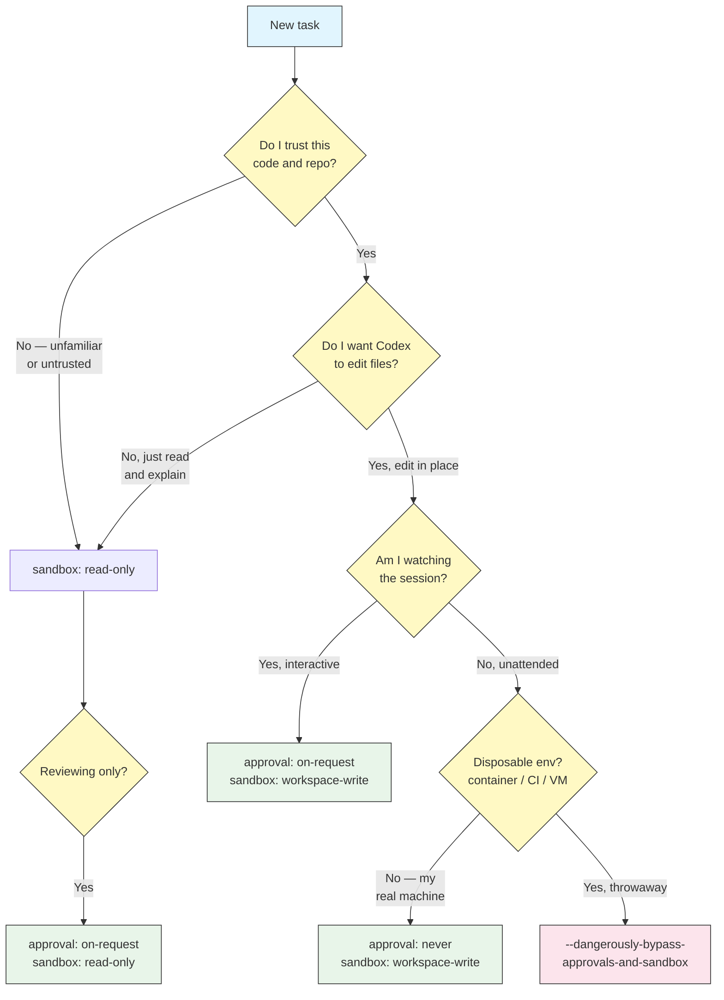
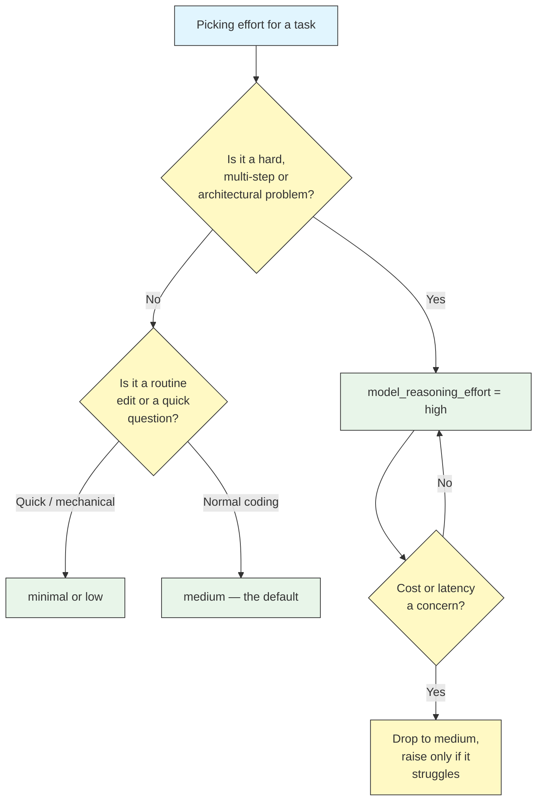
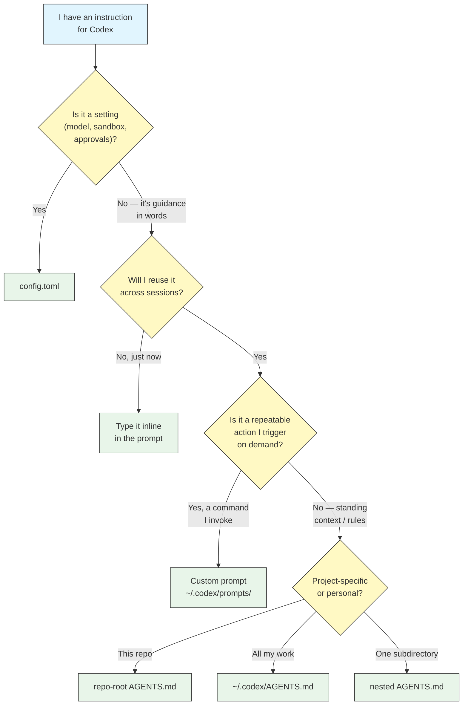
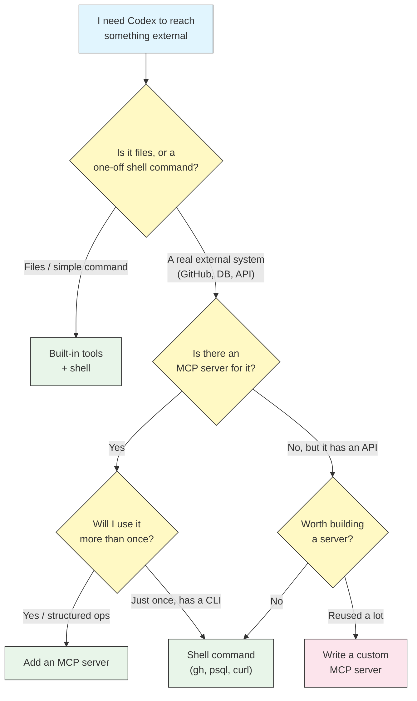
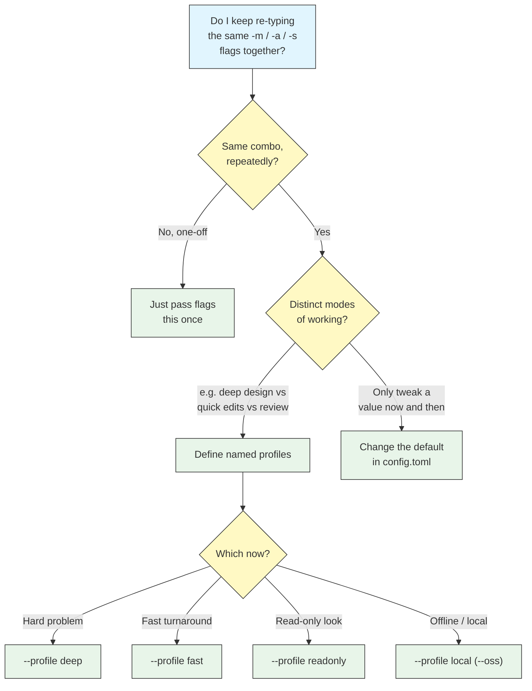

# Decision Guides

## Overview

The other modules tell you *what* each Codex CLI feature does. This one helps you decide *which* to reach for. Every setting Codex exposes — approval policy, sandbox mode, model, reasoning effort, where an instruction lives, whether to add an MCP server — is a trade-off between speed, cost, safety, and effort. Picking well is a skill, not a lookup.

Each guide below is a flowchart you can walk top-to-bottom, a table that names the trade-offs, and a **crisp default** for when you do not want to think about it. When in doubt, take the default — it is the choice that is right most of the time.

## The decisions



## 1. Which approval policy and sandbox mode?

This is the decision you make most often, and the one with the most at stake. The two axes are independent: `approval_policy` decides *when Codex asks you*, `sandbox_mode` decides *what the OS lets it do*. Start from how much you trust the code and how much you want to watch.



| Situation | Approval | Sandbox | Why |
|-----------|----------|---------|-----|
| Reviewing / exploring unfamiliar code | `on-request` | `read-only` | No writes possible; you still get asked before anything escalates |
| Everyday interactive coding | `on-request` | `workspace-write` | Codex edits freely in the project, asks before leaving the box |
| Trusted, well-scoped multi-step task | `on-failure` (`--full-auto`) | `workspace-write` | Fewer interruptions; prompts only on failure or escalation |
| Unattended run on your own machine | `never` | `workspace-write` | No prompts, but the OS still blocks writes outside the workspace and network by default |
| CI / container / throwaway VM | `never` | `danger-full-access` | Maximum autonomy where there is nothing to lose |

**Default: `on-request` + `workspace-write`.** It is the everyday combo — edits in place, network off unless a task needs it, and a prompt before anything crosses the workspace boundary. Only step down to `read-only` when you do not trust the code, and only step up to `danger-full-access` inside a disposable environment.

## 2. Headless `codex exec` or the interactive TUI?

The same engine runs both ways. The question is whether a human is in the loop to answer prompts and steer.

```mermaid
graph TD
    A["Running Codex"] --> B{"Will a human<br/>watch and answer<br/>prompts?"}
    B -->|"Yes"| C{"Do I need to<br/>iterate and course-<br/>correct as it works?"}
    C -->|"Yes"| D["Interactive TUI<br/>codex"]
    C -->|"One clear ask,<br/>then done"| E["codex \"prompt\"<br/>still interactive"]
    B -->|"No — script,<br/>CI, cron, pipe"| F{"Do I need the<br/>result as data?"}
    F -->|"Yes, parse it"| G["codex exec --json"]
    F -->|"Just run it"| H["codex exec \"prompt\""]

    style A fill:#e1f5fe,stroke:#333,color:#333
    style B fill:#fff9c4,stroke:#333,color:#333
    style C fill:#fff9c4,stroke:#333,color:#333
    style F fill:#fff9c4,stroke:#333,color:#333
    style D fill:#e8f5e9,stroke:#333,color:#333
    style E fill:#e8f5e9,stroke:#333,color:#333
    style G fill:#e8f5e9,stroke:#333,color:#333
    style H fill:#e8f5e9,stroke:#333,color:#333
```

| Signal | Use interactive TUI | Use `codex exec` |
|--------|---------------------|------------------|
| A human answers approval prompts | Yes | No — pair with `never` or `--full-auto` |
| Work is exploratory / needs steering | Yes | No |
| Runs in CI, a Git hook, or a pipe | No | Yes |
| Output feeds another tool | No | Yes, with `--json` |
| You want to see reasoning live | Yes | No (logs only) |

**Default: interactive `codex` for anything you are actively working on; `codex exec` the moment there is no human to answer a prompt.** If you reach for `exec`, remember it cannot pause for approvals usefully — set `never` or `--full-auto` so it does not stall waiting for input that never comes.

## 3. Which model and reasoning effort?

Higher reasoning effort means better handling of hard, multi-step problems — at the cost of more tokens and slower responses. Match the effort to the difficulty, not to the importance.



| Effort | Speed / cost | Best for |
|--------|--------------|----------|
| `minimal` | Fastest, cheapest | Renaming, formatting, one-line answers, trivial edits |
| `low` | Fast | Small, well-specified changes; quick lookups |
| `medium` | Balanced (default) | Everyday feature work, normal debugging |
| `high` | Slowest, most tokens | Architecture, tricky bugs, large refactors, ambiguous problems |

**Default: `medium`.** Reach for `high` when a task is genuinely hard or you have watched `medium` fail at it — not preemptively. Drop to `low`/`minimal` for mechanical work where thinking longer buys nothing. Set it per-session with `-c model_reasoning_effort=high`, or bake levels into [profiles](../08-profiles/) (a `deep` profile at `high`, a `fast` profile at `low`).

## 4. Where does this instruction belong?

You want Codex to "always run `make lint` before finishing," or "review this diff," or "use tabs not spaces." Whether that goes in `AGENTS.md`, a custom prompt, `config.toml`, or you just type it depends on how often you need it and what kind of thing it is.



| The instruction is... | Put it in | Example |
|-----------------------|-----------|---------|
| A knob Codex reads (model, effort, policy) | `config.toml` | `approval_policy = "on-request"` |
| Standing rules / project facts | `AGENTS.md` | "Build with `make`, tests live in `tests/`" |
| A personal rule across all repos | `~/.codex/AGENTS.md` | "Prefer explicit types; no one-letter vars" |
| A rule for one subtree only | nested `AGENTS.md` | API-only conventions in `src/api/AGENTS.md` |
| An action you invoke repeatedly | custom prompt | `/review`, `/commit`, `/onboard` |
| A one-off ask | inline in the prompt | "Also update the README while you're here" |

**Default: standing context goes in `AGENTS.md`, repeated actions become custom prompts, settings go in `config.toml`, everything else you just say.** If you find yourself typing the same paragraph every session, it belongs in `AGENTS.md`; if you type the same *request*, it belongs in a prompt.

## 5. MCP server, built-in tool, or shell command?

Codex can touch the outside world three ways. Reach for the simplest one that does the job.



| Need | Best fit | Why |
|------|----------|-----|
| Read/write/search files | Built-in tools | Already there, sandbox-aware |
| A quick one-off external action | Shell command | No setup; `gh`, `curl`, `psql` already exist |
| Repeated, structured access to a system | MCP server | Typed tools, cleaner than parsing CLI output |
| A system with no CLI but an API | Custom MCP server | Turns the API into first-class tools |

**Default: built-in tools and shell for anything local or one-off; add an MCP server only when you will reach the same external system repeatedly and want structured tools instead of scraped command output.** An MCP server is worth its setup when it is used often — not for a single call a shell command already covers.

## 6. Which profile, and when to switch?

Profiles bundle a model, effort, approval policy, and sandbox mode under a name. They pay off when you switch between distinct *modes of working*, not for tiny tweaks.



| You switch between... | Profile approach |
|-----------------------|------------------|
| Nothing — one way of working | Skip profiles; set defaults in `config.toml` |
| Deep work vs quick edits | `deep` (`high` effort) and `fast` (`low` effort) |
| Editing vs reviewing | `fast` and a `readonly` profile (`read-only` sandbox) |
| Cloud vs offline | A `local` profile with `--oss` and a local provider |

**Default: no profiles until you notice yourself re-typing the same flag combination.** At that point, name it. Two or three profiles (`deep`, `fast`, `readonly`) cover most people; add a `local` one if you work offline.

## Best practices

| Do | Don't |
|----|-------|
| Take the default when you are unsure | Over-tune every knob before you have a reason |
| Match reasoning effort to difficulty | Run everything at `high` "to be safe" |
| Step the sandbox *down* for untrusted code | Step it *up* to unblock a single path |
| Promote a repeated ask into a prompt or `AGENTS.md` | Retype the same instruction every session |
| Add an MCP server when a system is reused | Build a server for a one-off `curl` |
| Name a profile once a flag combo recurs | Create profiles you never switch to |

## Common mistakes

- **Reaching for `danger-full-access` to fix one blocked command.** Escalate that single command at the prompt, or add a `writable_root` — do not remove the whole wall. See [approvals and sandboxing](../05-approvals-sandbox/).
- **Running `codex exec` with an approval policy that pauses.** With no human present, `on-request` can stall forever. Pair `exec` with `never` or `--full-auto`.
- **Cranking reasoning effort instead of improving the prompt.** A vague ask at `high` still gets a vague answer. Sharpen the request first.
- **Putting settings in `AGENTS.md`.** `AGENTS.md` is prose guidance, not configuration — model, sandbox, and approvals go in `config.toml`.
- **Creating profiles you never switch between.** If you only ever use one, it is just your default; put it in `config.toml`.

## Related guides

- [Approvals and Sandboxing](../05-approvals-sandbox/) — The two-axis safety model behind guide 1
- [Config](../04-config/) — Where settings and `model_reasoning_effort` live
- [Automation](../07-automation/) — `codex exec` for the headless path in guide 2
- [AGENTS.md](../03-agents-md/) — Standing instructions and merge order for guide 4
- [MCP](../06-mcp/) — Adding external tools for guide 5
- [Profiles](../08-profiles/) — Defining the named setups in guide 6

---

**Last Updated**: September 28, 2026
**Tool**: OpenAI Codex CLI (`@openai/codex`)
**Compatible Models**: GPT-5-Codex (default), GPT-5, plus OpenAI-compatible and local (OSS) models
*Part of the [codexhowto](../) guide series*
