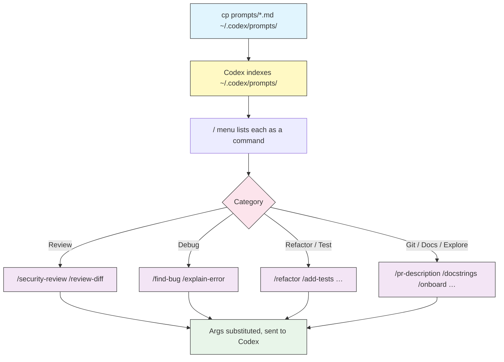

# Prompt Library

## Overview

Module [02](../02-slash-commands/) showed how a Markdown file in `~/.codex/prompts/` becomes a `/command`. This module is the **cookbook**: a curated set of ready-to-use custom prompts covering the tasks you repeat most — reviewing, debugging, refactoring, testing, git chores, docs, and exploration.

Drop the files into `~/.codex/prompts/`, reopen the `/` menu, and each one becomes a slash command. They are plain Markdown, so treat them as a starting point — rename, edit, and combine them to fit your team.

Every prompt here is deliberately **specialized**. Where module 02 ships a general `/review`, this library adds a `/security-review` scoped to vulnerabilities and a `/review-diff` scoped to a specific range. Narrow prompts give sharper results.

## Architecture



Each file's name (without `.md`) becomes the command. Arguments typed after the command fill `$1`, `$2`, and `$ARGUMENTS` before the text is sent to Codex.

## Install

Copy the whole library into your prompts directory:

```bash
mkdir -p ~/.codex/prompts
cp 13-prompt-library/prompts/*.md ~/.codex/prompts/
```

Then run `/prompts` (or reopen the `/` menu) to confirm they loaded. Prefer only a few? Copy the individual files you want instead.

> **Note**: Depending on your Codex version, custom prompts may appear namespaced (e.g. `/prompts:refactor`) in the menu. They are always listed by `/prompts`.

## The library

| File | Command | What it does | Example |
|------|---------|--------------|---------|
| [`prompts/security-review.md`](prompts/security-review.md) | `/security-review` | Audits changed code for vulnerabilities | `/security-review auth flow` |
| [`prompts/review-diff.md`](prompts/review-diff.md) | `/review-diff` | Reviews a specific commit/range/diff | `/review-diff main..HEAD` |
| [`prompts/find-bug.md`](prompts/find-bug.md) | `/find-bug` | Traces a bug to its root cause | `/find-bug login returns 500` |
| [`prompts/explain-error.md`](prompts/explain-error.md) | `/explain-error` | Explains an error or stack trace | `/explain-error <paste trace>` |
| [`prompts/refactor.md`](prompts/refactor.md) | `/refactor` | Refactors code, behavior preserved | `/refactor src/parser.ts` |
| [`prompts/extract-function.md`](prompts/extract-function.md) | `/extract-function` | Extracts a named function from a block | `/extract-function utils.py:40-72` |
| [`prompts/add-tests.md`](prompts/add-tests.md) | `/add-tests` | Writes thorough tests for a target | `/add-tests src/cart.ts` |
| [`prompts/cover-gaps.md`](prompts/cover-gaps.md) | `/cover-gaps` | Finds and fills coverage gaps | `/cover-gaps billing` |
| [`prompts/pr-description.md`](prompts/pr-description.md) | `/pr-description` | Drafts a PR title and description | `/pr-description main` |
| [`prompts/changelog.md`](prompts/changelog.md) | `/changelog` | Builds changelog entries from commits | `/changelog v1.2.0` |
| [`prompts/docstrings.md`](prompts/docstrings.md) | `/docstrings` | Adds/repairs doc comments in a file | `/docstrings src/api.py` |
| [`prompts/readme.md`](prompts/readme.md) | `/readme` | Drafts or refreshes the project README | `/readme end users` |
| [`prompts/onboard.md`](prompts/onboard.md) | `/onboard` | Guided tour of an unfamiliar codebase | `/onboard the queue system` |
| [`prompts/trace.md`](prompts/trace.md) | `/trace` | Traces a flow end to end | `/trace checkout request` |

## Writing your own good prompts

The prompts here follow a repeatable recipe. Reuse it when you add your own:

1. **One task per prompt.** A prompt that reviews *and* fixes *and* commits does all three vaguely. Split it.
2. **Tell Codex to read first.** "Read the file before answering" and "run the tests before assuming" turn guesses into grounded work.
3. **Ask for structured output.** Fixed sections (Severity / Location / Fix) make results skimmable and consistent across runs.
4. **Parameterize the variable part.** Use `$1` for a single required argument and `$ARGUMENTS` for free-form focus text; hardcode nothing that changes per project.
5. **Set guardrails.** "Do not commit", "do not change behavior", "do not invent issues" keep the model inside the lines.
6. **Add frontmatter.** A one-line `description` and an `argument-hint` make the `/` menu self-documenting.

```markdown
---
description: One line shown in the slash menu
argument-hint: [what-to-pass]
---

Do exactly one task with $1.
Read the relevant files first. Report results as a short structured list.
Do not <the thing you never want it to do>.
```

## Best practices

| Do | Don't |
|----|-------|
| Keep each prompt scoped to one task | Build a mega-prompt that does everything |
| Instruct the model to read/verify before acting | Let a prompt act on assumptions |
| Request structured, skimmable output | Accept a wall of prose you have to parse |
| Add `description` + `argument-hint` frontmatter | Leave the menu full of unlabeled commands |
| Store the team's prompts in a shared repo | Copy files by hand across machines |
| Add read-only/no-commit guardrails to risky prompts | Assume the model won't take extra actions |

## Troubleshooting

### A prompt does not show up

- Confirm the file is in `~/.codex/prompts/` and ends in `.md`.
- Run `/prompts` to see what Codex loaded, and reopen the `/` menu.
- Check the frontmatter is valid YAML between `---` lines.

### The command name clashes with a built-in

- Built-ins win. Rename the file (e.g. `review-diff.md`, not `review.md`) so it does not shadow `/review`, `/model`, or `/diff`.

### Arguments are not filled in

- Use `$1`/`$2` for positional args and `$ARGUMENTS` for the whole string.
- Pass them after the command: `/find-bug the cache never expires`.

## Related guides

- [Slash Commands & Custom Prompts](../02-slash-commands/) — how custom prompts work and the base templates
- [AGENTS.md](../03-agents-md/) — persistent project instructions vs. one-shot prompts
- [Automation](../07-automation/) — run these tasks non-interactively with `codex exec`
- [CLI Reference](../10-cli/) — full command and flag reference

---

**Last Updated**: September 28, 2026
**Tool**: OpenAI Codex CLI (`@openai/codex`)
**Compatible Models**: GPT-5-Codex (default), GPT-5, plus OpenAI-compatible and local (OSS) models
*Part of the [codexhowto](../) guide series*
