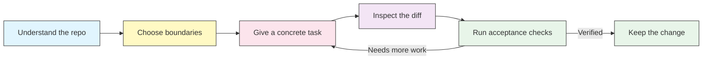

<h1 align="center">codexhowto</h1>

<p align="center">
  <strong>Learn the commands. Make the decisions. Verify the changes.</strong><br>
  A bilingual, hands-on guide to OpenAI Codex CLI — from your first session to repeatable coding workflows.
</p>

<p align="center">
  <a href="LICENSE"></a>
  <a href="#curriculum"></a>
  <a href="exercises/README.md"></a>
  <a href="zh/README.md"></a>
  <a href="https://github.com/sxxso/codexhowto/actions/workflows/verify.yml"></a>
</p>

<p align="center">
  <strong>English</strong> · <a href="zh/README.md">简体中文</a><br>
  <a href="#quick-start">Quick start</a> ·
  <a href="exercises/README.md">Try the lab</a> ·
  <a href="12-decision-guides/README.md">Make a decision</a> ·
  <a href="QUICK_REFERENCE.md">Cheat sheet</a>
</p>

---

**Knowing a command is not the same as knowing when to use it.** This project connects Codex's features to concrete tasks: explore an unfamiliar repository, reproduce a bug, write the missing tests, review a diff, and refactor without losing existing behavior.

The core teaching loop is simple:

> **Reproduce → give a bounded task → inspect the change → verify independently.**

This is an independent community learning project, not an official OpenAI product. The tutorials and templates are starting points, not production certifications or a replacement for the [official Codex documentation](https://developers.openai.com/codex/).

## Contents

- [What makes this useful](#what-makes-this-useful)
- [Choose your starting point](#choose-your-starting-point)
- [Quick start](#quick-start)
- [The hands-on lab](#the-hands-on-lab)
- [Curriculum](#curriculum)
- [Workflows with a finish line](#workflows-with-a-finish-line)
- [Reusable prompts and templates](#reusable-prompts-and-templates)
- [Repository map](#repository-map)
- [Safety and compatibility](#safety-and-compatibility)
- [FAQ](#faq)
- [Contributing](#contributing)
- [License and acknowledgments](#license-and-acknowledgments)

## What makes this useful

| Layer | What you get | What you practice |
|---|---|---|
| **Understand** | 10 foundational/reference modules with diagrams and configuration examples | How instructions, approval policies, sandboxes, MCP, and automation fit together |
| **Decide** | 6 decision guides with branching flowcharts and recommendations | Which execution mode, permission boundary, or instruction location fits a task |
| **Apply** | 7 end-to-end workflow recipes and 2 companion shell scripts | Combine features into a task with explicit verification |
| **Practice** | A small Python expense tracker with planted bugs, 6 exercises, and reference solutions | Diagnose, constrain, repair, test, and review an actual codebase |
| **Reuse** | 14 specialized prompts plus configuration, instruction, and CI templates | Carry a useful starting point into your own project |

**The lab is intentionally imperfect.** Its failing tests are the starting line, not an installation problem. You decide whether a proposed change actually solves the problem; Codex saying “done” is not the acceptance criterion.



Read the repository first, set boundaries, and repeat the task–review–test loop until the evidence supports keeping the change.

## Choose your starting point

You do **not** need to finish every reference chapter before doing something useful.

| Your goal | Suggested path | First tangible result |
|---|---|---|
| **“I've never used Codex.”** | [01 Getting started](01-getting-started/) → [05 Approvals and sandbox](05-approvals-sandbox/) → [Lab](exercises/) | An explained codebase and a verified bug fix |
| **“I use it, but my results are inconsistent.”** | [03 AGENTS.md](03-agents-md/) → [12 Decision guides](12-decision-guides/) → [11 Recipes](11-recipes/) | A bounded task with clear acceptance checks |
| **“I want repeatable scripts or CI.”** | [07 Automation](07-automation/) → [08 Profiles](08-profiles/) → [11 Recipes](11-recipes/) | A review workflow you inspect before deploying |
| **“I just need a starting prompt.”** | [13 Prompt library](13-prompt-library/) | A task-specific prompt you can adapt |
| **“I need to look something up.”** | [Quick reference](QUICK_REFERENCE.md) or [10 CLI reference](10-cli/) | The relevant command, option, or configuration section |

For a structured schedule, use the [learning roadmap](LEARNING-ROADMAP.md). Reading times there are estimates; allow extra time for installation, debugging, and running the exercises.

## Quick start

### 1. Get the prerequisites

- **Codex CLI:** use a supported installation method from the [official repository](https://github.com/openai/codex). The example below uses npm, which requires Node.js and npm.
- **Authentication:** an eligible ChatGPT account or API-based access. Availability and billing depend on your account and the current service terms.
- **The lab only:** Python 3.10+ and `pip`. The sample app uses Python's standard library; its test dependency is `pytest`.
- **This repository:** clone it using GitHub's **Code** menu or download and extract the ZIP. Commands below assume you are at the repository root unless stated otherwise.

```bash
npm install -g @openai/codex
codex --version
codex --help
codex login
```

> **Note:** CLI options, authentication flows, model availability, and custom-prompt support can change. Record your installed version and consult its help output if an example differs. No CLI version is pinned or certified by this repository.

### 2. Explore before editing

The included practice project gives you a concrete place to start:

```bash
cd exercises/sample-project
codex -a on-request -s read-only "Explain this project's entry points, data flow, and test setup. Do not edit files. Separate observations from guesses."
```

Read the explanation alongside `expenses.py`, `storage.py`, and `report.py`. A useful response should point to real code, not just describe what an expense tracker usually does.

### 3. Reproduce the baseline

From `exercises/sample-project/`, create a local test environment:

```bash
python -m venv .venv
```

If your system uses `python3` instead of `python`, use that command when creating the environment.

**macOS / Linux / a compatible Bash environment:**

```bash
.venv/bin/python -m pip install -r requirements.txt
.venv/bin/python -m pytest -q
```

**Windows PowerShell:**

```powershell
.\.venv\Scripts\python.exe -m pip install -r requirements.txt
.\.venv\Scripts\python.exe -m pytest -q
```

The supplied, unmodified tests are designed to report:

```text
2 failed, 3 passed
```

The failures concern rounding and case-insensitive category filtering. Follow the [lab guide](exercises/README.md) to repair them. The missing-data-file crash is a separate bug that the initial test suite does not cover.

> **Important:** The lab's expected failing baseline is not a passing repository-wide test suite. A green result after a fix only establishes what those tests check.

## The hands-on lab

The sample app is a command-line expense tracker: add expenses, list them, calculate a total, and generate a category report. It is deliberately small enough to inspect, with problems that span behavior, persistence, test coverage, and maintainability.

| Exercise | Your task | Evidence to look for |
|---|---|---|
| **01 · Explore** | Ask for a read-only project tour | Entry points and data flow agree with the source |
| **02 · Reproduce and repair** | Handle a missing data file on first use | A fresh data path no longer crashes |
| **03 · Debug from tests** | Repair the two failing behaviors without weakening the tests | The original five tests pass; inspect the implementation diff |
| **04 · Add coverage** | Test persistence using isolated temporary files | Missing-file, round-trip, and ID cases have meaningful assertions |
| **05 · Refactor** | Split the report generator without changing its output | Compare a captured baseline and add cases beyond that single fixture |
| **06 · Extend** | Add CSV export without breaking existing commands | Parse the exported CSV and run both new and existing tests |

**You get:** [guided exercises](exercises/README.md) · [sample source](exercises/sample-project/) · [reference solutions](exercises/SOLUTIONS.md).

For example, a bounded repair request is more useful than “fix everything”:

```text
Read test_expenses.py and reproduce its two failures.
Fix only the corresponding behavior in expenses.py.
Do not delete tests, weaken assertions, or add dependencies.
Run the original tests using the Python environment installed for this lab.
Report the changed functions, test result, and anything not verified.
```

Before allowing edits, choose the appropriate permission settings using the [decision guides](12-decision-guides/). Work on a copy or a dedicated branch; keep unrelated work out of the exercise.

## Curriculum

### Foundation and reference · 01–10

| Module | Focus | What to take away |
|---|---|---|
| [**01 · Getting started**](01-getting-started/) | Installation, authentication, first session | A working entry point into Codex CLI |
| [**02 · Slash commands and custom prompts**](02-slash-commands/) | Interactive commands and reusable instructions | How to reduce repetitive prompting; check version-specific support |
| [**03 · AGENTS.md**](03-agents-md/) | Project instructions and their scope | Put build commands and project conventions where they belong |
| [**04 · Configuration**](04-config/) | `config.toml`, overrides, example configurations | Understand a setting before adopting it |
| [**05 · Approvals and sandbox**](05-approvals-sandbox/) | Permission requests versus execution constraints | Separate “when to ask” from “what is permitted” |
| [**06 · MCP**](06-mcp/) | Connecting external tools and services | Add capabilities with explicit trust and access boundaries |
| [**07 · Automation and CI**](07-automation/) | Non-interactive `codex exec`, scripts, CI examples | Turn a repeatable task into inspectable automation |
| [**08 · Profiles and providers**](08-profiles/) | Named configurations and provider examples | Switch task settings deliberately |
| [**09 · Advanced features**](09-advanced/) | Sessions, notifications, search, images, IDE/cloud topics | Explore extensions to the basic workflow |
| [**10 · CLI reference**](10-cli/) | Commands, options, environment variables | Look up syntax alongside your installed CLI's help |

### Applied practice · 11–13 + lab

| Module | Included material | Start here when… |
|---|---|---|
| [**11 · Recipes and workflows**](11-recipes/) | 7 playbooks + 2 shell scripts | You need a sequence of steps, not another list of flags |
| [**12 · Decision guides**](12-decision-guides/) | 6 decisions with flowcharts and tables | Several options seem reasonable and you need a default |
| [**13 · Prompt library**](13-prompt-library/) | 14 specialized Markdown prompts | You want to adapt a bounded, reusable task description |
| [**Hands-on lab**](exercises/) | 6 exercises, Python project, reference answers | You want to test your understanding on code |

Detailed file lists: [index](INDEX.md) · [feature catalog](CATALOG.md).

## Workflows with a finish line

Each [recipe](11-recipes/README.md) combines a goal, commands, a prompt, and something to verify afterward.

| Workflow | Intended deliverable | Your acceptance check |
|---|---|---|
| **Onboard to a repository** | Architecture and entry-point map | Follow the cited files and check the described data flow |
| **Use a TDD loop** | A regression test followed by a minimal implementation | Confirm the test fails before the fix and passes afterward |
| **Review changes in CI** | Findings tied to the actual diff | Check the base revision, relevance, permissions, and false positives |
| **Plan a multi-file refactor** | An inspected plan, then a scoped change | Compare the diff with the plan; run the relevant checks |
| **Debug a failing test** | A reproduced error and root-cause repair | Re-run the original failing command |
| **Write docstrings in bulk** | Documentation consistent with the implementation | Review for invented behavior and unintended code changes |
| **Triage logs** | Evidence-backed hypotheses and next checks | Separate observed facts from untested explanations |

Companion scripts: [`onboarding-tour.sh`](11-recipes/scripts/onboarding-tour.sh) and [`codemod-plan-then-apply.sh`](11-recipes/scripts/codemod-plan-then-apply.sh). Read them before running; they require Bash and Codex, and the codemod script includes an edit phase.

## Reusable prompts and templates

### 14 task-specific prompts

| Category | Prompt files |
|---|---|
| **Review** | [security-review](13-prompt-library/prompts/security-review.md), [review-diff](13-prompt-library/prompts/review-diff.md) |
| **Debugging** | [find-bug](13-prompt-library/prompts/find-bug.md), [explain-error](13-prompt-library/prompts/explain-error.md) |
| **Refactoring** | [refactor](13-prompt-library/prompts/refactor.md), [extract-function](13-prompt-library/prompts/extract-function.md) |
| **Testing** | [add-tests](13-prompt-library/prompts/add-tests.md), [cover-gaps](13-prompt-library/prompts/cover-gaps.md) |
| **Git and delivery** | [pr-description](13-prompt-library/prompts/pr-description.md), [changelog](13-prompt-library/prompts/changelog.md) |
| **Documentation** | [docstrings](13-prompt-library/prompts/docstrings.md), [readme](13-prompt-library/prompts/readme.md) |
| **Exploration** | [onboard](13-prompt-library/prompts/onboard.md), [trace](13-prompt-library/prompts/trace.md) |

These are readable Markdown assets, not a plugin or an automatically running agent. Open one, adapt its scope, and replace placeholders such as `$1` or `$ARGUMENTS` if pasting it directly into a conversation.

For CLI versions that support custom prompts, follow [module 13's installation guide](13-prompt-library/README.md). Check the menu and current documentation for naming and discovery behavior rather than assuming every version exposes the same slash commands. Back up existing prompts before copying files with matching names.

### Configuration and project templates

- [**AGENTS.md templates**](03-agents-md/) — project, personal, and nested instructions.
- [**Configuration examples**](04-config/) — a starter file, minimal configuration, and a more detailed configuration.
- [**MCP snippets**](06-mcp/) — examples of connecting external tools.
- [**Profile examples**](08-profiles/profiles-config.toml) — named bundles for different tasks.
- [**Automation examples**](07-automation/scripts/) — review, documentation, and GitHub Actions examples.

**Merge what you understand; do not blindly replace your existing `~/.codex/config.toml` or `AGENTS.md`.** The Actions YAML is a template inside a lesson directory, not an active CI workflow for this repository.

## Repository map

```text
codexhowto/
├── README.md                  # English project home
├── QUICK_REFERENCE.md         # Short command lookup
├── LEARNING-ROADMAP.md         # Suggested paths and schedule
├── INDEX.md / CATALOG.md       # File index and feature catalog
├── 01-getting-started/
├── 02-slash-commands/          # Includes 3 introductory prompts
├── 03-agents-md/               # Instruction templates
├── 04-config/                 # Configuration examples
├── 05-approvals-sandbox/
├── 06-mcp/                    # MCP configuration examples
├── 07-automation/             # Shell scripts and CI template
├── 08-profiles/
├── 09-advanced/
├── 10-cli/
├── 11-recipes/                # Playbooks and companion scripts
├── 12-decision-guides/        # Trade-offs and decision trees
├── 13-prompt-library/         # 14 specialized prompts
├── exercises/
│   ├── README.md              # Six guided exercises
│   ├── SOLUTIONS.md           # Reference approaches
│   └── sample-project/       # Deliberately imperfect Python app
└── zh/                       # Chinese guides and mirrored assets
```

English and Chinese guides share the same directory organization. Commands, configuration keys, source code, and reusable prompt assets stay in English so both tracks work from the same technical material. Some repository-policy documents are available only in English.

## Safety and compatibility

| Principle | What it means here |
|---|---|
| **Start narrow** | Inspect a project before permitting edits. Do not disable safeguards just to silence an error. |
| **Approval is not isolation** | An approval policy controls requests; sandbox settings constrain supported operations. Neither is a universal guarantee. |
| **Read-only is not confidential** | Remote models can receive submitted context. External MCP services have their own credentials, permissions, and side effects. |
| **Treat repository input as untrusted** | Code, logs, and instructions from a repository can be misleading. Review commands, dependencies, and tool access before execution. |
| **Keep credentials out of Git** | Use your platform's secret mechanisms. An `env` table containing a literal token is still a secret stored in a file. |
| **Verify locally** | Model output is not proof. Run the relevant tests and inspect changes yourself. |
| **Check your version** | Consult `codex --version`, `codex --help`, and `codex exec --help`. Model names and supported settings are version- and account-dependent. |

**Validation boundary:** the included Python lab has a known, deliberately failing baseline. This project does not claim that every Codex command, provider, MCP server, or CI template has been end-to-end tested against the latest CLI. No fixed default model or blanket provider compatibility is promised.

### How this repo is verified

Every push and pull request runs the [Verify workflow](.github/workflows/verify.yml), so the parts that *can* be checked automatically stay honest:

| What | How it's checked | Status |
|---|---|---|
| **Lab baseline** | CI runs the sample project (EN and `zh/`) and asserts exactly `2 failed, 3 passed` — a green run means a planted bug was silently fixed | Automated |
| **Internal links** | CI resolves every relative Markdown/HTML link across the repo | Automated |
| **Lab runtime** | Python 3.10+ with `pytest` (see each `requirements.txt`) | Automated |
| **Codex CLI commands** | Written to be version-agnostic; **not** certified against any specific CLI release | Manual — run `codex --version` and record the version you tested against |

The last row is the honest caveat of any CLI tutorial: the tool moves. When you verify a command, note the version in your PR or issue so others know what it was tested on.

Some lesson examples use Bash-specific constructs such as heredocs and `diff`. On Windows, use a compatible Bash environment for those examples or translate them into PowerShell; do not paste Bash syntax directly into PowerShell.

See [SECURITY.md](SECURITY.md) for the project's security guidance.

## FAQ

<details>
<summary><strong>Is this just a command reference?</strong></summary>

No. The first ten modules supply the reference material; the decision guides, recipes, and lab are where you apply it. If you already know the CLI, start with the lab rather than rereading installation instructions.

</details>

<details>
<summary><strong>Why are the tests failing immediately?</strong></summary>

The practice project intentionally contains bugs. Its original five tests should produce two failures and three passes. Repair the implementation without weakening the assertions. Additional exercises cover behavior the initial tests miss.

</details>

<details>
<summary><strong>Do I need Python for every lesson?</strong></summary>

No. Python and pytest are for the expense-tracker lab. Most guides discuss Codex workflows independently of programming language; individual examples may require their own runtimes or services.

</details>

<details>
<summary><strong>Are the guide and Codex usage both free?</strong></summary>

The repository is MIT-licensed. Codex usage, API calls, and connected services may require a paid plan or incur charges. Check the current terms for your account and provider before running automation.

</details>

<details>
<summary><strong>Which model should I choose?</strong></summary>

Use a model supported by your installation and account. Start with a representative task, define an acceptance check, and compare quality, latency, and cost. The decision guides offer a framework, not a benchmark or a guarantee that one model always wins.

</details>

<details>
<summary><strong>Does passing a report snapshot prove a refactor is safe?</strong></summary>

It proves that one captured example stayed the same. Include empty input, category variations, and other relevant edge cases before making a broader behavior-preservation claim.

</details>

## Contributing

The most valuable contributions make an example easier to reproduce or a claim easier to verify:

- Fix a command that no longer matches current CLI behavior, recording the tested version and platform.
- Add a focused regression test or improve an exercise's acceptance criteria.
- Improve a workflow with concrete failure cases and recovery steps.
- Keep English and Chinese guides aligned.
- Improve diagrams, accessibility, and broken links.

Start with the [contribution guide](CONTRIBUTING.md), follow the [style guide](STYLE_GUIDE.md), and review the [code of conduct](CODE_OF_CONDUCT.md). For bug reports, include the module, sanitized command/error, CLI version, operating system, and expected result. Do not include tokens, personal data, or proprietary code.

## License and acknowledgments

Released under the [MIT License](LICENSE). You may use, adapt, and redistribute the material under its terms.

Built around the open-source [OpenAI Codex CLI](https://github.com/openai/codex). The numbered, bilingual tutorial format was inspired by an existing coding-agent how-to project; this repository's practice track focuses on Codex tasks and independently checked outcomes.

**Further reading:** [official Codex documentation](https://developers.openai.com/codex/) · [project changelog](CHANGELOG.md) · [Chinese edition](zh/README.md).

---

**Last updated:** September 29, 2026 · **Scope:** OpenAI Codex CLI (`@openai/codex`) · **Languages:** English / 简体中文
