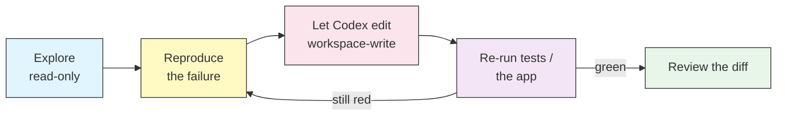

# Hands-on lab: fix a real project with Codex

Reading about a coding agent only gets you so far. This lab hands you a
small, broken Python project and walks you through repairing it with Codex —
practising the approval and sandbox choices, the exec workflow, and the
prompting habits taught in the reference modules.

## What's here

```text
exercises/
├── README.md          # this lab guide
├── SOLUTIONS.md       # reference answers — try before you peek
└── sample-project/    # the broken app you'll fix
    ├── expenses.py        # CLI + core logic
    ├── storage.py         # JSON load/save (untested)
    ├── report.py          # one overgrown function
    ├── test_expenses.py   # some tests are red on purpose
    └── requirements.txt
```

The project is a command-line **expense tracker**. It runs, but it has three
planted bugs, a module with no tests, and a function overdue for a refactor.

## Setup

```bash
cd exercises/sample-project
pip install -r requirements.txt
pytest -q          # observe: 2 failed, 3 passed
```

Keep a terminal open here. You'll run `codex` from inside `sample-project/`
so the workspace sandbox is scoped to it.

## How to work through it

Each exercise names a **safety posture** (approval policy + sandbox mode —
see [05-approvals-sandbox](../05-approvals-sandbox/) and
[12-decision-guides](../12-decision-guides/)). Start read-only, and only widen
access when you're about to let Codex edit. Verify every change yourself; the
point is to build the habit of checking the agent's work.



---

## Exercise 1 — Get oriented (read-only)

Before changing anything, let Codex give you the tour. This is the safest
possible posture: Codex can read and run commands but cannot write.

```bash
codex -a on-request -s read-only "Give me a tour of this project: what each \
file does, how the CLI is wired up, and anything that looks buggy or untested."
```

**Verify:** does its map match the file table above? Note any bug it spots —
you'll confirm each one yourself next.

---

## Exercise 2 — The app crashes on a fresh checkout (a bug with no test)

Reproduce it:

```bash
rm -f expenses.json
python expenses.py list
```

You'll get a `FileNotFoundError` from `storage.load_expenses`. A brand-new
user has no data file yet, so this should return an empty list, not crash.

Hand Codex the failure. Let it edit this time:

```bash
codex -a on-request -s workspace-write "Running 'python expenses.py list' on \
a fresh checkout crashes with FileNotFoundError in storage.load_expenses. A \
missing data file should be treated as no expenses yet. Fix it."
```

**Verify:**

```bash
rm -f expenses.json && python expenses.py list   # prints nothing, exits 0
python expenses.py add 12.50 food lunch           # now works
```

---

## Exercise 3 — Make the red tests green (without touching the tests)

```bash
pytest -q
```

Two tests fail: `test_total_rounds_to_cents` and
`test_filter_by_category_is_case_insensitive`. They describe how the code is
*supposed* to behave. Fix the code, not the tests:

```bash
codex -a on-request -s workspace-write "pytest shows two failing tests in \
test_expenses.py. Read them to understand the intended behaviour, then fix \
expenses.py so they pass. Do not modify the test file. Run pytest to confirm."
```

**Verify:** `pytest -q` → `5 passed`. Then open the diff (`/diff` in the TUI,
or `git diff` if you initialised a repo) and read exactly what changed.

> There's a related bug the tests don't catch: `report` groups categories
> case-insensitively but `total --category` does not. Try
> `python expenses.py total --category food` against the seed data in
> SOLUTIONS.md and see if your fix made the two consistent.

---

## Exercise 4 — Write the missing tests (storage.py has none)

`storage.py` ships with zero tests. Ask Codex to add them — and to use a
temporary path so the tests don't touch your real data file:

```bash
codex -a on-request -s workspace-write "storage.py has no tests. Write \
test_storage.py covering load_expenses (including the missing-file case), \
save_expenses round-tripping, and next_id. Use pytest's tmp_path fixture so \
no real files are written. Run pytest to confirm they pass."
```

**Verify:** `pytest -q` shows the new tests, all green, and re-running them
never creates a stray `expenses.json`.

---

## Exercise 5 — Refactor `generate_report` (behaviour must not change)

`report.generate_report` does grouping, totaling, sorting, and formatting in
one long function. Refactor it into small helpers — but the output must be
identical. Pin the behaviour *first*:

```bash
# capture the current output as a golden file
cat > expenses.json <<'EOF'
[{"id":1,"date":"2026-09-01","amount":12.50,"category":"Food","note":"lunch"},
 {"id":2,"date":"2026-09-02","amount":40.0,"category":"Travel","note":"train"},
 {"id":3,"date":"2026-09-03","amount":3.25,"category":"food","note":"coffee"}]
EOF
python expenses.py report > report.golden.txt
```

```bash
codex -a on-request -s workspace-write "Refactor report.generate_report into \
small, well-named helper functions (grouping, totals, formatting). Behaviour \
must be identical. Verify with: python expenses.py report | diff - \
report.golden.txt  (no output means success)."
```

**Verify:** `python expenses.py report | diff - report.golden.txt` prints
nothing. Clean up with `rm expenses.json report.golden.txt`.

---

## Exercise 6 (stretch) — Add a feature with a reusable prompt

Install the `add-tests` and `refactor` prompts from
[13-prompt-library](../13-prompt-library/), then add a real feature:

```bash
codex -a on-request -s workspace-write "Add a 'export' subcommand that writes \
all expenses to a CSV file (columns: id,date,amount,category,note). Add tests \
for it. Keep the existing CLI behaviour unchanged."
```

**Verify:** `python expenses.py export out.csv` produces a valid CSV and
`pytest -q` stays green.

---

## What a real session looks like

Reading the commands is not the same as watching one run. Here is an
abbreviated, representative session for **Exercise 3** — your exact wording,
diff, and timing will differ, and Codex may ask before it writes.

```text
$ codex -a on-request -s workspace-write "pytest shows two failing tests in \
test_expenses.py. Read them to understand the intended behaviour, then fix \
expenses.py so they pass. Do not modify the test file. Run pytest to confirm."

• Reading test_expenses.py
  - test_total_rounds_to_cents expects 0.1 + 0.2 to total 0.30, not
    0.30000000000000004
  - test_filter_by_category_is_case_insensitive expects "Food" and "food"
    to be counted together

• Reading expenses.py
  - total() returns sum(...) without rounding
  - filter_by_category() compares categories with a case-sensitive ==

  Proposed change to expenses.py:
    - return sum(e["amount"] for e in expenses)
    + return round(sum(e["amount"] for e in expenses), 2)
    ...
    - return [e for e in expenses if e["category"] == category]
    + target = category.lower()
    + return [e for e in expenses if e["category"].lower() == target]

  Apply this change? [y/N] y

• Running: pytest -q
  5 passed in 0.03s

I fixed two bugs in expenses.py without touching the tests: rounding in
total(), and case-insensitive matching in filter_by_category(). All tests pass.
```

**Now you verify — don't take the summary on trust:**

```bash
pytest -q                                    # confirm: 5 passed
git diff                                      # confirm only expenses.py changed
python expenses.py total --category food      # the related bug from the note above
```

The habit the transcript models is the whole point: Codex proposed a concrete,
reviewable diff, you approved it, and then **you** re-ran the check instead of
trusting "all tests pass."

---

## Where to go next

- Stuck or want to compare approaches? See [SOLUTIONS.md](SOLUTIONS.md).
- Turn these one-off commands into repeatable workflows: [11-recipes](../11-recipes/).
- Do the same review in CI: [07-automation](../07-automation/).

---

**Last Updated**: September 28, 2026
**Tool**: OpenAI Codex CLI (`@openai/codex`)
**Compatible Models**: GPT-5-Codex (default), GPT-5, plus OpenAI-compatible and local (OSS) models
*Part of the [codexhowto](../) guide series*
