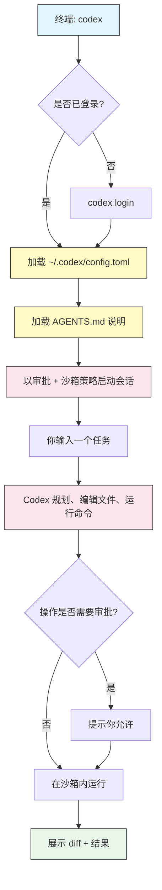

# 入门

## 概述

OpenAI Codex CLI 是一个运行在终端里的开源编码智能体。你用自然语言描述任务,Codex 就会读取你的文件、编写代码、运行命令并迭代——全部在一个由你通过审批策略控制的沙箱内进行。

本模块带你从零走到第一个完成的任务:安装 CLI、登录、运行一次交互式会话,再运行一次一次性的非交互命令。读完之后,你会知道 Codex 把配置存在哪里,以及如何控制它被允许做什么。

> **Note**:Codex 提供终端 CLI、IDE 扩展和云端智能体三种形态。本指南聚焦于 **CLI**(`@openai/codex`)。其中的概念(审批、`AGENTS.md`、MCP)同样适用于其他形态。

## 架构



Codex 加载你的配置和 `AGENTS.md` 说明,然后在沙箱和审批策略之下运行你的任务。每一个有风险的操作,要么在沙箱内自动运行,要么暂停等你审批。

## 安装

用 npm 或 Homebrew 全局安装:

```bash
# npm (Node.js 18+)
npm install -g @openai/codex

# 或 Homebrew (macOS / Linux)
brew install codex
```

验证安装:

```bash
codex --version
```

之后升级:

```bash
# npm
npm install -g @openai/codex@latest

# Homebrew
brew upgrade codex
```

> **Note (Windows)**:Codex 能在 Windows 上运行,但 OS 级沙箱在 **WSL2** 下支持最佳。如果你用 Windows,请在 WSL2 发行版里安装并运行 Codex 以获得完整沙箱。见[故障排查](#故障排查)。

## 登录

Codex 在做任何事之前都需要凭据。有两种认证方式。

### 方式一 —— 用 ChatGPT 登录(推荐)

```bash
codex login
```

这会打开浏览器,用你的 ChatGPT 账户登录。**Plus、Pro、Team、Edu 和 Enterprise** 计划已包含 Codex 用量——无需单独的 API 计费。

### 方式二 —— 使用 API key

```bash
# 直接传入 key
codex login --api-key "$OPENAI_API_KEY"

# 或在 shell 配置里导出
export OPENAI_API_KEY="sk-..."
```

查看和管理你的会话:

```bash
codex login status   # 显示当前以谁的身份登录
codex logout         # 清除已存储的凭据
```

## 你的第一个交互式会话

在项目目录内启动终端 UI(TUI):

```bash
cd my-project
codex
```

你会进入一个交互式提示符。用大白话输入一个任务:

```text
Add a --verbose flag to the CLI and update the README to document it.
```

Codex 会提出计划、编辑文件,并——取决于你的审批策略——在运行命令或改动工作区外文件之前询问。检查每个 diff 并批准或拒绝。

你也可以在命令行上直接传入第一个任务:

```bash
codex "explain what this project does and list its entry points"
```

## 你的第一次非交互运行

对于脚本、CI 和一次性任务,用 `exec`(也叫"无头"模式)。它运行到完成并打印结果,不进入交互提示:

```bash
codex exec "run the test suite and summarize any failures"
```

这是自动化的基本单元——见[自动化](../07-automation/)。

## TUI 布局

交互式会话有三个区域:

- **Transcript(记录区)** —— 你的消息、Codex 的推理摘要、文件 diff 和命令输出的滚动历史。
- **Status line(状态栏)** —— 显示当前模型、审批模式、沙箱模式和 token 用量。
- **Composer(输入区)** —— 你打字的地方。输入 `/` 打开 slash 命令菜单,或输入 `@` 附加一个文件。

随时运行 `/status` 查看完整的会话和配置状态。

## 键盘快捷键

| 按键 | 动作 |
|-----|--------|
| `Ctrl+C` | 中断智能体;再按一次退出会话 |
| `Ctrl+D` | 在输入为空时退出 |
| `Esc` | 中断当前回合 / 编辑你上一条消息 |
| `Ctrl+J` 或 `Shift+Enter` | 插入换行而不提交 |
| `@` | 触发文件提及选择器 |
| `Ctrl+T` | 切换完整记录视图 |
| `Up` / `Down` | 在提示历史中循环 |
| `/` | 打开 slash 命令菜单 |

## 审批与沙箱(预览)

每个会话都在两个旋钮之下运行:

- **Sandbox mode(沙箱模式)** —— Codex 技术上被允许做什么:`read-only`、`workspace-write` 或 `danger-full-access`。
- **Approval policy(审批策略)** —— Codex 何时必须停下来问你:`untrusted`、`on-failure`、`on-request` 或 `never`。

用 `/approvals` 实时切换,或在 `config.toml` 里设默认值。完整模型见[审批与沙箱](../05-approvals-sandbox/)——等你能自如地跑基本任务后,从那里开始。

本地工作常用的低摩擦组合:

```bash
codex --sandbox workspace-write --ask-for-approval on-request
```

## Codex 把文件放在哪里

Codex 把一切都存在 home 配置目录 `~/.codex/` 下(Windows 上是 `%USERPROFILE%\.codex\`):

| 路径 | 用途 |
|------|---------|
| `~/.codex/config.toml` | 全局配置(模型、审批、沙箱、MCP、profile) |
| `~/.codex/AGENTS.md` | 个人的、跨项目的说明 |
| `~/.codex/prompts/` | 会变成 slash 命令的自定义 prompt 文件 |
| `~/.codex/sessions/` | 已保存的对话记录(供 `codex resume` 使用) |
| `~/.codex/log/` | 诊断日志 |

项目级的说明放在仓库根的 `AGENTS.md` 文件里——见 [AGENTS.md](../03-agents-md/)。

## 示例

### 1. 验证一次干净的安装

```bash
codex --version
codex login status
```

如果两条都成功,你就可以跑任务了。

### 2. 提问而不改动文件

用只读模式运行,这样 Codex 无法编辑任何东西:

```bash
codex --sandbox read-only "summarize the architecture of this repository"
```

### 3. 交互式地做一个小改动

```bash
cd my-project
codex
# 然后输入:
# Fix the typo in src/config.ts where "recieve" should be "receive"
```

检查 diff 并批准。

### 4. 脚本中的一次性任务

```bash
codex exec "add a LICENSE file with the MIT license and my name"
```

### 5. 从上次的地方继续

```bash
codex resume --last     # 继续最近一次会话
codex resume            # 从列表中挑一个会话
```

### 6. 引导生成项目说明

在会话内运行:

```text
/init
```

Codex 会脚手架生成一个描述你项目的 `AGENTS.md`,让未来的会话带着上下文启动。

## 最佳实践

| 该做 | 不该做 |
|----|-------|
| 在信任某工作流之前先用 `read-only` 或 `on-request` | 在主力机器上一上来就用 `--dangerously-bypass-approvals-and-sandbox` |
| 从项目根运行 Codex,让它看得到你的文件 | 从 home 目录带着一个宽泛任务运行 |
| 若你的计划含 Codex,就用 ChatGPT 登录 | 把 API key 硬编码进提交到 git 的脚本 |
| 批准前检查每一个 diff | 盲目批准你看不懂的命令 |
| 用 `codex exec` 做可重复、可脚本化的任务 | 在 CI 流水线里用 TUI |
| 保持 Codex 更新(`@latest`) | 假设行为跨版本不变 |

## 故障排查

### `codex: command not found`

- 确认安装:`npm ls -g @openai/codex` 或 `brew list codex`。
- 确保你的 npm 全局 bin 目录在 `PATH` 上(`npm bin -g` 会显示它)。
- 安装后重启终端。

### 认证失败

- 运行 `codex login status` 查看当前状态。
- 重新运行 `codex login`,或设置 `OPENAI_API_KEY` 后重试。
- 若用 API key,确认 key 有效且有额度。

### Windows 上的沙箱错误

- 在 **WSL2** 里运行 Codex 以获得完整的 OS 级沙箱支持。
- 或者,选一个对每个操作都提示你的审批策略,而不是依赖沙箱。

### Codex 不肯编辑文件

- 你很可能处于 `read-only` 沙箱模式。用 `/approvals` 切换,或以 `--sandbox workspace-write` 启动。

## 相关指南

- [Slash 命令与自定义 prompt](../02-slash-commands/) —— 内置命令和你自己的命令
- [AGENTS.md](../03-agents-md/) —— 持久的项目与个人说明
- [配置](../04-config/) —— 深入 `config.toml`
- [审批与沙箱](../05-approvals-sandbox/) —— 控制 Codex 能做什么
- [CLI 参考](../10-cli/) —— 每一个命令和 flag

---

**最后更新**: September 28, 2026
**工具**: OpenAI Codex CLI (`@openai/codex`)
**兼容模型**: GPT-5-Codex (默认), GPT-5, 以及 OpenAI 兼容和本地 (OSS) 模型
*[codexhowto](../) 指南系列的一部分*
