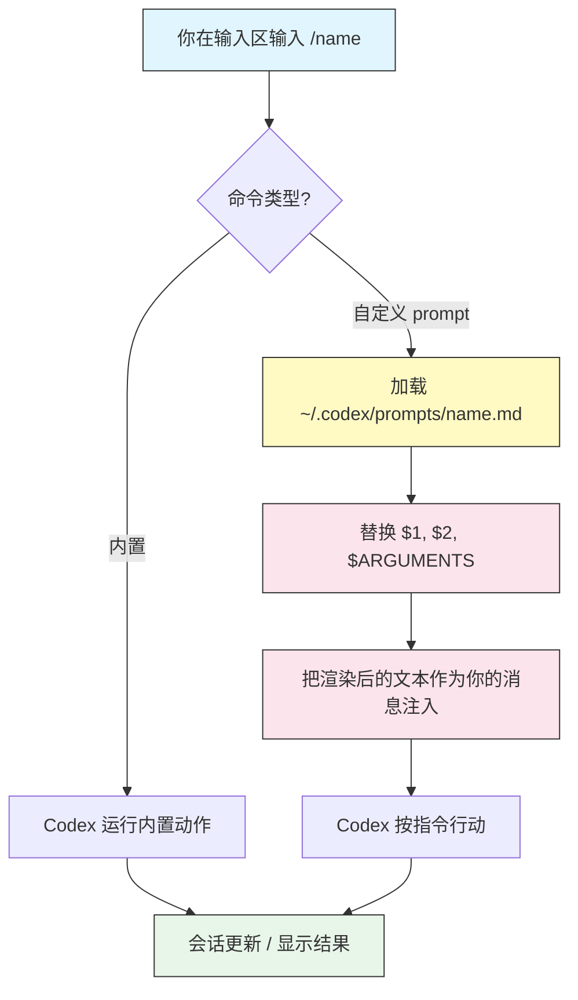

# Slash 命令与自定义 prompt

## 概述

Slash 命令从输入区(composer)控制一个 Codex 会话。输入 `/`,菜单就会列出所有可用命令。它们分两类:

- **内置命令** —— Codex 自带的(`/init`、`/diff`、`/model`、`/approvals` 等)。
- **自定义 prompt** —— 你放进 `~/.codex/prompts/` 的 Markdown 文件,把一段可复用的指令变成一个 `/command`。

内置命令改变会话(模型、审批、上下文)。自定义 prompt 注入一段保存好的指令——非常适合审查、提交,以及任何你会重复做的任务。

## 架构



内置命令运行一个内部动作;自定义 prompt 从磁盘加载、替换其参数,然后把结果作为你的下一条消息发送。

## 内置命令

输入 `/` 打开菜单。核心内置命令:

| 命令 | 用途 |
|---------|---------|
| `/init` | 脚手架生成描述当前项目的 `AGENTS.md` |
| `/diff` | 显示工作区的 git diff |
| `/compact` | 总结并压缩对话以释放上下文 |
| `/new` | 在同一会话中开始一段新对话 |
| `/clear` | 清空可见记录 |
| `/model` | 选择模型和推理强度(`minimal`/`low`/`medium`/`high`) |
| `/approvals` | 改变本会话的审批策略和沙箱模式 |
| `/status` | 显示会话信息:模型、审批模式、沙箱、token 用量 |
| `/mcp` | 列出已配置的 MCP server 及其工具 |
| `/review` | 对当前改动做一次代码审查 |
| `/prompts` | 列出你可用的自定义 prompt |
| `@` / `/mention` | 给你的消息附加一个文件 |
| `/quit` | 退出会话(别名 `/exit`) |

> **Tip**:在做有风险的任务前,`/status` 是确认你正在用哪个模型和沙箱的最快方式。`/compact` 能在会话上下文快耗尽时把它救回来,又不丢失思路。

## 自定义 prompt

自定义 prompt 是 `~/.codex/prompts/` 里的一个 Markdown 文件。文件名(去掉 `.md`)就是命令名。

```text
~/.codex/prompts/
├── review.md     ->  /review
├── commit.md     ->  /commit
└── explain.md    ->  /explain
```

> **Note**:取决于你的 Codex 版本,自定义 prompt 在菜单里可能带命名空间显示为 `/prompts:review`。无论哪种,它们都会被 `/prompts` 列出,并从 `/` 菜单触发。

### 文件格式

prompt 文件就是纯 Markdown。正文是发给 Codex 的指令。可选的 YAML frontmatter 块添加在菜单中显示的元数据:

```markdown
---
description: Review changed files for bugs and security issues
argument-hint: [focus-area]
---

Review the files changed in this branch. Focus on: $ARGUMENTS

Report findings grouped by severity with file:line references.
```

| Frontmatter 字段 | 用途 |
|-------------------|---------|
| `description` | 在 slash 菜单里显示的一行摘要 |
| `argument-hint` | 期望参数的占位提示 |

### 参数

prompt 接受在命令后输入的参数:

| 记号 | 展开为 |
|-------|-----------|
| `$1`、`$2`、… | 单个位置参数 |
| `$ARGUMENTS` | 所有参数合为一个字符串 |

示例 —— 一个名为 `explain.md` 的文件,内容为:

```markdown
Explain what the file $1 does, step by step, for a new teammate.
```

以 `/explain src/auth.ts` 调用时,发送:*"Explain what the file src/auth.ts does…"*。

### 创建你自己的

```bash
mkdir -p ~/.codex/prompts
cat > ~/.codex/prompts/tests.md <<'EOF'
---
description: Write tests for a file
argument-hint: [file]
---

Write thorough unit tests for $1. Cover edge cases and error paths.
Match the existing test framework and style in this project.
EOF
```

重新打开 `/` 菜单(或运行 `/prompts`),`/tests` 就可以用了。

## 本模块中的示例 prompt

把 [`prompts/`](prompts/) 里现成的模板复制到 `~/.codex/prompts/`:

| 文件 | 命令 | 作用 |
|------|---------|--------------|
| [`prompts/review.md`](prompts/review.md) | `/review` | 审查改动的文件;通过 `$ARGUMENTS` 指定可选关注点 |
| [`prompts/commit.md`](prompts/commit.md) | `/commit` | 从 git diff 生成 Conventional Commit 信息 |
| [`prompts/explain.md`](prompts/explain.md) | `/explain` | 解释以 `$1` 传入的文件 |

全部安装:

```bash
mkdir -p ~/.codex/prompts
cp 02-slash-commands/prompts/*.md ~/.codex/prompts/
```

## 示例

### 1. 任务中途切换模型

```text
/model
```

给一次困难的重构挑 `gpt-5-codex` 配 `high` 推理强度,然后为日常编辑降回 `medium`。

### 2. 提交前审查

```text
/diff
/review
```

先查看原始 diff,再让 Codex 审查它有无 bug 和安全问题。

### 3. 在长会话中释放上下文

```text
/compact
```

Codex 会总结到目前为止的对话,并以更小的上下文占用继续。

### 4. 带关注点运行自定义审查

```text
/review authentication and input validation
```

`$ARGUMENTS` 变成 "authentication and input validation"。

### 5. 生成提交信息

```text
/commit
```

Codex 读取已暂存的 diff,提出一条 Conventional Commit 信息。

### 6. 解释不熟悉的代码

```text
/explain src/payments/webhook.ts
```

`$1` 变成文件路径。

## 最佳实践

| 该做 | 不该做 |
|----|-------|
| 给每个 prompt 一个清晰的 `description` | 让菜单塞满没名字的 prompt |
| 让一个 prompt 只聚焦一件事 | 把整个工作流塞进单个 prompt |
| 用 `$1`/`$ARGUMENTS` 表示可变部分 | 硬编码随项目变化的文件路径 |
| 把团队 prompt 放共享仓库里再软链接 | 手工在各机器间复制 prompt 文件 |
| 有风险命令前先用 `/status` | 假设上次会话的模型/沙箱会延续 |

## 故障排查

### 某个自定义 prompt 没出现

- 确认文件在 `~/.codex/prompts/` 里且以 `.md` 结尾。
- 运行 `/prompts` 列出 Codex 找到了哪些。
- 重新打开 `/` 菜单(必要时重启会话)。
- 检查 frontmatter 是合法 YAML,并由 `---` 行分隔。

### 参数没有被替换

- 位置参数用 `$1`(不是 `${1}`),全部字符串用 `$ARGUMENTS`。
- 参数放在命令之后传:`/explain path/to/file`。

### 内置命令和自定义命令冲突

- 内置命令优先。给你的 prompt 文件改名,避免遮蔽 `/model` 或 `/diff` 这类内置命令。

## 相关指南

- [入门](../01-getting-started/) —— 安装与首次会话
- [AGENTS.md](../03-agents-md/) —— 持久说明 vs. 一次性 prompt
- [配置](../04-config/) —— 设置默认模型和推理强度
- [自动化](../07-automation/) —— 用 `codex exec` 非交互地运行 prompt

---

**最后更新**: September 28, 2026
**工具**: OpenAI Codex CLI (`@openai/codex`)
**兼容模型**: GPT-5-Codex (默认), GPT-5, 以及 OpenAI 兼容和本地 (OSS) 模型
*[codexhowto](../) 指南系列的一部分*
