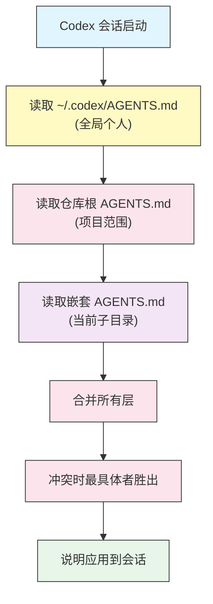

# AGENTS.md —— 项目记忆与说明

## 概述

`AGENTS.md` 是你告诉 Codex 项目如何运作的文件。它是纯 Markdown——散文、标题和列表——Codex 在会话开始时读取它,并当作长期有效的说明。把它想成你会交给新队友的入职文档:如何构建、如何测试、有哪些约定、要避免什么。

和一次性 prompt 不同,`AGENTS.md` 文件是持久的。那个仓库里的每个会话都以相同的上下文启动,于是你不必反复解释同样的东西,Codex 也不再靠猜。

`AGENTS.md` 是一个开放的、跨工具的标准(见 [agents.md](https://agents.md))。同一个文件可跨多个编码智能体使用,所以你花在它上面的功夫不会被锁定在单个工具上。

## 架构

Codex 会在多个位置查找 `AGENTS.md` 并合并它们,从最全局到最具体。当两个文件冲突时,离被编辑代码最近的那个文件胜出。



Codex 读取每一个适用的层并把它们组合起来。嵌套文件不会替换仓库根文件;它是在其之上叠加,只在冲突处覆盖。

## 三个层级

| 层级 | 位置 | 范围 | 用于 |
|-------|----------|-------|---------|
| **全局个人** | `~/.codex/AGENTS.md` | 你机器上的每个项目 | 个人风格、你始终想要的默认值 |
| **项目** | `<repo-root>/AGENTS.md` | 整个仓库 | 构建/测试命令、布局、团队约定 |
| **嵌套** | `<repo>/<subdir>/AGENTS.md` | 一个目录子树 | 特定于某个包、服务或模块的规则 |

在 Windows 上,全局文件位于 `%USERPROFILE%\.codex\AGENTS.md`。

### 优先级的实际表现

如果你的全局文件说"偏好 `npm`",而仓库根文件说"本项目用 `pnpm`",Codex 在那个仓库内遵循仓库根文件。如果一个嵌套的 `src/api/AGENTS.md` 加了"所有 handler 必须用 `zod` 校验输入",那条规则只在 Codex 于 `src/api/` 下工作时生效。

## 该在 AGENTS.md 里写什么

保持务实、具体。最好的条目是那些新贡献者第一天就会做错的东西。

- **命令** —— 如何安装、构建、测试、lint 和运行。给出确切的命令行。
- **项目布局** —— 重要代码在哪里,以及每个顶层目录是干什么的。
- **代码风格** —— 格式化器、linter、命名约定、import 规则。
- **约定** —— 团队遵循的模式(错误处理、日志、状态)。
- **该做与不该做** —— 护栏:绝不碰生成文件、绝不提交到 `main`、完成前始终跑测试。
- **提交与 PR 规则** —— 信息格式、分支命名、一个绿色 PR 需要什么。

不要把整个 README 全倒进来。Codex 能读代码库;`AGENTS.md` 是给那些从文件本身看不出来的东西用的。

## 用 `/init` 脚手架

你不必从零手写 `AGENTS.md`。在交互式 Codex 会话内运行:

```text
/init
```

Codex 会扫描仓库——包清单、配置文件、目录结构——并为你起草一份 `AGENTS.md`。检查并编辑它:草稿是个不错的起点,但你知道那些文件树揭示不出的约定。

## 控制读取多少

大的 `AGENTS.md` 文件会消耗上下文。`config.toml` 里的 `project_doc_max_bytes` 键限制 Codex 从项目文档读取多少字节:

```toml
# ~/.codex/config.toml
project_doc_max_bytes = 32768
```

如果你的文件超过上限,尾部会被截断。让文件保持聚焦,这样重要规则永远不会是被截掉的那些。完整键参考见[配置指南](../04-config/)。

## 示例

### 1. 最小项目文件

最小可用的 `AGENTS.md` 写清命令和那条最要紧的规则。

```markdown
# Project: acme-api

## Commands
- Install: `pnpm install`
- Test: `pnpm test`
- Lint: `pnpm lint`

## Rules
- Never edit files under `generated/` — they are built from the OpenAPI spec.
```

### 2. 全局个人偏好

把机器范围的偏好放进 `~/.codex/AGENTS.md`,让它们处处生效。

```markdown
# Personal preferences

- Explain the plan before making large multi-file changes.
- Prefer standard library solutions over new dependencies.
- Use `rg` (ripgrep) for searching, not `grep -r`.
- Keep commit messages in Conventional Commits format.
```

更完整的模板见 [personal-AGENTS.md](personal-AGENTS.md)。

### 3. 目录专属规则

嵌套文件把规则收窄到树的某一部分。把它放在 `src/api/AGENTS.md`:

```markdown
# src/api conventions

- Every route handler validates its input with `zod` before use.
- Return errors with the `problem+json` shape from `src/api/errors.ts`.
- Do not import from `src/web/` — the API layer must stay UI-agnostic.
```

更完整的模板见 [nested-AGENTS.md](nested-AGENTS.md)。

### 4. 编码一条硬护栏

对任何破坏性的东西,使用直接、无歧义的措辞。

```markdown
## Safety
- Do NOT run database migrations. Prepare the migration file and stop.
- Do NOT push to `main`. Open a branch named `codex/<short-description>`.
- Ask before deleting more than 5 files in one change.
```

### 5. 每个包一个文件的 monorepo

在 monorepo 里,一个轻量的仓库根文件加上聚焦的每包文件,能让每个上下文都保持小。

```text
AGENTS.md                 # shared: tooling, commit rules, monorepo layout
packages/web/AGENTS.md    # React conventions, component structure
packages/api/AGENTS.md    # service conventions, DB access rules
packages/cli/AGENTS.md    # argument parsing, output format
```

## 最佳实践

| 该做 | 不该做 |
|----|-------|
| 写确切命令(`pnpm test`,而非"跑测试") | 假设 Codex 能猜到你的任务运行器 |
| 让文件简短、易扫读 | 粘贴整个 README 或设计文档 |
| 把机器范围的习惯放全局文件 | 在每个仓库里重复个人偏好 |
| 用嵌套文件写包专属规则 | 把每个包的规则都塞进根文件 |
| 用平实、直接的语言写破坏性护栏 | 把关键的"不要"规则埋进一大段文字里 |
| 用 `/init` 引导,然后精修 | 在试 `/init` 之前手写一切 |
| 约定变化时更新文件 | 任它与代码库脱节 |

## 故障排查

### Codex 忽略某条规则

- 检查优先级:某个嵌套或仓库根文件可能覆盖了你以为会胜出的规则。最具体的文件优先。
- 让规则无歧义。"偏好 X"是建议;"始终用 X,绝不用 Y"是规则。
- 确认文件正好命名为 `AGENTS.md`(大写),且位于 Codex 会为被编辑文件实际读取的路径上。

### 文件看起来被截断了

- 你的文件可能超过了 `project_doc_max_bytes`。在 `config.toml` 里调高上限,或修剪文件让关键规则排在前面。

### 规则在项目间泄漏

- 项目专属规则应放仓库根或嵌套文件,而非 `~/.codex/AGENTS.md`。把任何项目专属内容从全局文件里挪出去。

### `/init` 产出了一个泛泛的文件

- 那是预期内的——`/init` 从文件树推断。补上代码里看不见的约定(为什么这么决定、要避免什么)。

## 相关指南

- [入门](../01-getting-started/) —— 安装 Codex 并运行第一个会话
- [Slash 命令与自定义 prompt](../02-slash-commands/) —— `/init` 和可复用 prompt
- [配置](../04-config/) —— `project_doc_max_bytes` 和其他键
- [审批与沙箱](../05-approvals-sandbox/) —— 把安全编码进配置,而不只是散文

---

**最后更新**: September 28, 2026
**工具**: OpenAI Codex CLI (`@openai/codex`)
**兼容模型**: GPT-5-Codex (默认), GPT-5, 以及 OpenAI 兼容和本地 (OSS) 模型
*[codexhowto](../) 指南系列的一部分*
