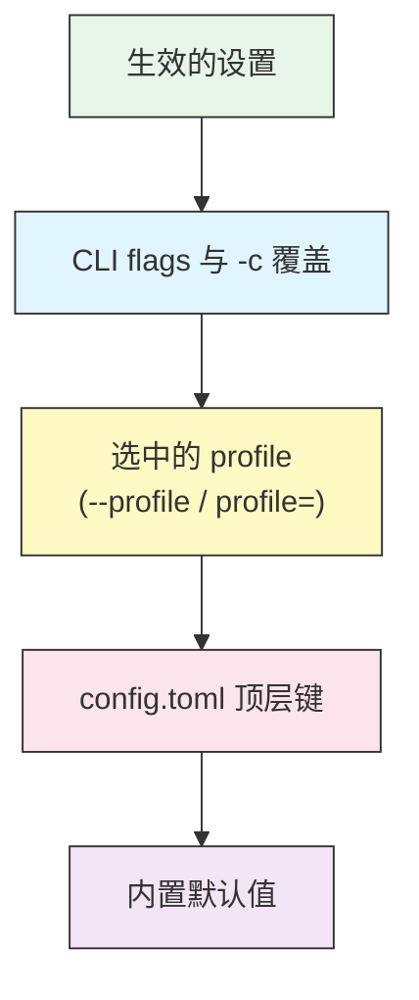

# 配置 — config.toml

## 概述

Codex 从单个 TOML 文件 `~/.codex/config.toml` 读取设置(Windows 上为
`%USERPROFILE%\.codex\config.toml`)。你在这里设置模型、Codex 能自主做多少事
(审批与沙箱)、推理强度、自定义模型提供方,以及可复用的 profile。

`config.toml` 里的任何内容都能在单次运行时用命令行 `-c key=value` 覆盖,所以你
可以在文件里保留安全的默认值,再针对单次会话放宽或收紧它们。

## 架构

设置从最具体到最不具体解析。第一个设置了某个键的来源胜出。



命令行上的 `-c` 胜过 profile;profile 胜过顶层键;顶层键胜过内置默认值。

## 核心键

| 键 | 取值 | 用途 |
|-----|--------|---------|
| `model` | 如 `"gpt-5-codex"`、`"gpt-5"` | 运行哪个模型 |
| `model_provider` | 提供方 id(默认 `"openai"`) | 模型来自哪里 |
| `model_reasoning_effort` | `"minimal"` / `"low"` / `"medium"` / `"high"` | 模型思考的深度 |
| `model_reasoning_summary` | `"auto"` / `"concise"` / `"detailed"` / `"none"` | 如何总结推理过程 |
| `model_verbosity` | `"low"` / `"medium"` / `"high"` | 回复的长度 |
| `approval_policy` | `"untrusted"` / `"on-failure"` / `"on-request"` / `"never"` | Codex 何时在行动前询问 |
| `sandbox_mode` | `"read-only"` / `"workspace-write"` / `"danger-full-access"` | Codex 能触碰什么 |
| `profile` | 一个 profile 名称 | 默认使用哪个 profile |
| `project_doc_max_bytes` | 整数(字节) | `AGENTS.md` 读取大小上限 |
| `disable_response_storage` | `true` / `false` | 退出服务端响应存储 |
| `hide_agent_reasoning` | `true` / `false` | 在输出中隐藏推理摘要 |

审批和沙箱是决定 Codex 自主程度的两个设置。它们在
[审批与沙箱指南](../05-approvals-sandbox/) 中有深入讲解;本页只讲怎么设置它们,
不讲何时用哪个取值。

## 沙箱与审批表

### `[sandbox_workspace_write]`

当 `sandbox_mode = "workspace-write"` 时生效。

| 键 | 取值 | 用途 |
|-----|--------|---------|
| `network_access` | `true` / `false`(默认 `false`) | 允许沙箱内部联网 |
| `writable_roots` | 路径数组 | Codex 额外可写入的目录 |
| `exclude_tmpdir_env_var` | `true` / `false` | 不自动把 `$TMPDIR` 加入可写根 |
| `exclude_slash_tmp` | `true` / `false` | 不自动把 `/tmp` 加入可写根 |

```toml
sandbox_mode = "workspace-write"

[sandbox_workspace_write]
network_access = false
writable_roots = ["/tmp/codex-scratch"]
```

### `[tools]`

| 键 | 取值 | 用途 |
|-----|--------|---------|
| `web_search` | `true` / `false` | 让 Codex 搜索网络 |

```toml
[tools]
web_search = true
```

## 自定义模型提供方

用 `[model_providers.NAME]` 把 Codex 指向一个 OpenAI 兼容端点或网关。用
`model_provider = "NAME"` 选择它。

| 键 | 用途 |
|-----|---------|
| `name` | 人类可读的标签 |
| `base_url` | API 基础 URL |
| `env_key` | 存放 API key 的环境变量 |
| `wire_api` | 传输协议(`"chat"` 或 `"responses"`) |

```toml
[model_providers.my-gateway]
name = "My Gateway"
base_url = "https://gateway.example.com/v1"
env_key = "MY_GATEWAY_API_KEY"
wire_api = "chat"
```

提供方和本地(OSS)模型在 [Profile 与提供方指南](../08-profiles/) 中讲解。

## Profile

一个 `[profiles.NAME]` 块把若干键打包到一个名字下。用 `--profile NAME` 切换,
或在顶层设置 `profile = "NAME"` 使其成为默认。

```toml
profile = "safe"

[profiles.safe]
approval_policy = "on-request"
sandbox_mode = "read-only"

[profiles.yolo]
approval_policy = "never"
sandbox_mode = "workspace-write"
model_reasoning_effort = "high"
```

```bash
# 单次运行使用 "yolo" profile
codex --profile yolo "refactor the auth module"
```

完整模式见 [Profile 与提供方指南](../08-profiles/)。

## 用 `-c` 做 CLI 覆盖

任何键都能用 `-c key=value` 为单次运行设置。字符串值需要引号;整个
`key=value` 常常也要用引号包住以避免 shell 处理。

```bash
# 单次运行覆盖模型
codex -c model="gpt-5" "explain this stack trace"

# 为一次有风险的探索强制只读
codex -c 'sandbox_mode="read-only"' "audit this dependency"

# 组合多个覆盖
codex -c model="gpt-5-codex" -c 'approval_policy="on-request"' "add tests"
```

`-c` 胜过 profile 和文件,所以它是临时收紧权限而无需改文件的最安全方式。

## 示例

### 1. 日常均衡配置

```toml
# ~/.codex/config.toml
model = "gpt-5-codex"
approval_policy = "on-request"
sandbox_mode = "workspace-write"
model_reasoning_effort = "medium"

[tools]
web_search = true
```

### 2. 谨慎默认 + 可选的快速 profile

```toml
model = "gpt-5-codex"
approval_policy = "on-request"
sandbox_mode = "read-only"

[profiles.build]
approval_policy = "on-failure"
sandbox_mode = "workspace-write"
```

```bash
codex --profile build "implement the feature and run tests"
```

### 3. 为难题调高推理强度

```bash
codex -c 'model_reasoning_effort="high"' "find the race condition in the scheduler"
```

### 4. 限制读取多少 AGENTS.md

```toml
project_doc_max_bytes = 16384
```

### 5. 为安装依赖允许沙箱内联网

```toml
sandbox_mode = "workspace-write"

[sandbox_workspace_write]
network_access = true
```

## 最佳实践

| 该做 | 不该做 |
|----|-------|
| 让文件默认保持安全(read-only 或 on-request) | 默认用 `never` + `danger-full-access` |
| 用 profile 表示要切换的命名模式 | 每次换模式都手改文件 |
| 用 `-c` 为单次运行放宽权限 | 把最宽松的设置留作永久默认 |
| 在 `-c` 覆盖中给字符串值加引号 | 传未加引号、被 shell 破坏的值 |
| 把自定义提供方的 key 放在环境变量里 | 在 `config.toml` 里硬编码 API key |
| 给不明显的设置写注释 | 留一份没有说明的晦涩配置 |

## 故障排查

### 某个设置没有生效

- 检查优先级:一个 `-c` flag 或活跃的 profile 可能在覆盖顶层键。CLI 覆盖胜出。
- 确认取值是合法选项(见上面的表);未知值可能被忽略或拒绝。

### 启动时 TOML 解析错误

- TOML 字符串需要引号:`model = "gpt-5"`,不是 `model = gpt-5`。
- 表头用方括号:`[profiles.safe]`。
- 数组用带逗号的方括号:`writable_roots = ["/tmp/a", "/tmp/b"]`。

### 自定义提供方没被使用

- 设置 `model_provider = "NAME"`(或选一个这样做的 profile),并确保 `env_key`
  变量已在 shell 中导出。

### Codex 仍然无法写文件

- `sandbox_mode` 可能是 `read-only`。切到 `workspace-write`,或者如果路径在
  工作区之外,把它加入 `writable_roots`。

## 相关指南

- [入门](../01-getting-started/) — 首次运行与登录
- [AGENTS.md](../03-agents-md/) — 被 `project_doc_max_bytes` 限制大小的项目记忆
- [审批与沙箱](../05-approvals-sandbox/) — 选择 `approval_policy` 和 `sandbox_mode`
- [MCP](../06-mcp/) — `[mcp_servers]` 配置
- [Profile 与提供方](../08-profiles/) — profile 和自定义/本地模型

---

**最后更新**: September 28, 2026
**工具**: OpenAI Codex CLI (`@openai/codex`)
**兼容模型**: GPT-5-Codex (默认), GPT-5, 以及 OpenAI 兼容和本地 (OSS) 模型
*[codexhowto](../) 指南系列的一部分*
