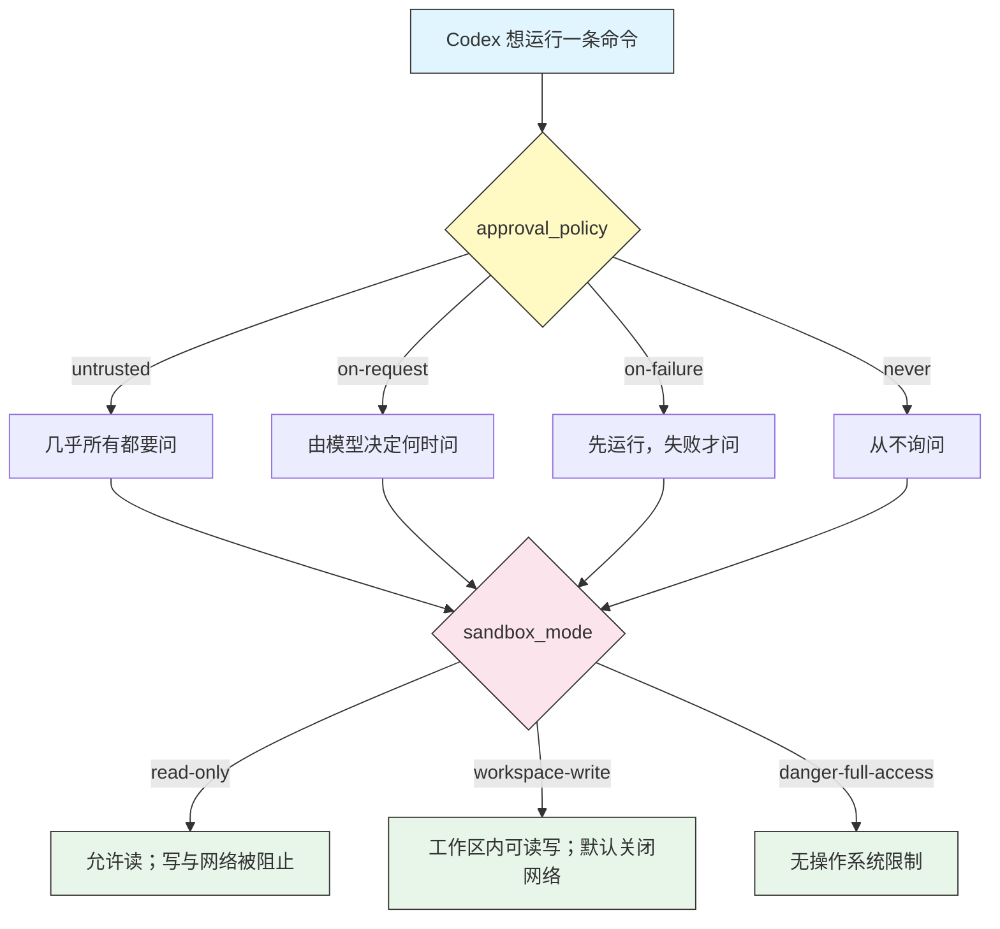

# 审批与沙箱

## 概述

审批与沙箱是决定 Codex 在你机器上拥有多少自由度的两个控制。它们是 Codex CLI 的招牌安全特性,以**两个相互独立、可组合的维度**工作:

- **`approval_policy`** —— Codex 在做某事之前*何时*暂停来问你。
- **`sandbox_mode`** —— Codex 在技术上*能做什么*,由操作系统强制执行。

区分很重要。审批是一个你来回答的提示;沙箱是即便模型试图越界、操作系统也会强制执行的一堵墙。宽松的审批策略配上严格的沙箱依然是安全的,因为无论模型如何决定,沙箱都会阻止该操作。挑对组合,就是"盯着每条命令"和"让 Codex 无人值守运行"之间的区别。

## 架构



Codex 提出的每条命令都要经过两道关卡:先由审批策略决定是否问你,再由沙箱决定命令运行后物理上被允许做什么。

## 两个维度

### 审批策略 —— Codex 何时询问

用 `--ask-for-approval <policy>`(短 flag `-a`)或 `config.toml` 中的 `approval_policy` 设置。

| 策略 | 行为 | 最适合 |
|--------|----------|----------|
| `untrusted` | 几乎每条命令都要批准;只有一个很小的安全白名单(如读文件)无需询问就运行 | 最大程度监督、陌生仓库 |
| `on-request` | 由模型决定何时需要请求更多权限 —— 均衡的默认 | 日常交互式工作 |
| `on-failure` | 命令在沙箱内运行;只有当某条失败或需要升级时 Codex 才询问 | 你信任沙箱的低摩擦会话 |
| `never` | Codex 从不暂停询问;在沙箱允许的范围内完全自主工作 | 自动化、CI、脚本化运行 |

> **Note**: `never` 不等于"无限制"。它的意思是 Codex 不会停下来问 —— 它仍然无法越过沙箱边界。把 `never` 与严格的 `sandbox_mode` 搭配,可实现安全的自动化。

### 沙箱模式 —— Codex 能做什么

用 `--sandbox <mode>`(短 flag `-s`)或 `config.toml` 中的 `sandbox_mode` 设置。

| 模式 | 文件系统 | 网络 | 何时使用 |
|------|-----------|---------|----------|
| `read-only` | 只读;不可写 | 阻止 | 审查代码、回答问题、做规划 |
| `workspace-write` | 在工作目录和临时目录内可读写 | **默认禁用** | 常规编码与编辑 |
| `danger-full-access` | 无文件系统限制 | 允许 | 仅限可信、可丢弃的环境 |

沙箱由操作系统强制执行,而非由模型。在 `workspace-write` 下,工作目录之外的写入会被阻止,除非你显式开启,否则网络访问是关闭的(见 [`[sandbox_workspace_write]`](#tuning-workspace-write))。

## 策略 × 模式矩阵

两个维度相乘,得到你实际体验到的行为:

| | `read-only` | `workspace-write` | `danger-full-access` |
|--|------------|-------------------|----------------------|
| **`untrusted`** | 最安全的审查模式 | 可编辑,但多数命令需确认 | 很少有用 |
| **`on-request`** | 有引导的阅读 | **推荐的日常组合** | 强大但暴露 |
| **`on-failure`** | 偶尔提示的阅读 | 流畅编码,升级时提示 | 快但暴露 |
| **`never`** | 自主读取/分析 | 在盒子里自主编码 | 完全 YOLO(仅限容器) |

**推荐的日常设置:`on-request` + `workspace-write`。** Codex 在你的项目内自由编辑,除非任务需要否则不联网,做任何逃出盒子的事之前会先问。

## 预设

Codex 内置了快捷方式,让你不必手动设置两个维度。

| 预设 | 展开为 | 含义 |
|--------|-----------|---------|
| `--full-auto` | `workspace-write` 沙箱 + `on-failure` 审批 | 低摩擦:Codex 在工作区内编辑和运行命令,只在出错或需要升级时提示 |
| `--dangerously-bypass-approvals-and-sandbox`(YOLO) | `never` + `danger-full-access` | 无审批、无沙箱。仅在一次性容器、VM 或 CI runner 中使用 |

在交互式 TUI 中,`/approvals` 选择器把同一思路呈现为三个友好的预设:

- **Read Only** —— Codex 只能看不能碰。
- **Auto** —— Codex 在工作区内工作,需要更多时才问。
- **Full Access** —— Codex 可在任意位置读写并使用网络。

## 调优 workspace-write

`workspace-write` 是大多数工作的甜蜜点,你可以用 `config.toml` 中的 `[sandbox_workspace_write]` 表精确地放宽它:

```toml
sandbox_mode = "workspace-write"

[sandbox_workspace_write]
# 为需要网络的任务重新开启网络访问(npm install、curl 等)
network_access = true

# 在工作目录之外，额外允许 Codex 写入的目录
writable_roots = ["/tmp/codex-scratch", "~/.cache/my-tool"]
```

> **Important**: 即便在可写根内部,某些路径仍受保护并会提示 —— 尤其是 `.git/`,这样 Codex 无法悄悄改写你的 git 历史。这一保护在 `workspace-write` 下依然有效。

## 平台说明

沙箱用原生操作系统特性实现,因此各平台行为不同:

- **macOS** —— Apple Seatbelt(`sandbox-exec`)限制文件系统和网络访问。
- **Linux** —— Landlock(文件系统)加 seccomp(系统调用)构成边界。
- **Windows** —— 操作系统级沙箱有限。在 **WSL2** 中运行 Codex 以获得真正的强制,或把审批策略(`untrusted` / `on-request`)作为主要控制。

> **Tip**: 如果你在没有 WSL2 的 Windows 上,把审批当作你的安全网,并避免 `danger-full-access`。

## 实用示例

### 1. 只读代码审查

在毫无更改风险的前提下探索一个陌生仓库:

```bash
codex --sandbox read-only "Explain the architecture of this service and list the main modules"
```

Codex 可以读取每个文件并回答问题,但不能写、删或联网。

### 2. 日常编码(推荐)

交互式工作的均衡默认:

```bash
codex --ask-for-approval on-request --sandbox workspace-write "Add input validation to the signup handler"
```

Codex 编辑你项目中的文件并运行本地命令,只在需要超出工作区的访问时暂停。

### 3. 需要网络的任务

安装依赖需要网络,而 `workspace-write` 默认禁用它。为该任务开启:

```bash
codex --sandbox workspace-write \
  -c 'sandbox_workspace_write.network_access=true' \
  "Install the missing dependencies and run the test suite"
```

或在 `config.toml` 的 `[sandbox_workspace_write]` 下持久设置。

### 4. 用 full-auto 的低摩擦会话

让 Codex 以最少打断完成一个多步骤改动:

```bash
codex --full-auto "Refactor the payments module into smaller files and update the imports"
```

这是 `workspace-write` + `on-failure`:Codex 只在命令失败或需要升级时停下来问。

### 5. 容器中的无人值守自动化

在一次性的 CI runner 或容器里,去掉所有摩擦:

```bash
codex exec --dangerously-bypass-approvals-and-sandbox \
  "Generate the changelog from git history and write it to CHANGELOG.md"
```

> **Warning**: 绝不要在你的主力机器上、或在带凭据的仓库上使用 YOLO 模式。它会禁用每一道防护。

### 6. 会话中途切换模式

你不必重启。在 TUI 中运行:

```text
/approvals
```

然后选 Read Only、Auto 或 Full Access。当你先审查、再决定让 Codex 动手改时,这很方便。

## 最佳实践

| 该做 | 不该做 |
|----|-------|
| 默认用 `on-request` + `workspace-write` | 习惯性地上手 `danger-full-access` |
| 在陌生仓库中先用只读 | 在容器或 VM 之外运行 YOLO 模式 |
| 只为需要的任务开启 `network_access` | 明明很少需要却全局开着网络 |
| 对可信、范围明确的任务用 `--full-auto` | 批准你没读过的命令 |
| 添加具体的 `writable_roots` 而非完全访问 | 为一个被挡的路径而放宽整个沙箱 |
| CI 用 `never` + 严格沙箱,而非 `never` + 完全访问 | 以为 `never` 意味着"无限制" |

## 故障排查

### 一条命令被阻止

**问题**:Codex 报告它无法运行某命令或写某文件。

**解决**:
- 检查你的 `sandbox_mode` —— `read-only` 会阻止所有写入。
- 目标路径可能在工作区之外;把它加入 `writable_roots`。
- 在提示时批准这单条命令来升级,而不是全局放宽沙箱。

### 网络调用失败

**问题**:`npm install`、`pip install` 或 `curl` 报网络错误。

**解决**:
- `workspace-write` 默认禁用网络。通过 `-c` flag 或 `config.toml` 为该任务设置 `sandbox_workspace_write.network_access=true`。
- 确认你不在 `read-only`,它同样会阻止网络。

### Codex 一直为 git 操作提示

**问题**:即便在 `workspace-write`,写入 `.git/` 也要审批。

**解决**:
- 这是有意为之 —— `.git/` 是受保护路径,历史不能被悄悄改写。当你信任时,批准该具体操作。

### Windows:沙箱似乎没有限制任何东西

**问题**:文件系统限制未被强制执行。

**解决**:
- 原生 Windows 沙箱有限。在 WSL2 中运行 Codex 以获得真正的强制,或用 `untrusted` / `on-request` 审批作为主要防护。

## 相关指南

- [配置](../04-config/) —— 在 `config.toml` 中持久设置 `approval_policy` 和 `sandbox_mode`
- [CLI 参考](../10-cli/) —— `--ask-for-approval` 与 `--sandbox` flag 的完整列表
- [自动化](../07-automation/) —— 用 `codex exec` 安全地无人值守运行
- [入门](../01-getting-started/) —— 你的第一个会话与 `/approvals` 选择器
- [Profile](../08-profiles/) —— 把策略和沙箱模式打包进一个命名 profile

---

**最后更新**: September 28, 2026
**工具**: OpenAI Codex CLI (`@openai/codex`)
**兼容模型**: GPT-5-Codex (默认), GPT-5, 以及 OpenAI 兼容和本地 (OSS) 模型
*[codexhowto](../) 指南系列的一部分*
