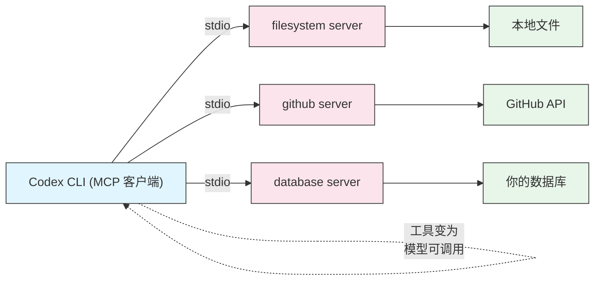

# MCP(模型上下文协议)

## 概述

模型上下文协议(Model Context Protocol,MCP)是一个开放标准,用于把 AI 智能体连接到外部工具和数据源。Codex CLI 是一个 **MCP 客户端**:你在配置中注册 MCP server,这些 server 暴露的工具就会在会话期间变成模型可调用的能力。想让 Codex 查询数据库、用结构化工具浏览文件系统、或者开 GitHub issue?把它指向合适的 MCP server,而不是自己写胶水代码。

Codex 也能反过来工作——它可以**作为** MCP server 运行,这样其他智能体和工具就能像调用任何 MCP 工具一样调用 Codex。

本课两个方向都会讲:配置 Codex 要对话的 server,以及把 Codex 自身暴露出去。

## 架构



每个 MCP server 都是 Codex 启动并通过某种传输方式(最常见是 stdio)与之通信的独立进程。server 声明一组工具;Codex 把它们加入本次会话模型的工具箱。

## MCP 能带来什么

- **结构化工具,而非 shell 拼凑** —— MCP 文件系统 server 提供带类型的操作,而不是原始的 `cat`/`sed`。
- **外部系统** —— GitHub、数据库、issue 跟踪系统和内部 API 成为一等能力。
- **复用** —— 同一批 MCP server 可用于所有兼容 MCP 的智能体,不止 Codex。
- **隔离** —— 每个 server 以自己的进程运行,拥有各自的权限和环境。

## 配置 MCP server

MCP server 定义在 `~/.codex/config.toml` 的 `[mcp_servers.NAME]` 表中。最可移植的传输方式是 **stdio**——Codex 启动一个命令,并通过它的标准输入/输出说 MCP 协议。

```toml
[mcp_servers.filesystem]
command = "npx"
args = ["-y", "@modelcontextprotocol/server-filesystem", "/path/to/project"]

[mcp_servers.github]
command = "npx"
args = ["-y", "@modelcontextprotocol/server-github"]
env = { GITHUB_PERSONAL_ACCESS_TOKEN = "ghp_your_token_here" }
```

| 字段 | 作用 |
|------|------|
| `command` | 要启动的可执行文件(如 `npx`、`python`、`node`、某个二进制) |
| `args` | 传给命令的参数数组 |
| `env` | 给 server 进程的环境变量表 |

表的键名(`filesystem`、`github`)就是你在 TUI 中看到的 server 名称。

> **Note**:某些版本还支持通过 HTTP 连接远程 MCP server,带 `url` 和认证字段。上面的 stdio 形式是支持最广泛的路径,也是最好的起点。

本文件夹中有可直接复制的片段:[`filesystem-mcp.toml`](filesystem-mcp.toml)、[`github-mcp.toml`](github-mcp.toml) 和 [`multi-mcp.toml`](multi-mcp.toml)。

## 从命令行管理 server

`codex mcp` 子命令无需手改 TOML 即可管理 server:

```bash
# 列出已配置的 MCP server
codex mcp list

# 添加一个 server(写入 config.toml)
codex mcp add filesystem -- npx -y @modelcontextprotocol/server-filesystem /path/to/project

# 查看 mcp 子命令组
codex mcp --help
```

`codex mcp` 下的一切都对应你可以手工编辑的那些 `[mcp_servers.*]` 表——用你喜欢的方式即可。

## 在 TUI 中检查 server

在交互式会话中运行:

```text
/mcp
```

这会列出每个已连接的 MCP server 及其暴露的工具,让你确认 server 是否正确启动,并看清 Codex 现在能调用哪些工具。

## Codex 作为 MCP server

Codex 可以把自己通过 MCP 暴露出去,让其他智能体把编码任务委派给它:

```bash
# 以 stdio 方式把 Codex 作为 MCP server 运行
codex mcp-server
```

让另一个兼容 MCP 的客户端指向该命令,Codex 就成了那个智能体工具箱里可调用的工具——适合构建由 Codex 负责写代码环节的多智能体系统。

## 实战示例

### 1. 给 Codex 结构化的文件系统访问

添加限定在某个项目目录的文件系统 server:

```toml
[mcp_servers.filesystem]
command = "npx"
args = ["-y", "@modelcontextprotocol/server-filesystem", "/Users/me/work/app"]
```

现在,除内置的文件访问外,Codex 还能通过带类型的 MCP 工具列出、读取和搜索文件。

### 2. 连接 GitHub 处理 issue 和 PR

把 token 存到环境变量,然后引用它:

```toml
[mcp_servers.github]
command = "npx"
args = ["-y", "@modelcontextprotocol/server-github"]
env = { GITHUB_PERSONAL_ACCESS_TOKEN = "ghp_xxx" }
```

让 Codex "开一个总结失败测试的 issue",它就能直接调用 GitHub 工具。

### 3. 不改 TOML 就添加 server

```bash
codex mcp add github -- npx -y @modelcontextprotocol/server-github
```

然后在 `config.toml` 或 shell 环境中设置 token,并运行 `/mcp` 确认已连接。

### 4. 同时运行多个 server

在一份配置里组合文件系统、GitHub 和一个自定义 Python server(见 [`multi-mcp.toml`](multi-mcp.toml)):

```toml
[mcp_servers.filesystem]
command = "npx"
args = ["-y", "@modelcontextprotocol/server-filesystem", "."]

[mcp_servers.github]
command = "npx"
args = ["-y", "@modelcontextprotocol/server-github"]
env = { GITHUB_PERSONAL_ACCESS_TOKEN = "ghp_xxx" }

[mcp_servers.metrics]
command = "python"
args = ["-m", "my_company.metrics_mcp"]
env = { METRICS_API_URL = "https://metrics.internal" }
```

### 5. 把 Codex 暴露给另一个智能体

```bash
codex mcp-server
```

在第二个智能体中把该命令注册为 MCP server,它就能以编程方式把编码任务交给 Codex。

## 最佳实践

| Do | Don't |
|----|-------|
| 把机密放在 `env` 或环境变量里 | 把 token 硬编码到会被提交的地方 |
| 把文件系统 server 限定到特定目录 | 让文件系统 server 指向整个 home 目录 |
| 用 `/mcp` 验证 server 已连接 | 不检查就假定 server 正常 |
| 给 server 起清晰、好记的名字 | 用同一个 server 名指代不同工具 |
| 尽量固定 server 版本 | 盲目运行不受信任的 MCP server |
| 把 MCP 与紧的沙箱结合 | 仅为让某个工具能用就授予宽泛访问 |

## 故障排查

### server 无法启动

**问题**:`/mcp` 显示 server 失败或缺失。

**解决办法**:
- 在 shell 里手动运行 `command` 和 `args`,看真实报错。
- 确认运行时已安装(`node`/`npx`、`python` 或对应二进制)。
- 检查 `args` 是分开的字符串数组,而不是一整个拼接的字符串。

### 缺少环境变量

**问题**:server 启动了,但它的工具报认证错误。

**解决办法**:
- 核对所需的环境变量名(如 `GITHUB_PERSONAL_ACCESS_TOKEN`)。
- 把它设在 server 的 `env` 表里,或在启动 Codex 前于 shell 中 export。
- 若 token 过期或缺少所需 scope,重新生成。

### 模型看不到工具

**问题**:Codex 没用你期待的某个 MCP 工具。

**解决办法**:
- 运行 `/mcp` 确认工具在列表中。
- 编辑 `config.toml` 后重启会话。
- 把你的请求写得足够具体,让该工具明显相关。

### server 启动时卡住

**问题**:Codex 长时间等待 server 连接。

**解决办法**:
- 首次 `npx` 运行可能在下载包;让它完成一次,之后会被缓存。
- 检查网络访问——有些 server 初始化时需要联网。

## 相关指南

- [Config](../04-config/) —— `[mcp_servers.*]` 放在哪里,以及配置优先级如何生效
- [审批与沙箱](../05-approvals-sandbox/) —— 把 MCP 驱动的访问约束在安全边界内
- [CLI 参考](../10-cli/) —— `codex mcp` 和 `codex mcp-server` 子命令
- [自动化](../07-automation/) —— 在非交互的 `codex exec` 运行中使用 MCP 工具

---

**最后更新**: September 28, 2026
**工具**: OpenAI Codex CLI (`@openai/codex`)
**兼容模型**: GPT-5-Codex (默认), GPT-5, 以及 OpenAI 兼容和本地 (OSS) 模型
*[codexhowto](../) 指南系列的一部分*
