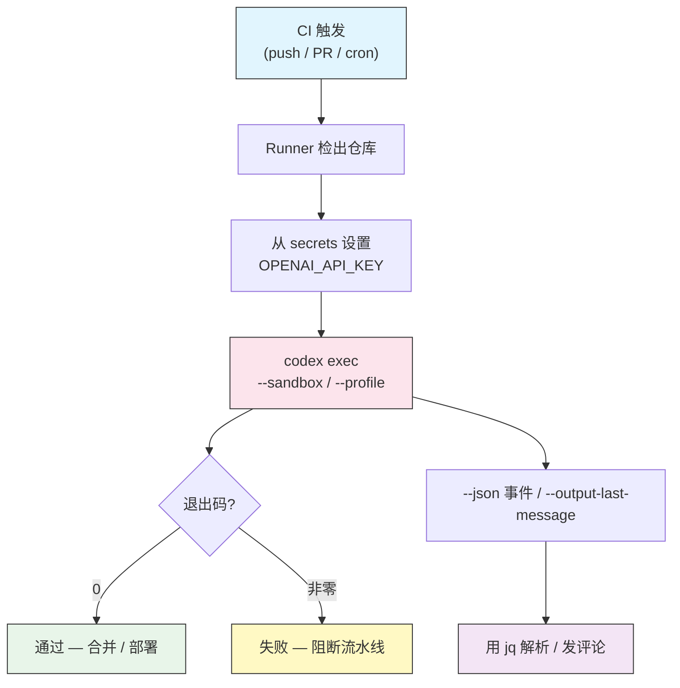

# 自动化与 CI

## 概述

`codex exec` 是 Codex CLI 的非交互式一面。`codex` 会打开一个交互式 TUI 并暂停来
请求审批,而 `codex exec` 把一个 prompt 运行到完成、打印结果,然后以一个状态码退出。
正是这一点差别让 Codex 可脚本化:你可以把它放进 shell 管道、`Makefile`、cron 任务或
CI runner,像对待任何命令行工具一样对待它。

本课涵盖无头执行、结构化 JSON 输出、把退出码用作质量门、数据的输入输出管道、在命令行上
提供配置,以及在无人守着键盘的环境里做认证。

## 架构



Runner 提供凭据和沙箱选择,`codex exec` 干活,退出码加上任何被捕获的输出喂给流水线的
其余部分。

## 无头模式:`codex exec`

`codex exec` 把一个 prompt 作为参数,或从标准输入读取一个,运行它,然后退出。没有交互式
提示,也没有审批循环,因此可以安全地无人值守运行。

```bash
# prompt 作为参数
codex exec "add a CHANGELOG entry for the latest commit"

# prompt 来自 stdin
echo "summarize the open TODOs in this repo" | codex exec

# prompt 来自文件
codex exec < prompts/nightly-audit.txt
```

因为没有人来回答审批提示,你必须把 `codex exec` 与一个无需询问即可完成的沙箱和审批选择
搭配。完整模型见 [审批与沙箱](../05-approvals-sandbox/)。

## 结构化输出

超出打印文本的一切,都应请求机器可读的输出。

| Flag | 效果 |
|------|--------|
| `--json` | 随运行推进发出结构化 JSONL 事件(每行一个 JSON 对象) |
| `--output-last-message <file>` | 仅把最终的助手消息写入文件 |

```bash
# 为解析器流式输出 JSONL 事件
codex exec --json "list every failing test and why" > events.jsonl

# 只捕获最终答案
codex exec --output-last-message result.txt "write release notes for v2.0"
cat result.txt
```

把 `--json` 与 `jq` 结合,精确取出你需要的字段,而不是去抓取散文。

```bash
codex exec --json "audit dependencies for known CVEs" \
  | jq -r 'select(.type=="item.completed") | .text'
```

## 退出码就是门

`codex exec` 在运行失败时以非零退出。这让它成为任何流水线的即插即用门:命令失败,阶段
就失败。

```bash
# 如果 Codex 报告阻断性问题就让构建失败
codex exec "Review the staged diff. If you find a blocking bug, exit non-zero
by printing 'BLOCKING' and failing. Otherwise print 'OK'." || {
  echo "Codex flagged blocking issues"
  exit 1
}
```

若要做确定性门控,让 Codex 运行一个真实检查(测试、linter、构建),而不是评判散文。沙箱
内一个失败的测试命令会传播一个你可以信任的非零退出码。

## 数据的输入输出管道

`codex exec` 读取 stdin,因此它能与你已在用的工具组合。

```bash
# 审查一个 diff
git diff | codex exec "review this diff for bugs and security issues"

# 分诊一份日志
cat /var/log/app/error.log | codex exec "group these errors and rank by severity"

# 串联到其他工具
codex exec "list all API endpoints, one per line" | sort | uniq
```

## 命令行上的配置

`config.toml` 里的一切都能按调用覆盖,这在同一脚本在不同环境里运行时至关重要。

```bash
# 用 -c 覆盖单个键
codex exec -c model="gpt-5" -c 'sandbox_mode="read-only"' "audit this module"

# 选择一个命名 profile
codex exec --profile ci-review "review the changed files"

# 直接选一个沙箱/审批预设
codex exec --full-auto "regenerate the OpenAPI client"
```

优先级,从高到低:`-c` / 显式 flag → `--profile` → `config.toml` 顶层 → 内置默认。见
[配置](../04-config/) 和 [Profile 与模型提供方](../08-profiles/)。

## CI 中的认证

交互式 `codex login` 通过 ChatGPT 登录,需要浏览器。CI runner 没有浏览器,所以改用
**API key 认证**。

```yaml
env:
  OPENAI_API_KEY: ${{ secrets.OPENAI_API_KEY }}
```

在你的 CI 提供方中把这个 key 设为脱敏 secret,并导出到 job 里。Codex 会自动拾取它。
绝不要回显该 key 或把它提交进仓库。

## 实用示例

### 1. 本地审查脚本

把工作树 diff 管道进 Codex 做一次快速的提交前审查。

```bash
git diff | codex exec --sandbox read-only \
  "Review this diff. List concrete bugs and risky changes only."
```

处理空 diff 情况的可移植版本见 [`scripts/review-diff.sh`](scripts/review-diff.sh)。

### 2. GitHub Actions 中的 PR 审查

在每个 pull request 上运行 Codex,发现阻断性问题时让检查失败。完整工作流见
[`scripts/codex-review.yml`](scripts/codex-review.yml)。核心步骤是:

```yaml
- name: Codex review
  env:
    OPENAI_API_KEY: ${{ secrets.OPENAI_API_KEY }}
  run: |
    git fetch origin "${{ github.base_ref }}"
    git diff "origin/${{ github.base_ref }}"... \
      | codex exec --sandbox read-only \
        "Review this diff. Print findings grouped by severity." \
      | tee review.md
```

### 3. 跨多个文件的批处理

在一组文件上循环,对每个运行相同指令。

```bash
for f in src/**/*.py; do
  echo "== $f =="
  codex exec --full-auto "Add or fix docstrings in $f. Do not change behavior."
done
```

带安全防护的完整脚本是 [`scripts/batch-docstrings.sh`](scripts/batch-docstrings.sh)。

### 4. 定时日志分诊

从 cron 任务运行一次生产错误的夜间汇总。

```bash
# crontab: 0 6 * * *  /usr/local/bin/nightly-triage.sh
tail -n 5000 /var/log/app/error.log \
  | codex exec --sandbox read-only --output-last-message /tmp/triage.md \
    "Summarize these errors, group duplicates, and list the top 5 to fix."
mail -s "Nightly error triage" oncall@example.com < /tmp/triage.md
```

### 5. 为仪表盘输出结构化数据

发出 JSON 并把它解析成一个指标。

```bash
COUNT=$(codex exec --json --sandbox read-only \
  "Count functions missing type hints. Reply with only a number." \
  | jq -r 'select(.type=="item.completed") | .text' | tail -1)
echo "untyped_functions=$COUNT" >> metrics.txt
```

## 最佳实践

| 该做 | 不该做 |
|----|-------|
| 审查/分析类 job 用 `--sandbox read-only` | 在一次性容器之外用 `--dangerously-bypass-approvals-and-sandbox` |
| 把 `OPENAI_API_KEY` 存为脱敏 CI secret | 打印或记录 API key |
| 让退出码驱动 pass/fail | 解析散文来猜测是否成功 |
| 用 `--profile` 或 `-c` 固定行为以求可复现 | 依赖 runner 上碰巧存在的 `config.toml` |
| 给长时间运行加超时 | 让无人值守的 job 永久挂起 |
| 编程用途用 `--json` + `jq` | 用正则去抓格式化文本 |

> **Note**: `--full-auto` 使用带低摩擦审批的 `workspace-write` 沙箱 —— 适合必须编辑
> 文件的 job。`read-only` 对只需查看的 job 最安全。完全绕过留给一次性 CI 容器。

## 故障排查

### CI 中认证失败

- 确认 `OPENAI_API_KEY` 已设置在 job 环境里(而不只是定义为 secret)。
- 检查该 secret 对运行 job 的 branch/PR 上下文可用。
- 核实这个 key 有效且有额度。

### Codex 挂起或等待

- 一个无人值守的运行遇到了它无法回答的审批。加上 `--full-auto`、合适的 `--sandbox`,
  或一个不需要提示的 profile。
- 用超时包住调用:`timeout 600 codex exec ...`。

### 命令被沙箱阻止

- 任务需要写入或联网,但沙箱禁止。只有在任务确实需要时,才移到
  `--sandbox workspace-write`(并在 `[sandbox_workspace_write]` 中开启网络)。

### JSON 解析出错

- 使用 `--json`(JSONL 事件),而不是在 prompt 里"用 JSON 回复"。
- 用 `jq 'select(.type=="item.completed")'` 选择完成事件,而不要假设行的顺序。

## 相关指南

- [审批与沙箱](../05-approvals-sandbox/) —— 与 `exec` 搭配的沙箱/审批模型
- [配置](../04-config/) —— 你用 `-c` 覆盖的键
- [Profile 与模型提供方](../08-profiles/) —— CI 用的可复用组合
- [CLI 参考](../10-cli/) —— 每个 flag 和子命令
- [MCP](../06-mcp/) —— 用外部工具扩展 `exec` 运行

---

**最后更新**: September 28, 2026
**工具**: OpenAI Codex CLI (`@openai/codex`)
**兼容模型**: GPT-5-Codex (默认), GPT-5, 以及 OpenAI 兼容和本地 (OSS) 模型
*[codexhowto](../) 指南系列的一部分*
