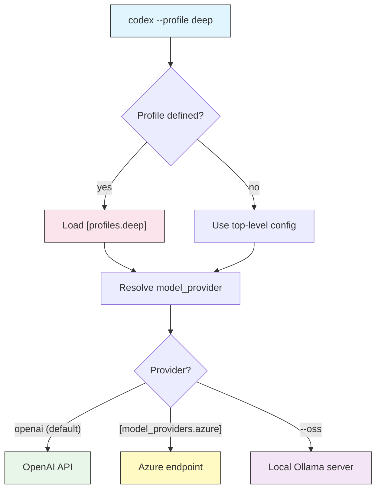

# Profile 与模型提供方

## 概述

**profile** 是 `config.toml` 中一组带名字的配置。与其在每次运行时重复
`-c model=...`、`-c approval_policy=...` 和 `-c sandbox_mode=...`,你可以把这套
组合定义一次,然后用 `--profile NAME` 切换过去。**模型提供方(model provider)**
告诉 Codex 把请求发到*哪里*——默认是 OpenAI,但同一套机制也能让你指向
Azure OpenAI、某个 OpenAI 兼容网关,或本地模型服务器。

两者结合,能把 Codex 变成可按任务重新调校的工具:快速编辑用 fast profile,
难题用 deep profile,审查用锁死的 profile,离线或私密工作用本地 profile。

## 架构



选中一个 profile 会加载它的键;profile(或顶层配置)指定一个提供方;
提供方决定实际由哪个端点来服务这个模型。

## Profile

用 `[profiles.NAME]` 表来定义一个 profile。任何顶层键都能放进去——
`model`、`model_provider`、`approval_policy`、`sandbox_mode`、
`model_reasoning_effort` 等等。

```toml
[profiles.deep]
model = "gpt-5-codex"
model_reasoning_effort = "high"
approval_policy = "on-request"
sandbox_mode = "workspace-write"

[profiles.fast]
model = "gpt-5"
model_reasoning_effort = "low"
```

### 激活一个 profile

```bash
# One run, deep profile
codex --profile deep "refactor the auth module for testability"

# Short form
codex -p fast "rename this variable everywhere"

# In headless mode
codex exec --profile readonly-review "review the staged diff"
```

### 把某个 profile 设为默认

在 `config.toml` 顶层设置 `profile`,之后每次运行都会用它,除非你用
`--profile` 覆盖。

```toml
profile = "deep"   # default profile for all sessions
```

### 优先级

当同一个键在多处被设置时,最具体的胜出:

| 优先级 | 来源 |
|--------|------|
| 1(最高) | `-c key=value` 和显式 flag(`--model`、`--sandbox` 等) |
| 2 | 当前激活的 `--profile`(或顶层 `profile`) |
| 3 | `config.toml` 中的顶层键 |
| 4(最低) | 内置默认值 |

## 模型提供方

默认情况下 Codex 与 OpenAI 通信。`[model_providers.NAME]` 表定义一个
替代端点,`model_provider = "NAME"` 选中它。

| 键 | 用途 |
|-----|------|
| `name` | 人类可读的标签 |
| `base_url` | 发送请求的 API 基础 URL |
| `env_key` | 存放 API key 的环境变量名 |
| `wire_api` | 协议:`"responses"` 或 `"chat"` |
| `query_params` | 可选查询参数(如 Azure 的 `api-version`) |

```toml
# OpenAI-compatible gateway
[model_providers.gateway]
name = "Internal Gateway"
base_url = "https://llm.example.com/v1"
env_key = "GATEWAY_API_KEY"
wire_api = "chat"

# Azure OpenAI
[model_providers.azure]
name = "Azure OpenAI"
base_url = "https://my-resource.openai.azure.com/openai"
env_key = "AZURE_OPENAI_API_KEY"
wire_api = "responses"
query_params = { api-version = "2025-04-01-preview" }
```

让某个 profile(或顶层)指向一个提供方:

```toml
[profiles.corp]
model = "gpt-5"
model_provider = "gateway"
```

`env_key` 指定的那个变量必须存在于你的环境中:

```bash
export GATEWAY_API_KEY="..."
codex --profile corp "explain this service"
```

## 本地与开源模型

`codex --oss` 会连接本地的 [Ollama](https://ollama.com) 服务器,而不是托管
API——适合离线工作或不能离开本机的代码。

```bash
# Use the default local OSS model
codex --oss "summarize this file"

# Pick a specific local model
codex --oss -m gpt-oss:20b "draft a unit test for parse()"
```

由于推理在本地进行,不需要 API key,请求也永远不会离开本机。能力取决于
本地模型,所以给 `--oss` 搭配一个较轻的任务或一个 `local` profile。

## 实用示例

### 1. 用于小改动的 fast profile

```toml
[profiles.fast]
model = "gpt-5"
model_reasoning_effort = "low"
approval_policy = "on-request"
sandbox_mode = "workspace-write"
```

```bash
codex -p fast "fix the typo in the README title"
```

### 2. 用于难题的 deep profile

```toml
[profiles.deep]
model = "gpt-5-codex"
model_reasoning_effort = "high"
sandbox_mode = "workspace-write"
```

```bash
codex -p deep "find and fix the race condition in the job queue"
```

### 3. 只读审查 profile

```toml
[profiles.readonly-review]
model = "gpt-5-codex"
approval_policy = "on-request"
sandbox_mode = "read-only"
```

```bash
git diff | codex exec -p readonly-review "review this diff"
```

### 4. 本地、私密 profile

```toml
[profiles.local]
model_provider = "oss"
model = "gpt-oss:20b"
sandbox_mode = "workspace-write"
```

```bash
codex --oss -p local "add logging to the parser"
```

### 5. 覆盖 profile 中的某一个键

flag 仍然胜过 profile,所以你可以借用一个 profile 再改动一处。

```bash
codex -p deep --sandbox read-only "just analyze, do not edit"
```

支撑这些示例的完整带注释文件是
[`profiles-config.toml`](profiles-config.toml)。

## 最佳实践

| 该做 | 不该做 |
|------|--------|
| 按意图命名 profile(`fast`、`deep`、`review`) | 按模型命名(`gpt5a`、`gpt5b`) |
| 通过 `env_key` 把提供方密钥存在环境变量里 | 在 `config.toml` 里硬编码 API key |
| 设一个合理的顶层 `profile` 默认 | 每次运行都重敲同样的 `-c` flag |
| 给审查 profile 用 `read-only` 沙箱 | 用全权限 profile 做分析 |
| 对必须留在本地的代码用 `--oss` | 未经审批把私有代码发给托管模型 |

> **Tip**: profile 与其他一切组合——CI 任务可以用
> `codex exec --profile ci-review` 固定行为,保证每个 runner 上模型、沙箱和
> 审批策略都一致。

## 故障排查

### profile 没有生效

- 检查表头拼写:`[profiles.deep]`,并用精确名称激活(`--profile deep`)。
- 记住 flag 会覆盖 profile——显式的 `--model`/`--sandbox` 胜出。

### 提供方认证失败

- `env_key` 指定的变量必须在当前 shell 中导出。
- 核实 `base_url` 和 `wire_api` 与提供方要求一致(`chat` 还是 `responses`)。
- 对 Azure,确认 `query_params` 的 `api-version` 对你的资源有效。

### `--oss` 无法连接

- 确保已安装并运行 Ollama,且已拉取模型(`ollama pull gpt-oss:20b`)。
- 确认本地服务器在其默认端口可达。

### 用错了模型

- 用 `codex --profile NAME` 启动后在 TUI 里运行 `/status` 打印生效设置。
- 检查优先级:某个顶层键或 `-c` flag 可能正在覆盖 profile。

## 相关指南

- [Configuration](../04-config/) —— profile 能容纳的每一个键
- [Automation & CI](../07-automation/) —— 固定 profile 以获得可复现的运行
- [Approvals & Sandboxing](../05-approvals-sandbox/) —— profile 打包的安全键
- [CLI Reference](../10-cli/) —— `--profile`、`--oss`、`-c` 和 `--model`
- [Getting Started](../01-getting-started/) —— 首次运行基础

---

**最后更新**: September 28, 2026
**工具**: OpenAI Codex CLI (`@openai/codex`)
**兼容模型**: GPT-5-Codex (默认), GPT-5, 以及 OpenAI 兼容和本地 (OSS) 模型
*[codexhowto](../) 指南系列的一部分*
