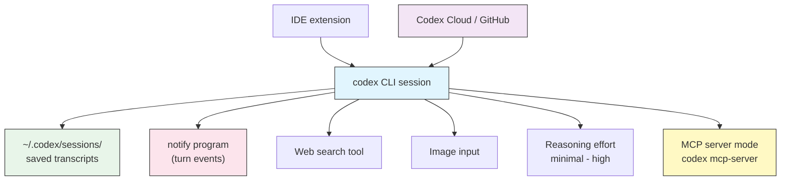

# 进阶功能

## 概述

一旦你熟悉了基础——运行 `codex`、编写 `AGENTS.md`、选择审批模式——Codex CLI 还有第二层功能,能把它从一个聊天工具变成工作流中长期的一部分。本模块讲的是新鲜感褪去后你真正会反复用到的那些:

- **会话与恢复** —— 几天后接着聊,而不是从头再来。
- **`notify` 钩子** —— 在 Codex 完成一轮或需要你时,运行你自己的程序。
- **联网搜索** —— 让 Codex 把当前信息拉进任务里。
- **图片输入** —— 把截图或设计稿交给 Codex。
- **推理强度** —— 在难题上用速度换深度。
- **IDE 扩展** —— 同一个智能体,搬进你的编辑器。
- **Codex Cloud** —— 把长任务委托给托管沙箱,由它开 pull request。
- **GitHub 审查** —— 在你的 pull request 上 `@codex`。
- **MCP server 模式** —— 让其他智能体来驱动 Codex。

每一项都是独立的;一次采用一个即可。

## 架构



Codex 通过 `~/.codex/` 主目录读写一切,所以这些功能共享同一份事实来源:你的配置、你的 `AGENTS.md`,以及你的会话历史。

## 会话与恢复

每一次对话都会随进程写入磁盘,存放在 `~/.codex/sessions/` 下。这意味着你可以关掉终端、重启,再回到你离开时的确切位置。

| 操作 | 命令 |
|------|------|
| 恢复最近的会话 | `codex resume --last` |
| 从列表中挑选一个会话 | `codex resume` |
| 恢复指定会话 | `codex resume <SESSION_ID>` |
| 开始一段全新对话(在 TUI 中) | `/new` |
| 收缩长对话以回收上下文 | `/compact` |

`codex resume`(不带参数)会打开一个交互式选择器,显示最近的会话及其工作目录和首个 prompt,便于你凭眼睛找到正确的那个。

> **Tip**: 当一个会话变长、Codex 开始"健忘"时,运行 `/compact`。它会把到目前为止的对话总结成紧凑形式,在保留重要决策的同时释放上下文窗口空间。切换到不相关的任务时,则改用 `/new`。

## `notify` 钩子

`notify` 是 Codex CLI 最接近事件钩子的东西。你在 `config.toml` 中注册一个外部程序,当值得注意的事件发生时,Codex 就运行它——最有用的是一轮完成时,或 Codex 被阻塞、等待你审批时。

```toml
# ~/.codex/config.toml
notify = ["bash", "/home/you/.codex/notify.sh"]
```

Codex 调用该程序,并传入描述事件的 JSON 载荷(作为参数和/或经由 stdin)。你的脚本决定如何处理它——发到 Slack、响铃、发桌面通知,或追加到日志。

这就是你不再需要盯着长任务的方法:启动它,切换窗口,让 `notify` 在 Codex 需要你回来时告诉你。本文件夹里的 [`notify.sh`](notify.sh) 是一个即用示例。

> **Note**: `notify` 以你的权限在你的机器上、沙箱之外运行。保持脚本小巧且经过审计——把它当成任何其他 shell 钩子一样对待。

## 联网搜索

默认情况下 Codex 依据你的代码和它的训练来推理。当任务需要当前信息时——某个库的新版本、你正粘贴进去的报错信息、一个改动过的 API——就打开联网搜索。

```toml
# ~/.codex/config.toml
[tools]
web_search = true
```

或者用 flag 按次运行启用:

```bash
codex --search "check whether our pinned axios version has known CVEs"
```

打开搜索后,Codex 可以抓取网页并引用它找到的内容。离线或隔离网络的工作则关掉它。

## 图片输入

Codex 是多模态的。附上一张截图、一份设计稿,或一块白板的照片,让 Codex 据此工作。

```bash
# Attach a screenshot of a failing UI
codex --image ./bug-screenshot.png "the button overlaps the footer on mobile — fix the CSS"

# Short flag, multiple images
codex -i mockup-1.png -i mockup-2.png "build a React component matching these two states"
```

这对前端工作("照着这个设计做")、复现视觉 bug,或读取截图里显示的报错(而不必重新敲一遍)尤其好用。

## 推理强度

Codex 的模型支持自适应推理。更高的强度意味着模型在动手前思考更久——在棘手问题上更好,在简单问题上更慢、更贵。

| 级别 | 用于 |
|------|------|
| `minimal` | 琐碎编辑、格式化、快速查询 |
| `low` | 路径清晰的常规改动 |
| `medium` | 日常特性开发(不错的默认) |
| `high` | 架构、棘手调试、微妙重构 |

用 `/model` 交互式设置,或在配置中持久化:

```toml
# ~/.codex/config.toml
model = "gpt-5-codex"
model_reasoning_effort = "high"
```

> **Tip**: 别把 `high` 一直开着。它会在不需要的任务上烧掉 token 和时间。在一次会话的难点部分调高,然后再调回来。

## IDE 扩展

有一个官方的 Codex 扩展,面向 VS Code(以及 Cursor 等 VS Code 衍生版)。它在你的编辑器里运行与终端里相同的智能体,带有内联 diff 和一键审批。

该扩展共享你的 `~/.codex/` 配置——同样的 `config.toml`、同样的 profile、同样的 `AGENTS.md` 文件。你在这里学到的关于审批、沙箱和项目记忆的一切都原样适用。从你编辑器的扩展市场安装它,并以相同方式登录(`codex login`)。

## Codex Cloud

Codex Cloud 让你把任务委托给一个托管环境,而不是在本地运行。你描述工作,Codex 在云端沙箱里执行,并可以带着结果开一个 pull request——适合你不想占用本机的长任务或并行任务。

你从 Codex 网页端(chatgpt.com/codex)启动云任务,或从 CLI 移交,再以分支或 PR 的形式取回结果。确切的命令和可用性变化很快,所以把本节当作概念性的:心智模型是"同一个智能体,别人的机器,最终产出一个 PR"。

## GitHub 代码审查

Codex 以审查者身份与 GitHub 集成。一旦在某个仓库上安装了 Codex 的 GitHub app,在 pull request 上提及 `@codex` 就会请它审查 diff 并留下评论。这与本地的 `/review` 命令以及 [Automation](../07-automation/) 中的 CI 方案互补——工作时用本地审查,PR 上用机器人做第二遍复查。

## MCP server 模式

Codex 通常是一个 MCP *客户端*(它调用外部的 MCP server——见 [MCP](../06-mcp/))。它也能作为一个 MCP *server* 运行,让另一个智能体或工具把 Codex 当作可调用的工具来驱动:

```bash
codex mcp-server
```

这通过 stdio、使用模型上下文协议(Model Context Protocol)对外暴露 Codex。当你在构建一个更大的多智能体系统、想让 Codex 成为其中一个 worker 时,用它。

## 实用示例

### 1. 恢复昨天的工作

```bash
# Come back to the most recent session
codex resume --last

# Or browse and pick
codex resume
```

Codex 会重新加载完整对话,包括它改过的文件和你做过的决策,让你在重构中途继续。

### 2. 长任务完成时收到提醒

```toml
# ~/.codex/config.toml
notify = ["bash", "/home/you/.codex/notify.sh"]
```

启动一个大任务,然后走开。当 Codex 完成这一轮或碰到审批提示时,`notify.sh` 会弹出桌面通知,你只在需要时才回来。

### 3. 任务中途查一个当前问题

```bash
codex --search "does Next.js 15 still support the pages router, and what's the migration note?"
```

联网搜索让 Codex 把答案建立在当前文档上,而不是凭训练数据猜测。

### 4. 从截图修一个视觉 bug

```bash
codex --image ./mobile-overlap.png \
  "on screens under 400px the CTA overlaps the footer — find and fix the responsive CSS"
```

### 5. 在难点部分调高推理强度

```bash
# Deep session for a tricky concurrency bug
codex -c model_reasoning_effort="high" "trace this deadlock between the worker pool and the DB connection cache"
```

### 6. 在马拉松式会话中回收上下文

```text
/compact
```

Codex 总结到目前为止的一切,释放空间以便在不丢失主线的情况下继续。

### 7. 把 Codex 暴露给另一个智能体

```bash
# Let an orchestrator call Codex as an MCP tool
codex mcp-server
```

## 最佳实践

| 该做 | 不该做 |
|------|--------|
| 用 `codex resume` 把长期工作保持在同一线程 | 每个小跟进都开一个新会话 |
| 上下文快满时运行 `/compact` | 放任会话膨胀到 Codex 忘掉早期决策 |
| 保持 `notify` 脚本小巧且经过审计 | 把机密或重逻辑放进 notify 钩子 |
| 任务需要当前事实时启用联网搜索 | 离线或敏感工作时还开着搜索 |
| 在难点部分调高推理强度,之后调低 | 一切都跑 `high` 并为此买单 |
| 让 CLI 和 IDE 共享同一份 `~/.codex/` 配置 | 每个工具维护各自分叉的设置 |

## 故障排查

### `codex resume` 显示没有会话

**解决方法:**
- 确认 `~/.codex/sessions/` 下存在会话(若设了 `CODEX_HOME`,则是 `$CODEX_HOME/sessions/`)。
- 你可能处在不同的用户账户,或一个没有挂载 home 目录的容器里。

### notify 程序从不运行

**解决方法:**
- 检查 `config.toml` 里的 `notify` 数组指向一个存在且可执行的脚本(`chmod +x`)。
- 确保解释器正确:`notify = ["bash", "/abs/path/notify.sh"]`。
- 用一个样例 JSON 参数手动测试脚本,确认它不报错。

### 联网搜索什么也没返回

**解决方法:**
- 核实 `[tools]` 下 `web_search = true`,或传 `--search`。
- 网络必须可达——`read-only` 沙箱或离线机器会阻断它。

### 图片未被识别

**解决方法:**
- 传一个指向受支持图片格式(PNG/JPEG)的真实路径。
- 每个文件用一次 `--image`/`-i`;确认文件相对于你的工作目录存在。

## 相关指南

- [Configuration](../04-config/) - 这些功能背后的 `config.toml` 键
- [Approvals & Sandboxing](../05-approvals-sandbox/) - 联网搜索和命令被允许做什么
- [MCP](../06-mcp/) - 作为 MCP 客户端与服务端的 Codex
- [Automation & CI](../07-automation/) - CI 中的无头运行与 GitHub 审查
- [Profiles & Model Providers](../08-profiles/) - 按 profile 设定推理强度
- [CLI Reference](../10-cli/) - 每一个 flag 和子命令

---

**最后更新**: September 28, 2026
**工具**: OpenAI Codex CLI (`@openai/codex`)
**兼容模型**: GPT-5-Codex (默认), GPT-5, 以及 OpenAI 兼容和本地 (OSS) 模型
*[codexhowto](../) 指南系列的一部分*
