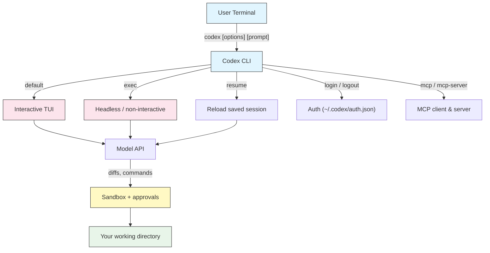
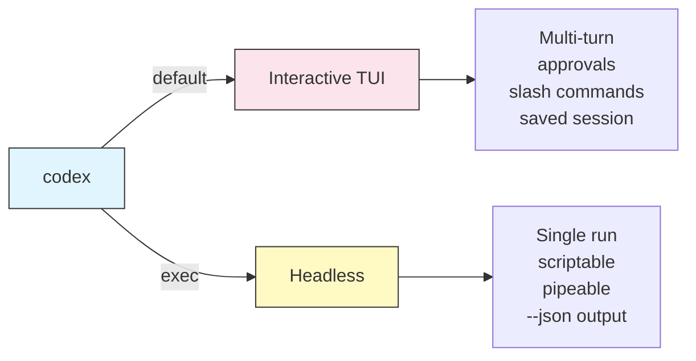

# CLI 参考

## 概述

`codex` 命令是 Codex CLI 的入口——OpenAI 的开源终端编码智能体。它默认运行一个交互式 TUI,但同一个二进制也驱动非交互自动化、会话管理、认证和 MCP 集成。本模块是完整的命令行参考:所有子命令、flag、配置键和环境变量,汇于一处。

## 架构



## 安装与升级

Codex CLI 通过 npm 和 Homebrew 分发。

```bash
# Install with npm (Node.js 18+)
npm install -g @openai/codex

# Or with Homebrew (macOS / Linux)
brew install codex

# Upgrade to the latest release
npm install -g @openai/codex@latest
brew upgrade codex

# Verify the install
codex --version
```

> **Note**: 在 Windows 上,操作系统级沙箱有限。在 WSL2 中运行 Codex 能获得完整的 Linux 沙箱(Landlock + seccomp);原生 Windows 可用,但更依赖审批提示。见 [Approvals & Sandboxing](../05-approvals-sandbox/)。

## 子命令

| 命令 | 说明 | 示例 |
|------|------|------|
| `codex` | 启动交互式 TUI | `codex` |
| `codex "prompt"` | 带初始 prompt 启动 TUI | `codex "explain this repo"` |
| `codex exec "prompt"` | 非交互(无头)运行;打印结果并退出 | `codex exec "add tests for utils.ts"` |
| `codex resume` | 打开已保存会话的选择器 | `codex resume` |
| `codex resume --last` | 恢复最近的会话 | `codex resume --last` |
| `codex resume <id>` | 按 ID 恢复指定会话 | `codex resume 01J9...` |
| `codex login` | 用 ChatGPT 登录(打开浏览器) | `codex login` |
| `codex login --api-key <key>` | 用 API key 登录 | `codex login --api-key "$OPENAI_API_KEY"` |
| `codex login status` | 显示当前认证状态 | `codex login status` |
| `codex logout` | 登出并清除凭证 | `codex logout` |
| `codex mcp` | 管理 MCP server(添加 / 列出) | `codex mcp list` |
| `codex mcp-server` | 把 Codex 本身作为 MCP server 运行(stdio) | `codex mcp-server` |
| `codex apply` | 把最近生成的 diff/patch 应用到工作树 | `codex apply` |
| `codex completion <shell>` | 打印 shell 补全脚本 | `codex completion zsh` |

### 交互式 vs 无头



**交互式**(默认)—— 一个全屏终端 UI,带 slash 命令、审批提示和内联 diff:

```bash
codex
codex "walk me through the authentication flow"
```

**无头**(`codex exec`)—— 一个 prompt,运行到完成,没有交互式审批。为脚本和 CI 而生:

```bash
codex exec "run the linter and fix every warning"
git diff | codex exec "review this diff for security issues"
```

## 核心 flag

| Flag | 别名 | 说明 | 示例 |
|------|------|------|------|
| `--model <name>` | `-m` | 选择模型 | `codex -m gpt-5` |
| `--profile <name>` | `-p` | 使用一个配置 profile | `codex -p deep` |
| `--ask-for-approval <policy>` | `-a` | 审批策略 | `codex -a on-request` |
| `--sandbox <mode>` | `-s` | 沙箱模式 | `codex -s read-only` |
| `--full-auto` | | `workspace-write` 沙箱 + 低摩擦审批 | `codex --full-auto` |
| `--dangerously-bypass-approvals-and-sandbox` | | 无审批、无沙箱(仅限容器/CI) | `codex --dangerously-bypass-approvals-and-sandbox` |
| `--cd <dir>` | `-C` | 设置工作目录 | `codex -C ./service` |
| `--config key=value` | `-c` | 覆盖任意配置键 | `codex -c model_reasoning_effort="high"` |
| `--image <path>` | `-i` | 给 prompt 附一张图片 | `codex -i ui.png "match this"` |
| `--oss` | | 使用本地(Ollama)模型 | `codex --oss -m gpt-oss` |
| `--search` | | 为本次运行启用联网搜索 | `codex --search "latest API change"` |
| `--version` | | 打印版本并退出 | `codex --version` |
| `--help` | `-h` | 显示帮助 | `codex --help` |

### 审批策略取值(`-a`)

| 取值 | 行为 |
|------|------|
| `untrusted` | 审批大多数命令;只有安全允许列表会自动运行 |
| `on-failure` | 在沙箱中运行;仅当命令失败、需要提权时才询问 |
| `on-request` | 模型在自认为需要时请求更多访问(平衡的默认) |
| `never` | 从不询问;在所设沙箱内完全自主 |

### 沙箱模式取值(`-s`)

| 取值 | 行为 |
|------|------|
| `read-only` | 只读文件——不写入、不联网 |
| `workspace-write` | 在工作目录和临时目录内读写;默认关闭网络 |
| `danger-full-access` | 完全不做沙箱 |

关于两个维度如何组合、该用哪些搭配,见 [Approvals & Sandboxing](../05-approvals-sandbox/)。

### `-c` / `--config` 覆盖

`-c` flag 为单次运行设置任意 `config.toml` 键,嵌套表用点号路径。取值是 TOML,所以字符串要加引号。

```bash
# Override the model and reasoning effort
codex -c model="gpt-5" -c model_reasoning_effort="high" "design the cache layer"

# Force a read-only sandbox for a review
codex -c 'sandbox_mode="read-only"' "audit this module"

# Set a nested table key
codex -c 'sandbox_workspace_write.network_access=true' "install and run the e2e suite"
```

**优先级**(最高者胜):`-c` 和命令行 flag → 激活的 `--profile` → 顶层 `config.toml` → 内置默认值。

## 配置键

这些位于 `~/.codex/config.toml`(或 `$CODEX_HOME/config.toml`)。完整细节见 [Configuration](../04-config/);这里是速查索引。

| 键 | 用途 |
|-----|------|
| `model` | 使用的模型(如 `"gpt-5-codex"`、`"gpt-5"`) |
| `model_provider` | 路由到哪个提供方(默认 `"openai"`) |
| `model_reasoning_effort` | `"minimal"` \| `"low"` \| `"medium"` \| `"high"` |
| `approval_policy` | `"untrusted"` \| `"on-failure"` \| `"on-request"` \| `"never"` |
| `sandbox_mode` | `"read-only"` \| `"workspace-write"` \| `"danger-full-access"` |
| `[sandbox_workspace_write]` | `network_access`、`writable_roots`、`exclude_tmpdir_env_var`、`exclude_slash_tmp` |
| `[profiles.<name>]` | 上述设置的具名组合 |
| `[model_providers.<name>]` | 自定义/OpenAI 兼容提供方(`base_url`、`env_key`、`wire_api`) |
| `[mcp_servers.<name>]` | MCP server 定义(`command`、`args`、`env`) |
| `notify` | 在轮次事件上运行的外部程序 |
| `[tools] web_search` | 启用联网搜索(`true`/`false`) |
| `disable_response_storage` | 选择退出服务端响应存储 |
| `project_doc_max_bytes` | 读取 `AGENTS.md` 的上限 |

## 环境变量

| 变量 | 说明 |
|------|------|
| `OPENAI_API_KEY` | 用于 API key 认证及 CI 的 API key |
| `CODEX_HOME` | 覆盖 `~/.codex` 主目录(配置、会话、认证) |
| `RUST_LOG` | 调试用日志级别(如 `RUST_LOG=debug`) |

提供方 API key 通过 `[model_providers.<name>]` 中的 `env_key` 按名引用,所以一个自定义提供方可能会从环境中读取,比如 `AZURE_OPENAI_API_KEY`。

```bash
# Point Codex at a different home (useful for isolated setups or CI)
export CODEX_HOME="$PWD/.codex-ci"

# API-key auth for headless use
export OPENAI_API_KEY="sk-..."
codex exec "run the test suite and summarize failures"
```

## 认证

Codex 支持两种认证方式,存储于 `~/.codex/auth.json`:

| 方式 | 如何 | 最适合 |
|------|------|--------|
| ChatGPT 登录 | `codex login`(打开浏览器) | 在付费 ChatGPT 计划上做本地交互式使用 |
| API key | `codex login --api-key "$OPENAI_API_KEY"` 或 `OPENAI_API_KEY` 环境变量 | CI、服务器、脚本化 |

```bash
# Interactive sign-in
codex login

# Check who you are signed in as
codex login status

# Sign out
codex logout
```

> **Note**: 若你的计划包含 Codex 用量,日常交互式工作用 ChatGPT 登录。任何非交互场景用 API key 认证(经 `OPENAI_API_KEY`),因为无头运行无法完成浏览器流程。

## 常见 flag 组合

| 用例 | 命令 |
|------|------|
| 只读代码审查 | `codex -s read-only -a on-request "review this module"` |
| 日常编码(平衡) | `codex -a on-request -s workspace-write "implement the feature"` |
| 放手的本地运行 | `codex --full-auto "fix all lint errors"` |
| 对难 bug 深度推理 | `codex -c model_reasoning_effort="high" "trace this deadlock"` |
| 无头 CI 审查 | `codex exec -s read-only "review the staged diff"` |
| 一次性容器 / CI,无提示 | `codex exec --dangerously-bypass-approvals-and-sandbox "..."` |
| 本地/离线模型 | `codex --oss -m gpt-oss "refactor this file"` |
| 在另一个目录工作 | `codex -C ./services/api "add request logging"` |
| 供脚本用的结构化输出 | `codex exec --json "list the public functions"` |

## 供脚本用的无头输出

`codex exec` 就是为接入其他工具而设计的。

```bash
# Structured JSONL events for parsing
codex exec --json "summarize the changes in this PR"

# Write only the final assistant message to a file
codex exec --output-last-message result.txt "generate release notes from git log"

# Pipe input in
cat error.log | codex exec "group these errors and suggest the top fix"
```

`codex exec` 在运行失败时以非零退出,所以它能在 CI 里当门禁。完整流水线见 [Automation & CI](../07-automation/)。

## 速查

### 最常用命令

```bash
# Interactive session
codex

# One-off headless task
codex exec "your task"

# Resume where you left off
codex resume --last

# Sign in
codex login

# Read-only review
codex -s read-only "review this code"
```

## 故障排查

### `codex: command not found`

**解决方法:**
- 重新安装:`npm install -g @openai/codex`(或 `brew install codex`)。
- 确保你的 npm 全局 bin 目录在 `PATH` 上。
- 安装后重启 shell。

### 认证失败

**解决方法:**
- 运行 `codex login status` 查看当前状态。
- 对 CI,确认 `OPENAI_API_KEY` 已设置且有效(`codex login --api-key "$OPENAI_API_KEY"`)。
- 若凭证过期,删除 `~/.codex/auth.json` 后重新登录。

### 命令被阻断或不断请求审批

**解决方法:**
- 你很可能处在 `read-only` 或 `untrusted`。选一个更宽松的搭配,例如 `-a on-request -s workspace-write`。
- 依赖网络的命令需要 `sandbox_workspace_write.network_access=true`。
- 见 [Approvals & Sandboxing](../05-approvals-sandbox/)。

### 配置更改没有生效

**解决方法:**
- 记住优先级:某个 `-c` flag 或激活的 `--profile` 会覆盖顶层 `config.toml`。
- 检查 TOML 语法——字符串必须加引号,表用 `[section]` 表头。
- 确认你编辑的是 `~/.codex/config.toml`(或 `$CODEX_HOME/config.toml`)。

## 相关指南

- [Getting Started](../01-getting-started/) - 安装、登录、首次运行
- [Slash Commands & Custom Prompts](../02-slash-commands/) - 会话内命令
- [AGENTS.md](../03-agents-md/) - 项目记忆
- [Configuration](../04-config/) - 完整 `config.toml` 参考
- [Approvals & Sandboxing](../05-approvals-sandbox/) - 安全模型
- [Automation & CI](../07-automation/) - 流水线中的 `codex exec`

---

**最后更新**: September 28, 2026
**工具**: OpenAI Codex CLI (`@openai/codex`)
**兼容模型**: GPT-5-Codex (默认), GPT-5, 以及 OpenAI 兼容和本地 (OSS) 模型
*[codexhowto](../) 指南系列的一部分*
