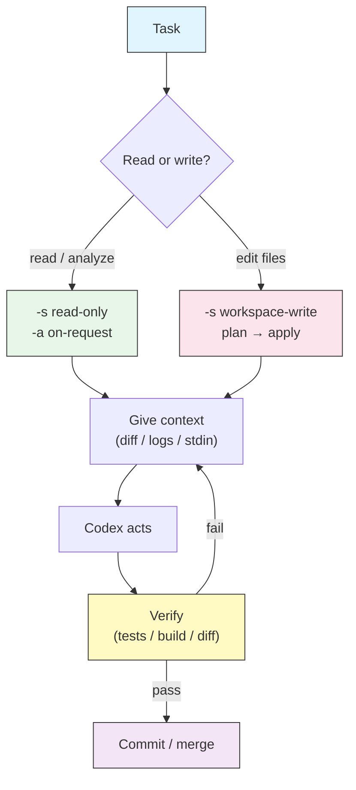

# 实战食谱与工作流

## 概述

前面的模块一次讲一个功能。真实的工作从来不是单一功能,而是一段**流程**:挑选模型和推理强度、选择与风险匹配的审批策略和沙箱、给 Codex 喂对上下文、让它行动、再验证结果。本课是一本端到端**食谱**合集,把这些环节串成你真正会做的任务:上手新仓库、跑 TDD 循环、在 CI 里为 PR 把关、驱动多文件 codemod、调试堆栈跟踪、批量生成 docstring,以及分流一堆日志。

每个食谱都写明**目标**、确切的**命令**(带上让它安全的审批与沙箱 flag)、要交给 Codex 的**提示词**,以及跑完后如何**验证**。把它们当作起点——复制一份、改掉路径和措辞,让它变成你自己的。

## 架构



下面每个食谱都是在同一个循环里走一遍。随任务变化的两个决定是:**Codex 能碰多少**(沙箱)和**它何时必须询问**(审批策略)——完整模型见[审批与沙箱](../05-approvals-sandbox/)。

## 怎么读一个食谱

每个食谱分四部分:

| 部分 | 回答什么 |
|------|----------|
| **目标** | 你最终想要什么 |
| **命令** | 如何用正确的安全 flag 启动 Codex |
| **提示词** | 交给模型的指令 |
| **验证** | 如何确认它真的生效了 |

永远别跳过**验证**。Codex 报告的是它*打算*做什么;你要用测试、构建或亲自读一遍的 diff 来确认它*实际*做了什么。

## 食谱 1 —— 上手一个陌生仓库

**目标**:在一个字节都不改的前提下,理解你从没见过的代码库。

**命令** —— 严格只读,让"导览"绝不可能改动任何东西:

```bash
codex -s read-only -a on-request \
  "Give me a tour of this repository."
```

**提示词** —— 要一张地图,而不是一部小说:

```text
You are onboarding me to this repo. Produce:
1. A one-paragraph summary of what it does.
2. The top-level directory layout with a one-line purpose for each.
3. The main entry points and how a request/command flows through them.
4. Build, test, and run commands (read them from config files, do not guess).
5. The five files worth reading first, and why.
Do not modify anything.
```

**验证**:抽查其中两三条说法,对照真实文件核对。确认 build/test 命令确实存在于 `package.json`、`Makefile`、`pyproject.toml` 等文件中。可复用版本见 [`scripts/onboarding-tour.sh`](scripts/onboarding-tour.sh)。

> **提示**:把导览内容存进 `AGENTS.md`,这样以后的会话直接带着上下文开始,而不必重新摸索。见 [AGENTS.md](../03-agents-md/)。

## 食谱 2 —— TDD 循环:红 → 绿 → 验证

**目标**:测试先行地实现一个功能,让 Codex 先写失败的测试、再让它通过、并加以证明。

**命令** —— Codex 需要编辑并运行测试,所以用 `workspace-write`;审批保持 on-request,让它在任何意外动作前先停一下:

```bash
codex -s workspace-write -a on-request \
  "Add input validation to parseConfig() using TDD."
```

**提示词** —— 明确强制顺序,别让它跳到答案:

```text
Work test-first, one step at a time:
1. Write a failing test for parseConfig() rejecting an empty path with a
   clear error. Run the suite and show me it fails for the right reason.
2. Implement the minimal change to make that test pass. Run the suite again.
3. Do not touch unrelated code. Stop after the suite is green.
```

**验证**:亲自跑一遍测试套件(`npm test`、`pytest`、`go test ./...`)。读 diff——改动应当很小,且局限于 `parseConfig` 及其测试。如果测试第一次运行就通过了,那它其实并没有先失败;让 Codex 重做第 1 步。

## 食谱 3 —— CI 中的自动代码审查

**目标**:在每个 PR 上审查 diff,发现阻断性 bug 就让检查失败,全程无人值守。

**命令** —— 无头 `codex exec`,只读(审查从不需要写),用 API key 认证,因为 CI 没有浏览器:

```bash
git fetch origin "$BASE_REF"
git diff "origin/$BASE_REF"... \
  | codex exec --sandbox read-only \
    "Review this diff. Report findings grouped by severity (blocking / warning
     / nit). If any finding is blocking, end your reply with the line BLOCKING."
```

**提示词把关** —— 用退出码把审查变成真正的通过/失败:

```bash
OUT=$(git diff "origin/$BASE_REF"... | codex exec --sandbox read-only \
  "Review this diff. End with BLOCKING if you find a release-blocking bug.")
echo "$OUT"
echo "$OUT" | grep -q '^BLOCKING' && { echo "Review failed"; exit 1; } || true
```

**验证**:在一个你确定干净的 PR 上跑一次(应退出 0),再在一个植入了 bug 的 PR 上跑一次(应退出 1)。本食谱是[自动化与 CI](../07-automation/)中那条流水线的交互式表亲——完整的 GitHub Actions 作业可复用 [`../07-automation/scripts/codex-review.yml`](../07-automation/scripts/codex-review.yml)。

## 食谱 4 —— 大规模多文件重构 / codemod

**目标**:在许多文件上施加同一种机械改动(重命名 API、替换日志调用、迁移 import),又不引发失控的编辑。

**两个阶段——先只读规划,再施加改动。** 这是任何"波及面很广"的操作的安全模式。

阶段一,规划(不写):

```bash
codex exec --sandbox read-only \
  "Find every call site of the old logger \`log.warn(msg)\` and list the files
   and line numbers. Propose the exact replacement \`logger.warning(msg)\`.
   Output a plan only — do not edit anything."
```

阶段二,施加(在你读过计划之后):

```bash
codex -s workspace-write -a on-request \
  "Apply the logger migration from the plan. Change only the call sites listed.
   After editing, run the test suite and report the result."
```

**验证**:用 `git diff --stat` 确认改动数量与计划一致;`grep -rn 'log.warn(' .` 应当返回空;测试套件必须仍然通过。可运行的两阶段封装见 [`scripts/codemod-plan-then-apply.sh`](scripts/codemod-plan-then-apply.sh)。

> **Warning**:绝不要用 `--dangerously-bypass-approvals-and-sandbox` 去启动一次大范围 codemod。一个坏的模式一次性铺满全仓,事后撤销远比事前预防更难。

## 食谱 5 —— 从堆栈跟踪调试失败的测试

**目标**:从一个红色测试加一段堆栈跟踪,走到修复并让整个套件变绿。

**命令** —— 把失败信息作为上下文管道进去,让 Codex 编辑并重跑:

```bash
npm test 2>&1 | tail -n 40 \
  | codex exec -s workspace-write -a on-request \
    "This is the failing test output. Find the root cause, fix it, and re-run
     the failing test to confirm it passes. Do not change unrelated tests."
```

**提示词补充** —— 当原因不明显时,让它先诊断再修复,好让你能核对它的判断:

```text
Before editing, state in two sentences what you believe the root cause is and
which file it lives in. Then make the smallest fix and re-run the test.
```

**验证**:跑完整套件,而不只是那一个测试——一个会弄坏邻居的修复不算修复。读 diff,确认它针对的是根因,而不是症状(比如它修的是差一错误,而不是把断言放松了)。

## 食谱 6 —— 批量生成 docstring / 注释

**目标**:在整个包里添加或修补 docstring,同时不改变行为。

**命令** —— 遍历文件,每个文件跑一次聚焦的编辑,让每次改动都小而可审:

```bash
for f in src/**/*.py; do
  echo "== $f =="
  codex exec -s workspace-write -a on-request \
    "Add or fix docstrings in $f. Document parameters, returns, and raised
     errors. Do NOT change any executable code — comments and docstrings only."
done
```

**验证**:`git diff` 应只触及 docstring/注释——没有逻辑行。跑测试套件证明行为未变,再跑 linter(`ruff`、`flake8`)抓出格式错误的 docstring。这与[自动化与 CI](../07-automation/)中的批处理模式如出一辙;见 [`../07-automation/scripts/batch-docstrings.sh`](../07-automation/scripts/batch-docstrings.sh)。

## 食谱 7 —— 日志 / 事故分流

**目标**:把一墙错误输出,变成一份排好序、去过重的行动清单。

**命令** —— 只读(你在分析,不在修复),把日志管道进去,把摘要落到文件:

```bash
tail -n 5000 /var/log/app/error.log \
  | codex exec --sandbox read-only --output-last-message triage.md \
    "Group these errors by root cause, collapse duplicates, and rank the top 5
     by impact. For each, give the likely cause and the first thing to check."
cat triage.md
```

**验证**:打开 `triage.md`,确认排在最前的那条与你在原始日志里能看到的最频繁或最严重的错误相符。由于本次运行是只读的,它碰不到生产状态——对着线上日志文件跑也安全。

> **提示**:要做成周期性的版本,把它放进 cron 作业,并把 `--output-last-message` 的文件发到值班邮箱,做法见[自动化与 CI](../07-automation/)。

## 最佳实践

| Do | Don't |
|----|-------|
| 让沙箱匹配任务:分析用 `read-only`,编辑用 `workspace-write` | 因为 `--dangerously-bypass-approvals-and-sandbox` 少敲几个字就用它 |
| 大范围改动先只读规划再施加 | 让 codemod 一次性无审查地铺满全仓 |
| 通过 stdin 喂上下文(diff、日志、堆栈) | 让 Codex 去重新推导你本可以直接粘贴的东西 |
| 永远用测试 / 构建 / 亲自读的 diff 来验证 | 相信模型对自己工作的自述 |
| 每次批量编辑只针对一个文件、一个关注点 | 用一句含糊的提示词要一大片改动 |
| 把来之不易的上下文存进 `AGENTS.md` | 每个会话都重讲一遍仓库 |

## 故障排查

### Codex 改的比我要求的多

- 提示词太宽,或沙箱太松。先按只读重跑规划阶段(食谱 4),并把提示词限定到具名文件。
- 用 `git restore` / `git checkout --` 丢弃多余的编辑,再用更紧的指令重试。

### 脚本里运行卡住

- 无头 `codex exec` 撞上了它无法回答的审批。给它一组能无人值守跑完的沙箱 + 审批组合,或用 `timeout` 包起来。见[自动化与 CI](../07-automation/)。

### "失败的"测试第一次运行就通过了(食谱 2)

- 它从没红过,所以这个测试什么都证明不了。让 Codex 在实现前明确展示失败的那次运行,或者你自己先把测试写出来。

### 审查食谱从不让构建失败(食谱 3)

- 把关依赖一个确切的哨兵词。让提示词以固定 token(`BLOCKING`)结尾,并用 `grep -q '^BLOCKING'` 去匹配,而不是靠模糊的散文。

## 相关指南

- [审批与沙箱](../05-approvals-sandbox/) —— 每个食谱都倚赖的沙箱/审批组合
- [自动化与 CI](../07-automation/) —— 无头 `codex exec`、退出码把关、批处理循环
- [配置](../04-config/) —— 设好默认值,让食谱少敲几个 flag
- [AGENTS.md](../03-agents-md/) —— 在会话之间保留仓库上下文
- [Profile 与模型提供方](../08-profiles/) —— 把一个食谱的 flag 打包成命名 profile
- [CLI 参考](../10-cli/) —— 上面用到的每一个 flag

---

**最后更新**: September 28, 2026
**工具**: OpenAI Codex CLI (`@openai/codex`)
**兼容模型**: GPT-5-Codex (默认), GPT-5, 以及 OpenAI 兼容和本地 (OSS) 模型
*[codexhowto](../) 指南系列的一部分*
