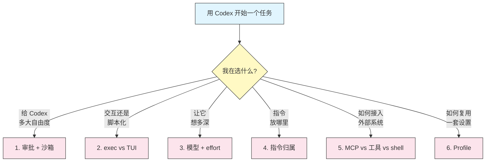
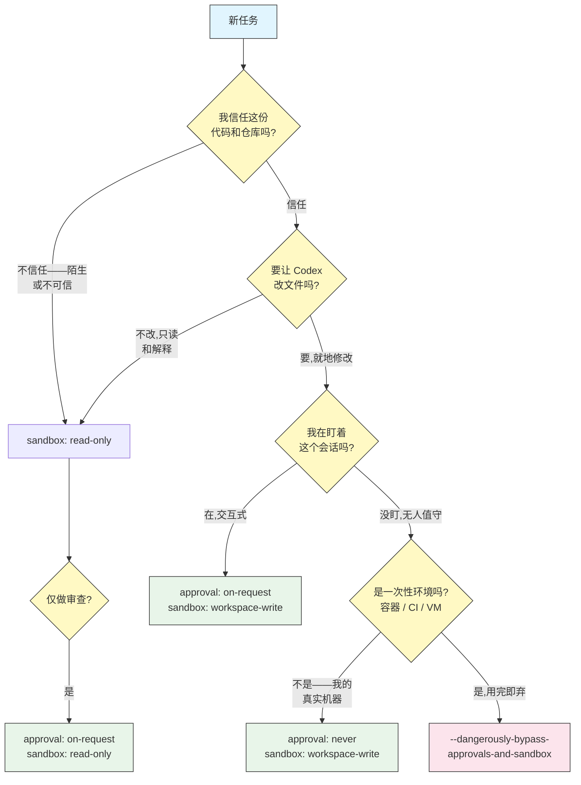
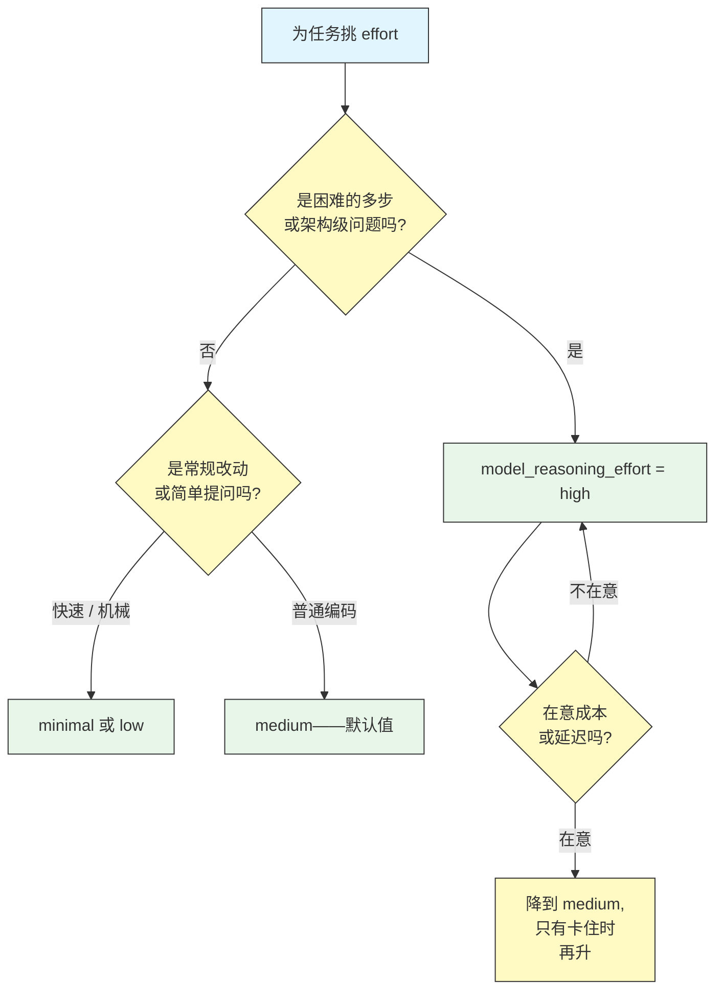
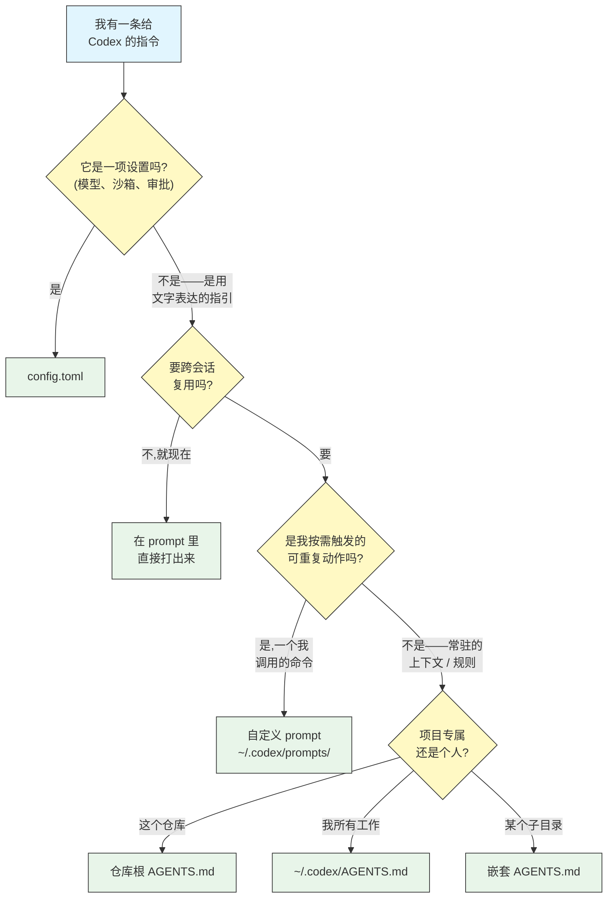
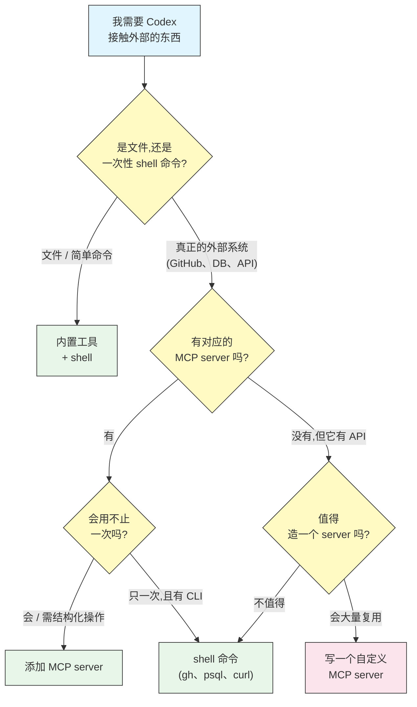
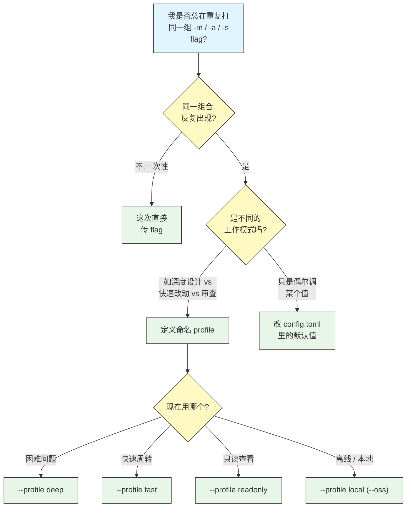

# 决策指南

## 概述

其他模块告诉你每个 Codex CLI 功能**是什么**;本模块帮你决定该**选哪个**。Codex 暴露的每一项设置——审批策略、沙箱模式、模型、推理强度、指令放在哪里、要不要加 MCP server——都是速度、成本、安全和精力之间的取舍。选得好是一种判断力,不是查表。

下面每份指南都由三部分组成:一张可以从上往下走的流程图、一张点明取舍的表格,以及一个**干脆的默认值**——当你不想多想时该选什么。拿不准时就用默认值,那是多数情况下正确的选择。

## 这些决策



## 1. 该用哪种审批策略和沙箱模式?

这是你最常做的决策,也是风险最高的一个。两个维度相互独立:`approval_policy` 决定 *Codex 何时询问你*,`sandbox_mode` 决定 *操作系统允许它做什么*。从"你有多信任这份代码"和"你想盯得多紧"出发。



| 场景 | 审批 | 沙箱 | 为什么 |
|------|------|------|--------|
| 审查 / 探索陌生代码 | `on-request` | `read-only` | 无法写入;升级前仍会问你 |
| 日常交互式编码 | `on-request` | `workspace-write` | Codex 在项目内自由改动,越界前才问 |
| 可信、范围清晰的多步任务 | `on-failure`(`--full-auto`) | `workspace-write` | 打扰更少;仅在失败或升级时才问 |
| 自己机器上的无人值守运行 | `never` | `workspace-write` | 不再询问,但 OS 仍默认拦截工作区外写入和联网 |
| CI / 容器 / 一次性 VM | `never` | `danger-full-access` | 在没什么可损失的地方给最大自主权 |

**默认:`on-request` + `workspace-write`。** 这是日常组合——就地修改、除非任务需要否则不联网、越过工作区边界前先询问。只有在不信任代码时才降到 `read-only`,只有在一次性环境里才升到 `danger-full-access`。

## 2. 用无头 `codex exec` 还是交互式 TUI?

两种方式跑的是同一个引擎。问题在于:是否有人在环节里回答提示、把控方向。

```mermaid
graph TD
    A["运行 Codex"] --> B{"会有人盯着<br/>并回答提示吗?"}
    B -->|"会"| C{"需要边做边<br/>迭代、随时<br/>纠偏吗?"}
    C -->|"需要"| D["交互式 TUI<br/>codex"]
    C -->|"一个明确请求,<br/>做完即止"| E["codex \"prompt\"<br/>仍是交互式"]
    B -->|"没有——脚本、<br/>CI、cron、管道"| F{"需要把结果<br/>当数据用吗?"}
    F -->|"需要,要解析"| G["codex exec --json"]
    F -->|"跑一下就行"| H["codex exec \"prompt\""]

    style A fill:#e1f5fe,stroke:#333,color:#333
    style B fill:#fff9c4,stroke:#333,color:#333
    style C fill:#fff9c4,stroke:#333,color:#333
    style F fill:#fff9c4,stroke:#333,color:#333
    style D fill:#e8f5e9,stroke:#333,color:#333
    style E fill:#e8f5e9,stroke:#333,color:#333
    style G fill:#e8f5e9,stroke:#333,color:#333
    style H fill:#e8f5e9,stroke:#333,color:#333
```

| 信号 | 用交互式 TUI | 用 `codex exec` |
|------|-------------|-----------------|
| 有人回答审批提示 | 是 | 否——须配 `never` 或 `--full-auto` |
| 工作偏探索 / 需把控 | 是 | 否 |
| 跑在 CI、Git 钩子或管道里 | 否 | 是 |
| 输出喂给另一个工具 | 否 | 是,配 `--json` |
| 想实时看到推理 | 是 | 否(只有日志) |

**默认:凡是你在主动动手的,用交互式 `codex`;一旦没有人回答提示,立刻换 `codex exec`。** 用 `exec` 时记住:它无法有意义地为审批暂停——设 `never` 或 `--full-auto`,免得它苦等永远不会到来的输入而卡死。

## 3. 该选哪个模型和推理强度?

更高的推理强度意味着更能应付困难的多步问题——代价是更多 token 和更慢的响应。让 effort 匹配**难度**,而不是匹配重要性。



| Effort | 速度 / 成本 | 最适合 |
|--------|-------------|--------|
| `minimal` | 最快、最省 | 重命名、格式化、一句话回答、琐碎改动 |
| `low` | 快 | 小而明确的改动;快速查询 |
| `medium` | 均衡(默认) | 日常功能开发、常规调试 |
| `high` | 最慢、最耗 token | 架构、棘手 bug、大型重构、模糊问题 |

**默认:`medium`。** 当任务确实困难、或你已亲眼看到 `medium` 在它上面失手时,再上 `high`——别预防性地拉满。机械性工作降到 `low`/`minimal`,想更久也换不来什么。用 `-c model_reasoning_effort=high` 按会话设置,或把强度固化进 [profile](../08-profiles/)(`deep` profile 用 `high`,`fast` profile 用 `low`)。

## 4. 这条指令该放在哪里?

你想让 Codex "结束前总是先跑 `make lint`",或"审查这段 diff",或"用 tab 不用空格"。这该放进 `AGENTS.md`、自定义 prompt、`config.toml`,还是直接打出来,取决于你多久需要一次、以及它是什么性质的东西。



| 这条指令是…… | 放进 | 示例 |
|-------------|------|------|
| Codex 读取的旋钮(模型、effort、策略) | `config.toml` | `approval_policy = "on-request"` |
| 常驻规则 / 项目事实 | `AGENTS.md` | "用 `make` 构建,测试在 `tests/`" |
| 跨所有仓库的个人规则 | `~/.codex/AGENTS.md` | "偏好显式类型;不用单字母变量" |
| 只针对某个子树的规则 | 嵌套 `AGENTS.md` | `src/api/AGENTS.md` 里仅 API 的约定 |
| 你反复触发的动作 | 自定义 prompt | `/review`、`/commit`、`/onboard` |
| 一次性的请求 | prompt 里直接说 | "顺手把 README 也更新一下" |

**默认:常驻上下文放 `AGENTS.md`,重复动作做成自定义 prompt,设置放 `config.toml`,其余的直接说。** 如果你发现每个会话都在打同一段话,它就该进 `AGENTS.md`;如果你重复打的是同一个*请求*,它就该做成 prompt。

## 5. 用 MCP server、内置工具,还是 shell 命令?

Codex 有三种方式接触外部世界。用能完成任务的最简单那种。



| 需求 | 最合适 | 为什么 |
|------|--------|--------|
| 读/写/搜索文件 | 内置工具 | 本就自带,且理解沙箱 |
| 快速的一次性外部动作 | shell 命令 | 零配置;`gh`、`curl`、`psql` 现成 |
| 反复、结构化地访问某系统 | MCP server | 带类型的工具,比解析 CLI 输出干净 |
| 没有 CLI 但有 API 的系统 | 自定义 MCP server | 把 API 变成一等工具 |

**默认:凡是本地或一次性的,用内置工具和 shell;只有当你会反复接触同一个外部系统、且想要结构化工具而非解析命令输出时,才加 MCP server。** MCP server 在被频繁使用时才对得起它的配置成本——不要为 shell 命令一句话就能搞定的单次调用去建它。

## 6. 该定义哪个 profile,何时切换?

Profile 把模型、effort、审批策略和沙箱模式打包成一个名字。当你在几种不同的*工作模式*之间切换时它才划算,而不是为了微调。



| 你在……之间切换 | Profile 做法 |
|-----------------|-------------|
| 不切换——只有一种工作方式 | 别用 profile;把默认值写进 `config.toml` |
| 深度工作 vs 快速改动 | `deep`(`high` effort)和 `fast`(`low` effort) |
| 编辑 vs 审查 | `fast` 和一个 `readonly` profile(`read-only` 沙箱) |
| 云端 vs 离线 | 一个用 `--oss` 和本地 provider 的 `local` profile |

**默认:在你注意到自己重复打同一组 flag 之前,不要用 profile。** 到那一刻,给它起个名字。两三个 profile(`deep`、`fast`、`readonly`)对多数人够用;离线工作再加一个 `local`。

## 最佳实践

| Do | Don't |
|----|-------|
| 拿不准时就用默认值 | 还没理由就把每个旋钮都调一遍 |
| 让推理 effort 匹配难度 | "保险起见"什么都跑 `high` |
| 面对不可信代码把沙箱*调低* | 为解一个被拦的路径把沙箱*调高* |
| 把重复的请求提升为 prompt 或 `AGENTS.md` | 每个会话重打同一条指令 |
| 系统会被复用时才加 MCP server | 为一次性 `curl` 造一个 server |
| flag 组合反复出现时才命名 profile | 建了从不切换的 profile |

## 常见错误

- **为解一个被拦的命令就搬出 `danger-full-access`。** 在提示处放行那一条命令,或加一个 `writable_root`——别把整堵墙拆了。见[审批与沙箱](../05-approvals-sandbox/)。
- **在没人的情况下用会暂停的审批策略跑 `codex exec`。** 没有人时,`on-request` 会永久卡住。给 `exec` 配 `never` 或 `--full-auto`。
- **靠拉高推理 effort 代替改进 prompt。** 模糊的请求跑 `high` 仍得到模糊的答案。先把请求写清楚。
- **把设置写进 `AGENTS.md`。** `AGENTS.md` 是文字指引,不是配置——模型、沙箱、审批都归 `config.toml`。
- **建了从不互相切换的 profile。** 如果你只用其中一个,那它就是你的默认值;放进 `config.toml` 即可。

## 相关指南

- [审批与沙箱](../05-approvals-sandbox/) —— 指南 1 背后的双轴安全模型
- [Config](../04-config/) —— 设置和 `model_reasoning_effort` 存放处
- [自动化](../07-automation/) —— 指南 2 中无头路径用的 `codex exec`
- [AGENTS.md](../03-agents-md/) —— 指南 4 的常驻指令与合并顺序
- [MCP](../06-mcp/) —— 指南 5 的外部工具接入
- [Profile](../08-profiles/) —— 指南 6 中的命名设置定义

---

**最后更新**: September 28, 2026
**工具**: OpenAI Codex CLI (`@openai/codex`)
**兼容模型**: GPT-5-Codex (默认), GPT-5, 以及 OpenAI 兼容和本地 (OSS) 模型
*[codexhowto](../) 指南系列的一部分*
