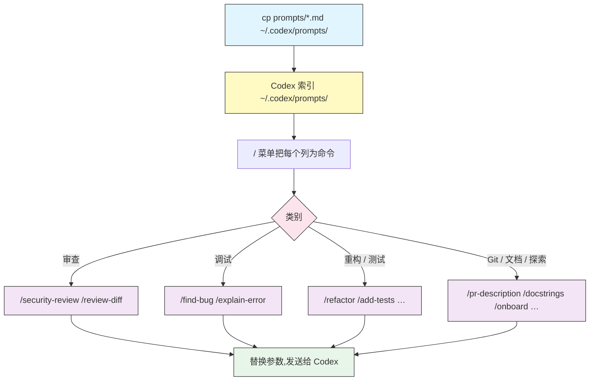

# Prompt 库

## 概述

模块 [02](../02-slash-commands/) 讲了如何把 `~/.codex/prompts/` 里的一个 Markdown 文件变成 `/command`。本模块是**菜谱集**:一批可直接取用的自定义 prompt,覆盖你最常重复的任务——审查、调试、重构、测试、git 杂务、文档和探索。

把文件放进 `~/.codex/prompts/`,重开 `/` 菜单,每个都会成为一个 slash 命令。它们只是普通 Markdown,所以把它们当作起点——按你团队的需要重命名、编辑和组合。

这里的每个 prompt 都刻意**专门化**。模块 02 提供的是通用的 `/review`,而本库补上一个专查漏洞的 `/security-review` 和一个专审指定范围的 `/review-diff`。越窄的 prompt,结果越锐利。

## 架构



每个文件的名字(去掉 `.md`)就是命令名。命令后面输入的参数会先填入 `$1`、`$2` 和 `$ARGUMENTS`,再把文本发送给 Codex。

## 安装

把整个库复制到你的 prompts 目录:

```bash
mkdir -p ~/.codex/prompts
cp 13-prompt-library/prompts/*.md ~/.codex/prompts/
```

然后运行 `/prompts`(或重开 `/` 菜单)确认已加载。只想要几个?复制你想要的单个文件即可。

> **Note**:取决于你的 Codex 版本,自定义 prompt 在菜单里可能带命名空间(如 `/prompts:refactor`)。它们始终能被 `/prompts` 列出。

## 库内容

| 文件 | 命令 | 作用 | 示例 |
|------|------|------|------|
| [`prompts/security-review.md`](prompts/security-review.md) | `/security-review` | 审查改动代码中的漏洞 | `/security-review auth flow` |
| [`prompts/review-diff.md`](prompts/review-diff.md) | `/review-diff` | 审查指定提交/范围/diff | `/review-diff main..HEAD` |
| [`prompts/find-bug.md`](prompts/find-bug.md) | `/find-bug` | 把 bug 追溯到根因 | `/find-bug login returns 500` |
| [`prompts/explain-error.md`](prompts/explain-error.md) | `/explain-error` | 解释报错或堆栈 | `/explain-error <粘贴堆栈>` |
| [`prompts/refactor.md`](prompts/refactor.md) | `/refactor` | 重构代码,保持行为不变 | `/refactor src/parser.ts` |
| [`prompts/extract-function.md`](prompts/extract-function.md) | `/extract-function` | 从一段代码抽出命名函数 | `/extract-function utils.py:40-72` |
| [`prompts/add-tests.md`](prompts/add-tests.md) | `/add-tests` | 为目标写全面的测试 | `/add-tests src/cart.ts` |
| [`prompts/cover-gaps.md`](prompts/cover-gaps.md) | `/cover-gaps` | 找出并补齐覆盖率缺口 | `/cover-gaps billing` |
| [`prompts/pr-description.md`](prompts/pr-description.md) | `/pr-description` | 起草 PR 标题与描述 | `/pr-description main` |
| [`prompts/changelog.md`](prompts/changelog.md) | `/changelog` | 从提交生成 changelog 条目 | `/changelog v1.2.0` |
| [`prompts/docstrings.md`](prompts/docstrings.md) | `/docstrings` | 为文件补齐/修正文档注释 | `/docstrings src/api.py` |
| [`prompts/readme.md`](prompts/readme.md) | `/readme` | 起草或刷新项目 README | `/readme end users` |
| [`prompts/onboard.md`](prompts/onboard.md) | `/onboard` | 陌生代码库的导览 | `/onboard the queue system` |
| [`prompts/trace.md`](prompts/trace.md) | `/trace` | 端到端追踪某条流程 | `/trace checkout request` |

## 写好自己的 prompt

这里的 prompt 遵循一套可复用的套路。你自己加时也照着来:

1. **一个 prompt 只做一件事。** 又审查又修复又提交的 prompt,三件事都做得含糊。拆开。
2. **让 Codex 先读。** "回答前先读文件"、"假设前先跑测试"能把猜测变成有据可依的工作。
3. **要求结构化输出。** 固定的小节(严重程度 / 位置 / 修复)让结果易扫读,且多次运行保持一致。
4. **把可变部分参数化。** 用 `$1` 表示单个必填参数,用 `$ARGUMENTS` 表示自由文本;不要硬编码任何随项目变化的东西。
5. **设护栏。** "不要提交"、"不要改变行为"、"不要编造问题"能把模型约束在界内。
6. **加 frontmatter。** 一行 `description` 加一个 `argument-hint`,能让 `/` 菜单自带说明。

```markdown
---
description: 在 slash 菜单里显示的一行说明
argument-hint: [要传入什么]
---

只用 $1 做一件事。
先读相关文件。以简短的结构化列表报告结果。
不要<你绝不希望它做的那件事>。
```

## 最佳实践

| Do | Don't |
|----|-------|
| 每个 prompt 只聚焦一个任务 | 造一个什么都做的巨型 prompt |
| 让模型先读/核实再动手 | 让 prompt 基于假设行动 |
| 要求结构化、易扫读的输出 | 接受一大段还得自己解析的散文 |
| 加 `description` + `argument-hint` frontmatter | 让菜单里全是无标签命令 |
| 把团队的 prompt 放进共享仓库 | 跨机器手工复制文件 |
| 给有风险的 prompt 加只读/不提交护栏 | 假定模型不会做额外动作 |

## 故障排查

### prompt 不出现

- 确认文件在 `~/.codex/prompts/` 里且以 `.md` 结尾。
- 运行 `/prompts` 看 Codex 加载了什么,并重开 `/` 菜单。
- 检查 frontmatter 是 `---` 之间的合法 YAML。

### 命令名和内置命令冲突

- 内置优先。重命名文件(如用 `review-diff.md` 而非 `review.md`),避免遮盖 `/review`、`/model` 或 `/diff`。

### 参数没有被替换

- 位置参数用 `$1`/`$2`,整个字符串用 `$ARGUMENTS`。
- 参数写在命令后面:`/find-bug the cache never expires`。

## 相关指南

- [Slash 命令与自定义 prompt](../02-slash-commands/) —— 自定义 prompt 的工作原理与基础模板
- [AGENTS.md](../03-agents-md/) —— 持久的项目说明 vs. 一次性 prompt
- [自动化](../07-automation/) —— 用 `codex exec` 非交互地运行这些任务
- [CLI 参考](../10-cli/) —— 完整的命令与 flag 参考

---

**最后更新**: September 28, 2026
**工具**: OpenAI Codex CLI (`@openai/codex`)
**兼容模型**: GPT-5-Codex (默认), GPT-5, 以及 OpenAI 兼容和本地 (OSS) 模型
*[codexhowto](../) 指南系列的一部分*
