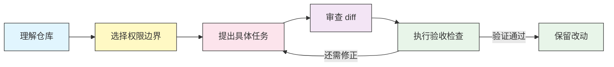

<h1 align="center">codexhowto</h1>

<p align="center">
  <strong>不只会敲命令，更要会做判断、验证结果。</strong><br>
  一套中英双语的 OpenAI Codex CLI 实战指南：从第一次会话，到可复用的开发工作流。
</p>

<p align="center">
  <a href="../LICENSE"></a>
  <a href="#课程目录"></a>
  <a href="exercises/README.md"></a>
  <a href="../README.md"></a>
  <a href="https://github.com/sxxso/codexhowto/actions/workflows/verify.yml"></a>
</p>

<p align="center">
  <a href="../README.md">English</a> · <strong>简体中文</strong><br>
  <a href="#快速开始">快速开始</a> ·
  <a href="exercises/README.md">动手做实验</a> ·
  <a href="12-decision-guides/README.md">查看决策指南</a> ·
  <a href="QUICK_REFERENCE.md">命令速查</a>
</p>

---

**知道一个命令怎么写，不等于知道什么时候该用它。** 这个项目把 Codex 的功能放进具体任务：接手陌生仓库、复现一个 bug、补齐缺失测试、审查 diff，以及在保留原有行为的前提下重构代码。

我们反复练习同一个过程：

> **先复现 → 带约束地委派 → 审查改动 → 独立验证。**

这是一个独立的社区学习项目，并非 OpenAI 官方产品。教程和模板是可供修改的起点，不是生产环境认证，也不能替代 [Codex 官方文档](https://developers.openai.com/codex/)。

## 导航

- [这个项目有什么不同](#这个项目有什么不同)
- [找到你的起点](#找到你的起点)
- [快速开始](#快速开始)
- [动手实验](#动手实验)
- [课程目录](#课程目录)
- [有验收标准的工作流](#有验收标准的工作流)
- [可复用的提示词与模板](#可复用的提示词与模板)
- [项目结构](#项目结构)
- [安全与兼容性](#安全与兼容性)
- [常见问题](#常见问题)
- [参与贡献](#参与贡献)
- [许可与致谢](#许可与致谢)

## 这个项目有什么不同

| 层次 | 你会得到什么 | 练习什么能力 |
|---|---|---|
| **理解功能** | 10 个基础与参考模块，配有图解和配置示例 | 理解指令、审批、沙箱、MCP 和自动化如何协作 |
| **做出判断** | 6 份带分支流程图和推荐方案的决策指南 | 为任务选择执行方式、权限边界和指令存放位置 |
| **组合应用** | 7 套端到端工作流与 2 个配套 shell 脚本 | 把单点功能组合成有明确验收标准的任务 |
| **动手验证** | 一个埋有 bug 的 Python 记账项目、6 个练习及参考答案 | 在实际代码中练习诊断、约束、修复、测试和审查 |
| **带走复用** | 14 个专项提示词，以及配置、项目指令和 CI 模板 | 把合适的起点带回自己的项目，而不是从空白开始 |

**实验项目故意不完美。** 初始测试失败不是安装出错，而是练习的起点。改动是否解决问题，由你检查证据来判断；Codex 说“完成了”不等于通过验收。



先读懂仓库、设定边界，再反复执行“任务—审查—测试”，直到有足够证据支持保留改动。

## 找到你的起点

**不必先读完所有参考章节，才能开始做有用的事情。**

| 你的目标 | 建议路线 | 第一个具体成果 |
|---|---|---|
| **“我还没用过 Codex。”** | [01 入门](01-getting-started/) → [05 审批与沙箱](05-approvals-sandbox/) → [动手实验](exercises/) | 一份有依据的项目说明，以及一个经过验证的 bug 修复 |
| **“我会用，但结果不稳定。”** | [03 AGENTS.md](03-agents-md/) → [12 决策指南](12-decision-guides/) → [11 工作流](11-recipes/) | 一个边界清晰、验收标准明确的任务 |
| **“我想接入脚本或 CI。”** | [07 自动化](07-automation/) → [08 Profile](08-profiles/) → [11 工作流](11-recipes/) | 一套先审查、再部署的代码审查流程 |
| **“我只想找个好用的提示词。”** | [13 提示词库](13-prompt-library/) | 一份能针对任务调整的提示词 |
| **“我只是来查命令。”** | [快速参考](QUICK_REFERENCE.md) 或 [10 CLI 参考](10-cli/) | 找到相关命令、选项或配置段 |

想按顺序学，可以使用[学习路线图](LEARNING-ROADMAP.md)。其中的时间是估算值；安装环境、调试和实际完成练习都需要额外时间。

## 快速开始

### 1. 准备环境

- **Codex CLI：**按[官方仓库](https://github.com/openai/codex)支持的方式安装。下面使用 npm，因此需要 Node.js 和 npm。
- **认证：**符合条件的 ChatGPT 账户或 API 访问方式。可用性与费用以你的账户和当前服务条款为准。
- **仅实验项目需要：**Python 3.10+ 和 `pip`。记账程序使用 Python 标准库，测试依赖为 `pytest`。
- **本仓库：**通过 GitHub 的 **Code** 菜单克隆，或下载 ZIP 后解压。除非另有说明，下列路径以仓库根目录为起点。

```bash
npm install -g @openai/codex
codex --version
codex --help
codex login
```

> **注意：**CLI 选项、认证流程、可用模型和自定义提示词机制可能变化。如果示例与你的安装不一致，请记录版本并查看对应的帮助信息。本项目没有锁定或认证某一个 CLI 版本。

### 2. 先观察，不急着修改

仓库自带练习项目，不必先寻找一个合适的业务仓库：

```bash
cd exercises/sample-project
codex -a on-request -s read-only "Explain this project's entry points, data flow, and test setup. Do not edit files. Separate observations from guesses."
```

对照 `expenses.py`、`storage.py` 和 `report.py` 阅读回答。有用的说明应该指向实际代码，而不是泛泛介绍“记账软件一般怎么工作”。

> **路径说明：**上述命令使用根目录的英文实验副本。若要跟随中文实验说明，可从仓库根目录进入 `zh/exercises/sample-project/`；两份实验源码相同，只选一份练习即可。

### 3. 复现初始状态

在选定的 `sample-project/` 目录中创建本地测试环境：

```bash
python -m venv .venv
```

如果系统使用 `python3` 而非 `python`，创建环境时替换命令名即可。

**macOS / Linux / 兼容的 Bash 环境：**

```bash
.venv/bin/python -m pip install -r requirements.txt
.venv/bin/python -m pytest -q
```

**Windows PowerShell：**

```powershell
.\.venv\Scripts\python.exe -m pip install -r requirements.txt
.\.venv\Scripts\python.exe -m pytest -q
```

未经修改的初始测试设计为输出：

```text
2 failed, 3 passed
```

失败项涉及金额舍入和类别匹配的大小写处理。跟随[实验指南](exercises/README.md)修复它们。首次运行时数据文件缺失导致的崩溃，是初始测试尚未覆盖的另一个 bug。

> **重要：**实验的“预期失败基线”不等于全仓库测试通过。修复后测试变绿，也只能证明这些测试所检查的行为。

## 动手实验

示例是一个命令行记账工具：添加记录、列出记录、计算总额、生成分类报告。代码量足够小，可以逐个文件看懂；问题则覆盖业务行为、持久化、测试缺口和可维护性。

| 练习 | 你的任务 | 应当检查的证据 |
|---|---|---|
| **01 · 探索** | 让 Codex 只读地梳理项目 | 入口和数据流与源码一致 |
| **02 · 复现并修复** | 处理首次使用时数据文件不存在的情况 | 使用全新数据路径不再崩溃 |
| **03 · 根据测试调试** | 修复两个失败行为，不削弱测试 | 原来的 5 个测试通过，并检查实现 diff |
| **04 · 补充覆盖** | 使用隔离的临时文件测试持久化 | 缺文件、读写往返、ID 分配都有有效断言 |
| **05 · 重构** | 拆分报告函数，同时保留输出行为 | 比较保存的基准输出，并补充单个样例之外的测试 |
| **06 · 扩展** | 增加 CSV 导出，保留现有命令 | 解析导出的 CSV，同时运行新旧测试 |

**配套材料：**[分步练习](exercises/README.md) · [示例源码](exercises/sample-project/) · [参考答案](exercises/SOLUTIONS.md)。

例如，下面这样的任务比“把所有问题都修好”更容易验收：

```text
Read test_expenses.py and reproduce its two failures.
Fix only the corresponding behavior in expenses.py.
Do not delete tests, weaken assertions, or add dependencies.
Run the original tests using the Python environment installed for this lab.
Report the changed functions, test result, and anything not verified.
```

它明确要求：先复现，只改对应实现，不删除测试或放宽断言，并报告真实验证结果。允许写入之前，请用[决策指南](12-decision-guides/)选择权限设置；在副本或专门分支上练习，不要混入无关改动。

## 课程目录

### 基础与参考 · 01–10

| 模块 | 主要内容 | 学完带走什么 |
|---|---|---|
| [**01 · 入门**](01-getting-started/) | 安装、认证、首次会话 | 一个可用的 Codex CLI 起点 |
| [**02 · 斜杠命令与自定义提示词**](02-slash-commands/) | 交互命令和可复用指令 | 减少重复输入，并核对当前版本的支持情况 |
| [**03 · AGENTS.md**](03-agents-md/) | 项目指令与作用范围 | 把构建命令和项目约定放到合适位置 |
| [**04 · 配置**](04-config/) | `config.toml`、覆盖方式、配置示例 | 理解一个设置，再决定是否采用 |
| [**05 · 审批与沙箱**](05-approvals-sandbox/) | 权限请求与执行约束 | 区分“什么时候询问”与“允许做什么” |
| [**06 · MCP**](06-mcp/) | 接入外部工具和服务 | 明确访问权限与信任边界后再扩展能力 |
| [**07 · 自动化与 CI**](07-automation/) | 非交互 `codex exec`、脚本、CI 示例 | 把重复任务变成可检查的自动化流程 |
| [**08 · Profile 与模型提供方**](08-profiles/) | 命名配置与提供方示例 | 有意识地切换任务配置 |
| [**09 · 进阶功能**](09-advanced/) | 会话、通知、搜索、图片、IDE/云端话题 | 了解基础工作流之外的扩展方向 |
| [**10 · CLI 参考**](10-cli/) | 命令、选项、环境变量 | 配合当前 CLI 的帮助信息查语法 |

### 应用与实践 · 11–13 + 实验

| 模块 | 包含什么 | 什么时候看 |
|---|---|---|
| [**11 · 实战手册与工作流**](11-recipes/) | 7 套任务剧本 + 2 个 shell 脚本 | 需要一套操作步骤，而不只是 flag 列表 |
| [**12 · 决策指南**](12-decision-guides/) | 6 类决策，配流程图和表格 | 几种选项看起来都合理，不知道默认选什么 |
| [**13 · 提示词库**](13-prompt-library/) | 14 个专项 Markdown 提示词 | 需要一份有边界、能复用的任务描述 |
| [**动手实验**](exercises/) | 6 个练习、Python 项目、参考答案 | 想在代码上检验自己是否真正理解 |

查具体文件：[完整索引](INDEX.md) · [功能目录](CATALOG.md)。

## 有验收标准的工作流

每份[实战手册](11-recipes/README.md)都包含目标、命令、提示词，以及执行后的验证步骤。

| 工作流 | 预期产物 | 你的验收动作 |
|---|---|---|
| **接手陌生仓库** | 架构和入口地图 | 对照引用文件，检查实际数据流 |
| **使用 TDD 循环** | 回归测试与最小实现 | 确认同一测试在修复前失败、修复后通过 |
| **在 CI 中审查改动** | 与 diff 对应的发现 | 检查基准版本、相关性、权限与误报 |
| **规划多文件重构** | 先审阅计划，再执行限定范围的变更 | 对照计划检查 diff，运行相关检查 |
| **调试失败测试** | 可复现的错误与根因修复 | 重跑最初失败的命令 |
| **批量补充文档注释** | 与实现一致的说明 | 查找编造行为和意外代码改动 |
| **分析日志** | 有证据支撑的假设和后续检查 | 区分已经观察到的事实与尚未验证的解释 |

配套脚本：[`onboarding-tour.sh`](11-recipes/scripts/onboarding-tour.sh) 与 [`codemod-plan-then-apply.sh`](11-recipes/scripts/codemod-plan-then-apply.sh)。运行前先读源码；两者需要 Bash 和 Codex，后者包含修改代码的阶段。

## 可复用的提示词与模板

### 14 个专项提示词

| 分类 | 提示词文件 |
|---|---|
| **代码审查** | [security-review](13-prompt-library/prompts/security-review.md)、[review-diff](13-prompt-library/prompts/review-diff.md) |
| **定位问题** | [find-bug](13-prompt-library/prompts/find-bug.md)、[explain-error](13-prompt-library/prompts/explain-error.md) |
| **代码重构** | [refactor](13-prompt-library/prompts/refactor.md)、[extract-function](13-prompt-library/prompts/extract-function.md) |
| **测试** | [add-tests](13-prompt-library/prompts/add-tests.md)、[cover-gaps](13-prompt-library/prompts/cover-gaps.md) |
| **Git 与交付** | [pr-description](13-prompt-library/prompts/pr-description.md)、[changelog](13-prompt-library/prompts/changelog.md) |
| **文档** | [docstrings](13-prompt-library/prompts/docstrings.md)、[readme](13-prompt-library/prompts/readme.md) |
| **项目探索** | [onboard](13-prompt-library/prompts/onboard.md)、[trace](13-prompt-library/prompts/trace.md) |

这些是可阅读的 Markdown 文件，不是插件，也不会自动运行智能体。打开一个文件，调整任务范围；如果直接粘贴到对话中，请先替换 `$1`、`$ARGUMENTS` 等占位符。

若当前 CLI 支持自定义提示词，请按[模块 13 的安装说明](13-prompt-library/README.md)操作。命名和发现机制以当前菜单与官方文档为准，不假定所有版本都有相同的斜杠命令。复制前先备份已有的同名提示词。

### 配置与项目模板

- [**AGENTS.md 模板**](03-agents-md/)：项目级、个人级和子目录指令。
- [**配置示例**](04-config/)：起步配置、最小配置及较完整的配置。
- [**MCP 片段**](06-mcp/)：外部工具的连接示例。
- [**Profile 示例**](08-profiles/profiles-config.toml)：为不同任务保存命名配置。
- [**自动化示例**](07-automation/scripts/)：审查、文档和 GitHub Actions 模板。

**只合并自己理解的设置，不要直接覆盖现有的 `~/.codex/config.toml` 或 `AGENTS.md`。** Actions YAML 位于课程目录内，是教学模板，不是本仓库已启用的 CI 工作流。

## 项目结构

```text
codexhowto/
├── README.md                  # 英文项目首页
├── QUICK_REFERENCE.md         # 命令速查
├── LEARNING-ROADMAP.md         # 建议路线与学习安排
├── INDEX.md / CATALOG.md       # 文件索引与功能目录
├── 01-getting-started/
├── 02-slash-commands/          # 含 3 个入门提示词
├── 03-agents-md/               # 项目指令模板
├── 04-config/                 # 配置示例
├── 05-approvals-sandbox/
├── 06-mcp/                    # MCP 配置示例
├── 07-automation/             # shell 脚本与 CI 模板
├── 08-profiles/
├── 09-advanced/
├── 10-cli/
├── 11-recipes/                # 实战手册与配套脚本
├── 12-decision-guides/        # 权衡方法与决策树
├── 13-prompt-library/         # 14 个专项提示词
├── exercises/
│   ├── README.md              # 六个分步练习
│   ├── SOLUTIONS.md           # 参考做法
│   └── sample-project/       # 故意不完美的 Python 应用
└── zh/                       # 中文指南与配套文件镜像
```

中英文指南使用相同的目录组织方式。命令、配置键、源码及可复用提示词保留英文，使两条学习路线使用相同的技术材料。部分仓库管理文档目前只有英文版。

## 安全与兼容性

| 原则 | 在本项目中的含义 |
|---|---|
| **从小权限开始** | 允许修改之前先检查项目，不要仅为消除报错而关闭防护。 |
| **审批不等于隔离** | 审批策略控制权限请求，沙箱设置约束其支持的操作；两者都不是万能保证。 |
| **只读不等于保密** | 远程模型可能接收到提交的上下文；外部 MCP 服务有自己的凭据、权限和副作用。 |
| **仓库输入并不天然可信** | 代码、日志和仓库指令可能误导智能体；执行前检查命令、依赖和工具权限。 |
| **凭据不进 Git** | 使用平台提供的密钥管理机制。在 `env` 表里写入字面量 token，仍然是在文件中存储密钥。 |
| **本地独立验证** | 模型回答不是证据。自己运行相关测试并检查改动。 |
| **核对安装版本** | 查看 `codex --version`、`codex --help`、`codex exec --help`；模型和设置的可用性取决于版本与账户。 |

**验证边界：**Python 实验有一组已知、故意失败的初始测试。本项目不声称所有 Codex 命令、模型提供方、MCP server 或 CI 模板都已在最新版 CLI 上完成端到端测试，也不承诺固定的默认模型或全面的提供方兼容性。

### 本仓库如何验证

每次 push 和 pull request 都会运行 [Verify 工作流](../.github/workflows/verify.yml)，让能自动核查的部分保持诚实：

| 检查项 | 怎么查 | 状态 |
|---|---|---|
| **实验基线** | CI 跑示例项目(英文与 `zh/`),断言输出正好是 `2 failed, 3 passed`——一旦变绿,说明有埋的 bug 被悄悄修掉了 | 自动 |
| **内部链接** | CI 解析全仓库每一个相对 Markdown/HTML 链接 | 自动 |
| **实验运行环境** | Python 3.10+ 与 `pytest`(见各自的 `requirements.txt`) | 自动 |
| **Codex CLI 命令** | 尽量写成与版本无关;**未**针对任何特定 CLI 版本做认证 | 手动——运行 `codex --version`,记录你实测的版本 |

最后一行是所有 CLI 教程都逃不掉的诚实告示:工具在变。当你验证某个命令时,请在 PR 或 issue 里注明版本,好让别人知道它是在哪个版本上测过的。

部分课程使用 heredoc、`diff` 等 Bash 专用写法。在 Windows 上，请使用兼容的 Bash 环境，或将相应命令改写为 PowerShell；不要直接将 Bash 语法粘贴到 PowerShell。

项目安全指南见 [SECURITY.md](SECURITY.md)。

## 常见问题

<details>
<summary><strong>这是不是又一本命令手册？</strong></summary>

前十个模块提供基础与参考材料；决策指南、工作流和实验负责把知识用起来。如果你已经熟悉 CLI，可以直接从实验开始，不必重新读安装说明。

</details>

<details>
<summary><strong>为什么刚下载，测试就失败？</strong></summary>

练习项目故意带有 bug。原始 5 个测试应当是 2 个失败、3 个通过。请修复实现，不要放宽断言；后续练习还会覆盖初始测试没有检查到的行为。

</details>

<details>
<summary><strong>每一课都需要 Python 吗？</strong></summary>

不需要。Python 和 pytest 用于记账实验；大多数指南讨论的是与具体编程语言无关的 Codex 工作方式。个别示例可能需要相应运行时或外部服务。

</details>

<details>
<summary><strong>教程和 Codex 使用都是免费的吗？</strong></summary>

仓库采用 MIT 许可。Codex 用量、API 调用和外部服务可能要求付费套餐或产生费用；运行自动化之前，请检查当前账户和提供方的计费规则。

</details>

<details>
<summary><strong>应该选哪个模型？</strong></summary>

先选择当前安装和账户支持的模型，再用有代表性的任务与明确验收标准比较质量、延迟和费用。决策指南提供选择方法，不是性能测评，也不保证某个模型在所有任务上都更好。

</details>

<details>
<summary><strong>报告快照不变，就能证明重构安全吗？</strong></summary>

只能证明那个样例的输出没有变。要支持更广泛的行为保持结论，还需要覆盖空输入、类别变化和其他相关边界情况。

</details>

## 参与贡献

最有价值的贡献，是让示例更容易复现，或让结论更容易验证：

- 修正与当前 CLI 不一致的命令，并注明实际测试的版本和平台。
- 补充针对性的回归测试，或改进练习的验收标准。
- 为工作流增加具体失败案例与恢复步骤。
- 保持中英文指南同步。
- 改进图解、可访问性和失效链接。

请先阅读[贡献指南](CONTRIBUTING.md)，遵循[风格规范](STYLE_GUIDE.md)和[行为准则](CODE_OF_CONDUCT.md)。报告问题时，请提供模块位置、脱敏的命令或错误、CLI 版本、操作系统和预期结果；不要提交 token、个人数据或专有代码。

## 许可与致谢

本项目采用 [MIT License](../LICENSE)。你可以依照许可证使用、修改和分发这些材料。

围绕开源的 [OpenAI Codex CLI](https://github.com/openai/codex)编写。编号式、双语教程的组织方式借鉴了已有编码智能体教程；本仓库的实践内容聚焦 Codex 任务及独立验证结果。

**延伸阅读：**[Codex 官方文档](https://developers.openai.com/codex/) · [更新记录](CHANGELOG.md) · [English edition](../README.md)。

---

**最后更新：**2026 年 9 月 29 日 · **面向工具：**OpenAI Codex CLI (`@openai/codex`) · **语言：**English / 简体中文
