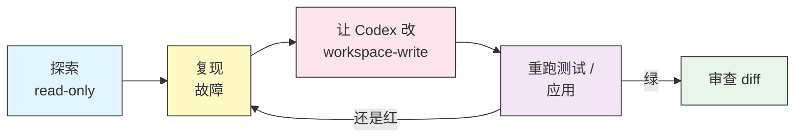

# 动手实验:用 Codex 修好一个真实项目

光读关于编码智能体的文档,能学到的有限。这节实验课交给你一个不大但有毛病的
Python 项目,带你用 Codex 一步步修好它——在过程中练习审批与沙箱的取舍、exec
工作流,以及各参考模块里教过的提示习惯。

## 这里有什么

```text
exercises/
├── README.md          # 本实验课指南
├── SOLUTIONS.md       # 参考答案——先自己做,再偷看
└── sample-project/    # 待修复的应用
    ├── expenses.py        # CLI + 核心逻辑
    ├── storage.py         # JSON 读写(无测试)
    ├── report.py          # 一个过于臃肿的函数
    ├── test_expenses.py   # 部分测试故意是红的
    └── requirements.txt
```

这个项目是一个命令行**记账工具**。它能跑,但埋了三个 bug、一个没测试的模块,
以及一个亟需重构的函数。

## 准备

```bash
cd exercises/sample-project
pip install -r requirements.txt
pytest -q          # 观察:2 failed, 3 passed
```

在这里开一个终端。你将从 `sample-project/` 目录里运行 `codex`,让工作区沙箱
限定在它之内。

## 怎么做这些练习

每个练习都会点明一种**安全姿态**(审批策略 + 沙箱模式——见
[05-approvals-sandbox](../05-approvals-sandbox/) 与
[12-decision-guides](../12-decision-guides/))。从只读开始,只有当你确实要让
Codex 改文件时才放宽访问。每次改动都自己验证一遍;重点就是养成核查智能体产物的
习惯。



---

## 练习 1 —— 先摸清全貌(只读)

改任何东西之前,先让 Codex 带你转一圈。这是最安全的姿态:Codex 能读、能跑命令,
但不能写。

```bash
codex -a on-request -s read-only "Give me a tour of this project: what each \
file does, how the CLI is wired up, and anything that looks buggy or untested."
```

**验证**:它的说明是否和上面的文件表吻合?记下它指出的每个 bug——接下来你会
逐个自己确认。

---

## 练习 2 —— 全新检出就崩溃(一个没有测试的 bug)

复现:

```bash
rm -f expenses.json
python expenses.py list
```

你会在 `storage.load_expenses` 处得到 `FileNotFoundError`。全新用户还没有数据
文件,这种情况应当返回空列表,而不是崩溃。

把故障交给 Codex。这次让它改:

```bash
codex -a on-request -s workspace-write "Running 'python expenses.py list' on \
a fresh checkout crashes with FileNotFoundError in storage.load_expenses. A \
missing data file should be treated as no expenses yet. Fix it."
```

**验证**:

```bash
rm -f expenses.json && python expenses.py list   # 无输出,退出码 0
python expenses.py add 12.50 food lunch           # 现在能用了
```

---

## 练习 3 —— 把红的测试变绿(且不许动测试)

```bash
pytest -q
```

两个测试失败:`test_total_rounds_to_cents` 和
`test_filter_by_category_is_case_insensitive`。它们描述了代码*应有*的行为。
去改代码,别改测试:

```bash
codex -a on-request -s workspace-write "pytest shows two failing tests in \
test_expenses.py. Read them to understand the intended behaviour, then fix \
expenses.py so they pass. Do not modify the test file. Run pytest to confirm."
```

**验证**:`pytest -q` → `5 passed`。然后打开 diff(TUI 里用 `/diff`,若初始化了
git 仓库则 `git diff`),逐行看清改了什么。

> 还有一个测试没覆盖到的相关 bug:`report` 按类别不区分大小写地分组,而
> `total --category` 却区分大小写。拿 SOLUTIONS.md 里的种子数据跑一下
> `python expenses.py total --category food`,看看你的修复是否让两者一致了。

---

## 练习 4 —— 补上缺失的测试(storage.py 一个都没有)

`storage.py` 出厂时零测试。请 Codex 补上——并让它用临时路径,免得测试碰到你的
真实数据文件:

```bash
codex -a on-request -s workspace-write "storage.py has no tests. Write \
test_storage.py covering load_expenses (including the missing-file case), \
save_expenses round-tripping, and next_id. Use pytest's tmp_path fixture so \
no real files are written. Run pytest to confirm they pass."
```

**验证**:`pytest -q` 显示新测试全绿,且反复运行都不会冒出多余的
`expenses.json`。

---

## 练习 5 —— 重构 `generate_report`(行为不能变)

`report.generate_report` 把分组、求和、排序、格式化都塞在一个长函数里。把它拆成
小的辅助函数——但输出必须完全一致。先把行为*钉死*:

```bash
# 把当前输出存成黄金基准文件
cat > expenses.json <<'EOF'
[{"id":1,"date":"2026-09-01","amount":12.50,"category":"Food","note":"lunch"},
 {"id":2,"date":"2026-09-02","amount":40.0,"category":"Travel","note":"train"},
 {"id":3,"date":"2026-09-03","amount":3.25,"category":"food","note":"coffee"}]
EOF
python expenses.py report > report.golden.txt
```

```bash
codex -a on-request -s workspace-write "Refactor report.generate_report into \
small, well-named helper functions (grouping, totals, formatting). Behaviour \
must be identical. Verify with: python expenses.py report | diff - \
report.golden.txt  (no output means success)."
```

**验证**:`python expenses.py report | diff - report.golden.txt` 无任何输出。
收尾:`rm expenses.json report.golden.txt`。

---

## 练习 6(进阶)—— 用可复用的 prompt 加一个功能

先从 [13-prompt-library](../13-prompt-library/) 安装 `add-tests` 和 `refactor`
两个 prompt,再加一个真实功能:

```bash
codex -a on-request -s workspace-write "Add a 'export' subcommand that writes \
all expenses to a CSV file (columns: id,date,amount,category,note). Add tests \
for it. Keep the existing CLI behaviour unchanged."
```

**验证**:`python expenses.py export out.csv` 生成合法的 CSV,且 `pytest -q`
保持全绿。

---

## 下一步去哪

- 卡住了,或想对比不同做法?见 [SOLUTIONS.md](SOLUTIONS.md)。
- 把这些一次性命令变成可复用的工作流:[11-recipes](../11-recipes/)。
- 在 CI 里做同样的审查:[07-automation](../07-automation/)。

---

**最后更新**: September 28, 2026
**工具**: OpenAI Codex CLI (`@openai/codex`)
**兼容模型**: GPT-5-Codex (默认), GPT-5, 以及 OpenAI 兼容和本地 (OSS) 模型
*[codexhowto](../) 指南系列的一部分*
